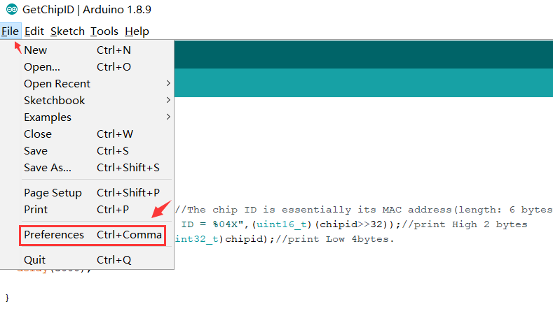
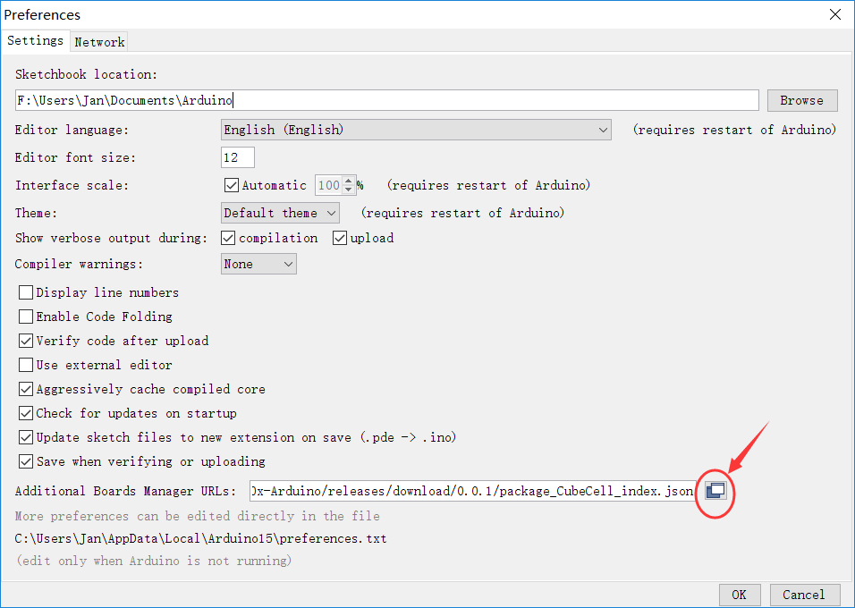
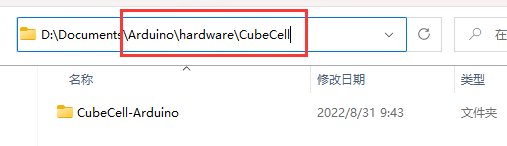

# CubeCell Series Quick Start
{ht_translation}`[简体中文]:[English]`
## Summary

CubeCell is based on ASR650x series, this page shown how to install and configuration CubeCell Arduino Framework, and how to uploading and running code (examples).

## Install CubeCell Relevant Framework

**there are three methods to install the CubeCell framework, choose one of them.**

- [Use Arduino board manager](use-arduino-board-manager)
- [Via Git](via-git)
- [Via Local File](via-local-file)

``` {Tip} Please confirm whether the USB driver, Git and Arduino IDE has been installed correctly.

```

*If not, please view this two articles [establish serial connection](https://docs.heltec.org/general/establish_serial_connection.html) and [Install Git and Arduino IDE](https://docs.heltec.org/general/how_to_install_git_and_arduino.html).*

(use-arduino-board-manager)=
### Use Arduino board manager

Open Arduino IDE, and click `File`->`Peferences`->`Settings`





Input following json url to board manager URLs:

 [https://github.com/HelTecAutomation/CubeCell-Arduino/releases/download/V1.5.0/package_CubeCell_index.json](https://github.com/HelTecAutomation/CubeCell-Arduino/releases/download/V1.5.0/package_CubeCell_index.json)


Click `Tools`->`Board:`->`Boards Manager...`, search `Heltec cubecell`in the new pop-up dialog, select the latest `releases` and  click `install`


The source code of Heltec ASR650x series (ASR6501&ASR6502) framework available here: [https://github.com/HelTecAutomation/ASR650x-Arduino](https://github.com/HelTecAutomation/ASR650x-Arduino)

(via-git)=
### Via Git

- For Windows: `https://github.com/HelTecAutomation/ASR650x-Arduino/blob/master/InstallGuide/windows.md`
- For MacOS: `https://github.com/HelTecAutomation/ASR650x-Arduino/blob/master/InstallGuide/mac.md`
- For Linux(Ubuntu/Debian): `https://github.com/HelTecAutomation/ASR650x-Arduino/blob/master/InstallGuide/debian_ubuntu.md`

&nbsp;

(via-local-file)=

## Via Local File

Download the development environment. [https://resource.heltec.cn/download/CubeCell/CubeCell.zip](https://resource.heltec.cn/download/CubeCell/CubeCell.zip)

Open Arduino IDE, and click `File`->`Peferences`.


Go to the folder in the red box.


Create a new "hardware" folder in the Arduino folder. If there is already a "hardware" folder, you don't need to create a new one.


Go to the "hardware" folder and extract "CubeCell" into this folder.


Go to the "CubeCell" folder, refer to the figure below to confirm whether the path in the red box is correct.



Restart the Arduino IDE to confirm whether the development environment is installed successfully.


### New a sketch

In Arduino IDE, click `File --> new` and copy the following code:

```arduino
// the setup routine runs once when starts up
void setup(){

  // Initialize the Heltec ASR650x object


// the loop routine runs over and over again forever
void loop() {

}
```

&nbsp;

## External resources

- **Serial port cannot connected to Linux system?**

In the Linux system, If encounter the serial port cannot be connected. Please refer to this document:
[https://playground.arduino.cc/Linux/All/#Permission](https://playground.arduino.cc/Linux/All/#Permission)

&nbsp;

Enjoy!

