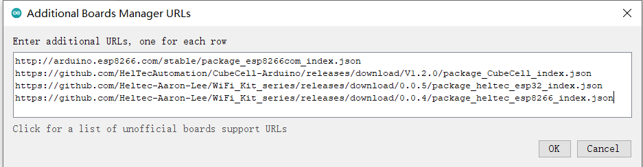

=========================================================
Cubecell Framework installation Via Arduino Board Manager
=========================================================

{ht_translation}`[简体中文]:[English]`

This topic describes the steps to install the Cubecell development framework through the Board Manager that comes with Arduino.

1. Open Arduino IDE, and click `File`->`Peferences`->`Settings`

.. image:: ./img/04.png
   :align: center

.. image:: ./img/05.png
   :align: center

2. Input following json url to board manager URLs:

 https://github.com/HelTecAutomation/CubeCell-Arduino/releases/download/V1.5.0/package_CubeCell_index.json

3. Click **Tools** -> **Board** -> **Boards Manager**...`, search **Heltec cubecell** in the new pop-up dialog, select the latest releases and  click **INSTALL**.

.. image:: ./img/08.png
   :align: center

Other installation methods can be found here: `CubeCell Framework Installation`.

