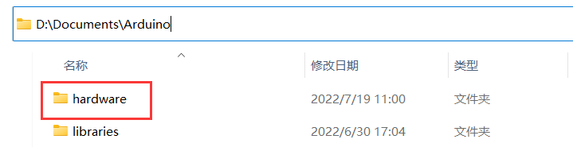
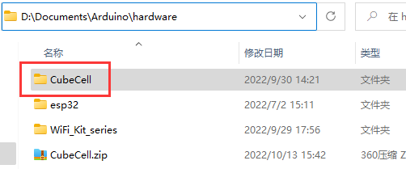

==============================================
Cubecell Framework installation Via Local File
==============================================

{ht_translation}`[简体中文]:[English]`

This chapter describes how to install the CubeCell development framework by downloading an installer.

1. Download the development framework: https://resource.heltec.cn/download/CubeCell/CubeCell.zip

2. Open Arduino IDE, and click **File**-> **Peferences**.

.. image:: ./img/04.png
   :align: center

3. See the library installation path.

.. image:: ./img/09.png
   :align: center

4. Open the path. Create a new **hardware** folder in the Arduino folder. **If there is already a "hardware" folder, you don't need to create a new one.**

5. Unzip the downloaded installation package into hardware.

6. This is the final correct path, please refer to.

.. image:: ./img/12.png
   :align: center

7. Restart the Arduino IDE to confirm whether the development environment is installed successfully.

.. image:: ./img/13.png
   :align: center

