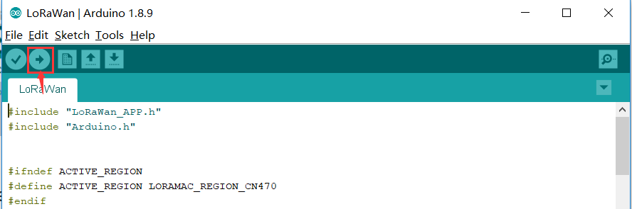
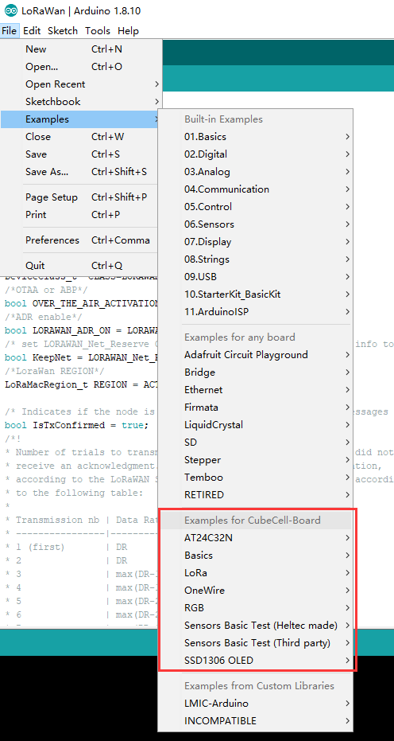

===========================
CubeCell Series Quick Start
===========================

{ht_translation}`[简体中文]:[English]`

CubeCell is based on ASR650x series, this page shown how to install CubeCell Arduino Framework, and how to uploading and running code (examples).

Preparation
===========

Hardware
--------
- A Cubecell node.
- High quality USB cable.

.. note::
    Please ensure that the USB cable can transfer data normally.

Software
--------
- `CP210X serial port driver <https://docs.heltec.org/general/establish_serial_connection.html>`_.
- `Arduino IDE <https://www.arduino.cc/en/Main/Software>`_.
- `Git <https://git-scm.com/download/win>`_ (Only required via Git installation).

Install CubeCell Framework
==========================
**there are three methods to install the CubeCell framework, choose one of them.**

.. toctree::
   :maxdepth: 1

    Use Arduino board manager <cubecell-use-arduino-board-manager>
    Via Git <https://github.com/HelTecAutomation/CubeCell-Arduino>
    Via Local File <cubecell-via-local-file>

Programming
===========

New a sketch
------------
1. In Arduino IDE, click **File** --> **New**

2. Open the tools menu, select your board and the corresponding port.

3. Click Upload.

Run Example
-----------
The CubeCell framework already contains a lot of basic code examples that you can run directly or modify some of the parameters to get started.

1. Open the tools menu, select your board and the corresponding port.

2. Click File, example, and select the example you want to run.

3. After determining the corresponding parameters, click Upload.

   
External resources
==================

- **Serial port cannot connected to Linux system?**

In the Linux system, If encounter the serial port cannot be connected. Please refer to this document:

https://playground.arduino.cc/Linux/All/#Permission

Enjoy!

