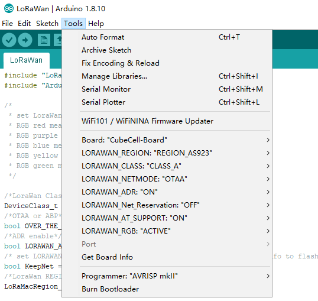

# Running an Example
{ht_translation}`[简体中文]:[English]`

## Preparation

- CubeCell development frameworks.
- A CubeCell node, include the board and the antenna.
- A **high quality** Micro USB cable *(This is the most common reason we had encountered can’t program software)*. 

### Correctly Config the Tools Menu


In the tools menu, there are following options:

- **Board** -- Choose the right hardware connected to your computer;
- **LORAWAN_REGION** -- LoRaWAN protocol region definition, strictly follow [LoRaWAN™ 1.0.2 Regional Parameters rB](https://resource.heltec.cn/download/LoRaWANRegionalParametersv1.0.2_final_1944_1.pdf);
- **LORAWAN_CLASS** -- Now with Class A and Class C supported;
- **LORAWAN_DEVEUI** -- The source of the LoRaWAN parameter `DevEUI`
  - `CUSTOM -- Use the value defined in the devEui array, which is in the .ino file, Can be any value, but it may conflict with other serial numbers.`
  - `Generate by ChipID -- Generated based on the ASR650x's unique Chip ID`
- **LORAWAN_NETMODE** -- OTAA or ABP;
- **LORAWAN_ADR** -- Turn ON or turn OFF ADR (Adaptive Data Rate);
- **LORAWAN_Net_Reservation** -- This is a feature outside the LoRaWAN protocol, only valid in OTAA mode. If this option is enabled, when system reset does not need join again. Projects such as smart street lights may be useful.
- **LORAWAN_UPLINKMODE** -- LoRa uplink confirmed/unconfirmed messages. Confirmed messages need server send downlink to node, but some LoRa server have downlink limited (such as TTN).
- **LORAWAN_AT_SUPPORT** -- AT command will provide many useful functions, for example, users can use serial port to config LoRa Node's DevEui, AppKey, or make node sleep, reset etc.
- **LORAWAN_RGB** -- RGB light for LoRaWAN status:
  - `Purple -- Join;`
  - `Blue -- First RX window;`
  - `Yellow -- Second RX window;`
  - `Green -- Join done.`
- **LoRaWan Debug Level** -- LoRaWAN relevant messages print by serial port
  - `None -- Default;`
  - `Freq -- Sending/receiving frequency;`
  - `Freq && DIO -- Sending/receiving frequency, and DIO pin interrupt information.`
- **COM Port** -- Device's serial port in your computer.


``` {Note} **LORAWAN_Net_Reservation:** For example, a large-scale power outage in city, when power is restored, thousands of devices are connected to the network at the same time, which may cause the LoRa gateway or server to fail. Enable this feature will avoid this situation. Enable LORAWAN_Net_Reservation must disable Frame counter (fCnt) in LoRa server.

```



### Select an example


### Compile and upload


