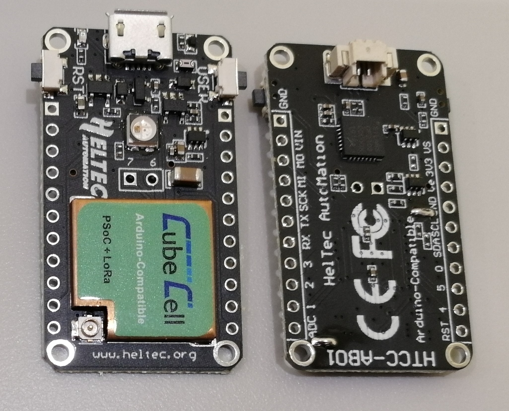

# Hardware Update Logs
{ht_translation}`[简体中文]:[English]`

## HTTC - AB01 Hardware Update Logs

### V1

- First release
- 2017-6-1 public sale
- [Pinout diagram of V1](http://resource.heltec.cn/download/CubeCell/HTCC-AB01/HTCC-AB01_PinoutDiagram.pdf)
- [Schematic diagram of V1](http://resource.heltec.cn/download/CubeCell/HTCC-AB01/HTCC-AB01_SchematicDiagram.pdf)

- HTCC-AB02S_SchematicDiagram_V1.1.pdf)

### V2

- MCU is replaced with ASR6502.

- The interface is changed to USB Type-C.
- Replaced the appearance of the frequency closed shell
