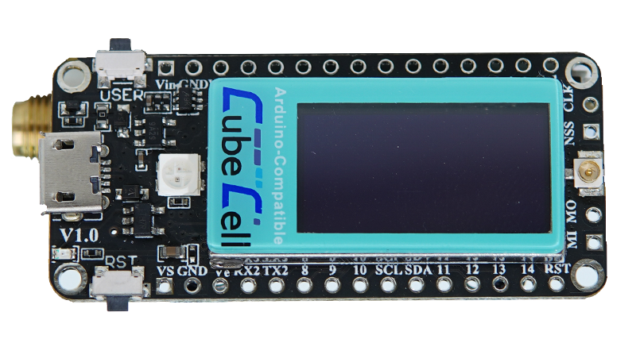

=========
HTCC-AB02
========= 

:ht_translation:`[简体中文]:[English]`

Instruction
===========
CubeCell (TM) is a new product series made by Heltec team, mainly for LoRa/LoRaWAN node applications.

CubeCell (TM) series is based on ASR605x (ASR6501, ASR6502), those chips are already integrated with the PSoC® 4000 series MCU (ARM® Cortex® M0+ Core) and SX1262. We have done a lot of migration and development, made it perfectly support Arduino®, can run the LoRaWAN protocol stably, can easily connect lithium batteries and solar panels.

`HTCC-AB02 <https://heltec.org/project/htcc-ab02/>`_ is a Dev-Board. Friendly designed for developers, easy to verify communication solutions.

Key Resources
=============

.. toctree::
   :maxdepth: 1

   Datasheet<https://resource.heltec.cn/download/CubeCell/HTCC-AB02/AB02.pdf>
   Schematic Diagram<https://resource.heltec.cn/download/CubeCell/HTCC-AB02/HTCC-AB02_SchematicDiagram.pdf>
   Pin Map<https://resource.heltec.cn/download/CubeCell/HTCC-AB02/HTCC-AB02_PinoutDiagram.pdf>
   AT Command List <https://resource.heltec.cn/download/CubeCell/AT_Command_list/CubeCell_Series_AT_Command_User_Manual_V0.6.pdf>
   Frequently Asked Questions<https://docs.heltec.org/en/node/asr650x/asr650x_general_docs/frequently_asked_questions.html>
   Hardware Update Log <hardware_update_log>

Quick Start
===========
For a quick start on how to get started with the Cubecell development board, install the development environment (libraries), and how to run the official sample code, see the following links:

.. toctree::
   :maxdepth: 2

   CubeCell Series Quick Start<https://docs.heltec.org/en/node/asr650x/asr650x_general_docs/quick_start/index.html>

Examples & Extensions
=====================

.. toctree::
   :maxdepth: 1

   LoRaWAN Example <https://docs.heltec.org/en/node/asr650x/asr650x_general_docs/lorawan/index.html>
   Solar Panel <https://docs.heltec.org/en/node/asr650x/asr650x_general_docs/solar_panel.html>

Related Resources
=================
- GitHub: https://github.com/HelTecAutomation/CubeCell-Arduino
- LoRa License Enquiry: https://resource.heltec.cn/search
- How to use license: https://docs.heltec.org/general/how_to_use_license.html
- LoRaWAN Parameters Instruction: https://docs.heltec.org/general/lorawan_parameters.html
- LoRaWAN example Sub-Band usage https://docs.heltec.org/general/sub_band_usage.html
- LoRaWAN ABP Mode https://docs.heltec.org/general/lorawan_abp/index.html
- LoRa Node to Node https://docs.heltec.org/general/lora_node_to_node.html
- LoRaWAN test server(base on TTS): https://lora.heltec.org/ 
- SnapEmu IoT platform: https://platform.snapemu.com/    
- Heltec Data Format Document https://docs.heltec.org/general/data_format_document.html

General Docs
============

.. toctree::
   :maxdepth: 1

   General Docs<https://docs.heltec.org/general/index.html>
    

