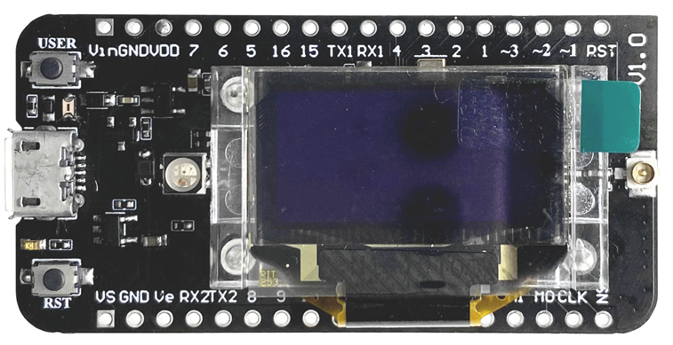
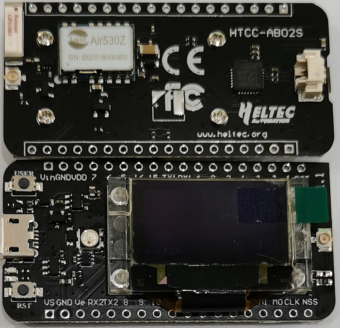

# Hardware Update Logs
{ht_translation}`[简体中文]:[English]`

## HTTC - AB02S Hardware Update Logs

### V1.0

- First release.
- 2020-04-30 public sale.
- [Pinout diagram of V1](http://resource.heltec.cn/download/CubeCell/HTCC-AB02S/HTCC-AB02S_PinoutDiagram.pdf)
- [Schematic diagram of V1](http://resource.heltec.cn/download/CubeCell/HTCC-AB02S/HTCC-AB02S_SchematicDiagram.pdf)

### V1.0.1

- 2020-10-08 public sale.
- Change the GPS indicator pin from IO8 to IO12.
- [Pinout diagram of V1.0.1](http://resource.heltec.cn/download/CubeCell/HTCC-AB02S/HTCC-AB02S_PinoutDiagram.pdf)

- [Schematic diagram of V1.0.1](https://resource.heltec.cn/download/CubeCell/HTCC-AB02S/HTCC-AB02S_SchematicDiagram_V1.1.pdf)

### V1.1

- 2021-03-28 public sale.
- Replace the GPS module from AIR530 to AIR530Z to further improve performance and optimize low power consumption.
- Optimize the circuit and optimize the PCB layout.
- [Pinout diagram of V1.1](http://resource.heltec.cn/download/CubeCell/HTCC-AB02S/HTCC-AB02S_PinoutDiagram.pdf)
- [Schematic diagram of V1.1](https://resource.heltec.cn/download/CubeCell/HTCC-AB02S/HTCC-AB02S_SchematicDiagram_V1.1.pdf)
