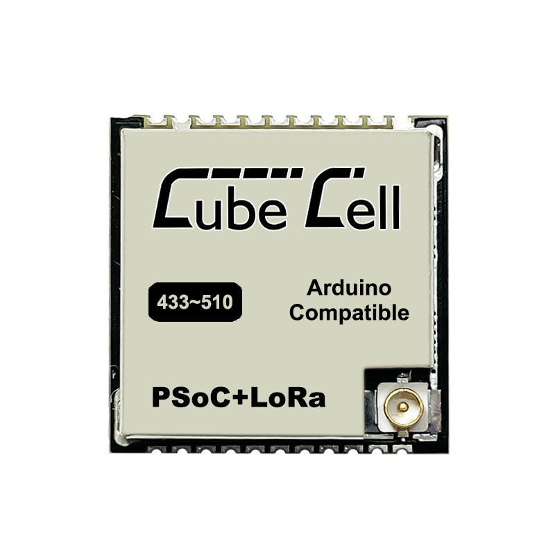

============
HTCC-AM01_V2
============

:ht_translation:`[简体中文]:[English]`

Instruction
===========
`HTCC-AM01 V2 <https://heltec.org/project/htcc-am01-v2/>`_ is a part of the “CubeCell“ series, with the following features:

- Perfect Arduino-Compatible!
- Based on ASR605x (ASR6501, ASR6502), those chips are already integrated the PSoC® 4000 series MCU (ARM® Cortex® M0+ Core) and SX1262;
- LoRaWAN 1.0.2 support;
- Ultra low power design, 3.5uA in deep sleep;
- 1.27 stamp edge design for SMT;

Key Resources
=============

.. toctree::
   :maxdepth: 1

   Datasheet <https://resource.heltec.cn/download/CubeCell/HTCC-AM01_V2/HTCC-AM01_V2(Rev1.1).pdf>
   Schematic Diagram <https://resource.heltec.cn/download/CubeCell/HTCC-AM01_V2/HTCC-AM01_V2_Schematic_Diagram.pdf>
   Reference Circuit Design (Arduino) <https://resource.heltec.cn/download/CubeCell/HTCC-AM01_V2/HTCC-AM01_Reference_Design(Arduino).pdf>
   Reference Circuit Design (AT) <https://resource.heltec.cn/download/CubeCell/HTCC-AM01_V2/HTCC-AM01_Reference_Design(AT).pdf>
   Pin Map <https://resource.heltec.cn/download/CubeCell/HTCC-AM01_V2/HTCC-AM01_V2.png>
   AT Command List <https://resource.heltec.cn/download/CubeCell/AT_Command_list/CubeCell_Series_AT_Command_User_Manual_V0.6.pdf>
   Frequently Asked Questions<https://docs.heltec.org/en/node/asr650x/asr650x_general_docs/frequently_asked_questions.html>
   Hardware Update Log <hardware_update_log>

Quick Start
===========
For a quick start on how to get started with the Cubecell development board, install the development environment (libraries), and how to run the official sample code, see the following links:

.. toctree::
   :maxdepth: 2

   Install Framework <https://docs.heltec.org/en/node/asr650x/asr650x_general_docs/quick_start/index.html>
   Programming <programming_cubecell>

Examples & Extensions
=====================

.. toctree::
   :maxdepth: 1

   LoRaWAN Example <https://docs.heltec.org/en/node/asr650x/asr650x_general_docs/lorawan/index.html>
   Solar Panel <https://docs.heltec.org/en/node/asr650x/asr650x_general_docs/solar_panel.html>

Related Resources
=================
- GitHub: https://github.com/HelTecAutomation/CubeCell-Arduino
- LoRa License Enquiry: https://resource.heltec.cn/search
- How to use license: https://docs.heltec.org/general/how_to_use_license.html
- LoRaWAN Parameters Instruction: https://docs.heltec.org/general/lorawan_parameters.html
- LoRaWAN example Sub-Band usage https://docs.heltec.org/general/sub_band_usage.html
- LoRaWAN ABP Mode https://docs.heltec.org/general/lorawan_abp/index.html
- LoRa Node to Node https://docs.heltec.org/general/lora_node_to_node.html
- LoRaWAN test server(base on TTS): https://lora.heltec.org/ 
- SnapEmu IoT platform: https://platform.snapemu.com/    
- Heltec Data Format Document https://docs.heltec.org/general/data_format_document.html

General Docs
============

.. toctree::
   :maxdepth: 1

   General Docs<https://docs.heltec.org/general/index.html>