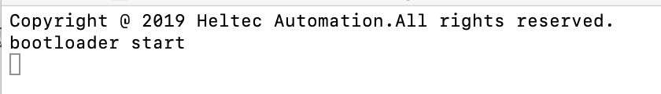

# How to programming a CubeCell Module
{ht_translation}`[简体中文]:[English]`

CubeCell module provide two version:

- **AT command only**

  ``` {tip} For the flash size reason, the "AT command only" HTCC-AM01 only provide CN470-510MHz hardware versions, sending & lestening frequency are fixed (Channel 0~7), cannot be configured by software, and can't upgrade without special hardwares.
  ```

- **Arduino compatible & AT command**

  ``` {tip} Support AT command defaultly, already have an actived Arduino bootloader, can development via Arduino.
  ```

**This document is for the "Arduino compatible & AT command" version. Take HTCC-AM01 as an example.**

``` {note} CubeCell module (HTCC-AM01) only have ASR6501and RF relevant circute inside. In order to program it, need connect to a external UART-USB bridge. CH340G, CP2102 etc.
```

&nbsp;

## Recommend Circuit

There are two recommend schematics:

- **[Arduino compatible recommend design](http://resource.heltec.cn/download/CubeCell/HTCC-AM01_Module/HTCC-AM01_Reference_Design(Arduino).pdf)**
  - This circuit have an auto boot circuit, can running into bootloader mode automatically.
- **[A slave module control by a master device](http://resource.heltec.cn/download/CubeCell/HTCC-AM01_Module/HTCC-AM01_Reference_Design(AT).pdf)**
  - This circuit need access bootloader mode manually ([How to access bootloader](https://heltec-automation-docs.readthedocs.io/en/latest/cubecell/frequently_asked_questions.html#how-to-access-bootloader-mode)).

## Get start

1. Install the CubeCell development framework correctly: [CubeCell Series Quick Start](https://docs.heltec.org/en/node/asr650x/asr650x_general_docs/quick_start/index.html);
2. Connect your redesigned board to a computer, make sure useing a high quality Micro USB cable;
3. Click the `tools` option to select the appropriate port and board.


4. Success access the bootloader mode, following log will be print via serial port:



``` {tip} If use the Arduino compatible circuit, and system into bootloader mode automatically, will not see this log. Log printed by CubeCell normally, but the com port used by IDE for programming purpose,  there is no place to show.
```

5. Program via Arduino IDE;


&nbsp;

Enjoy.

