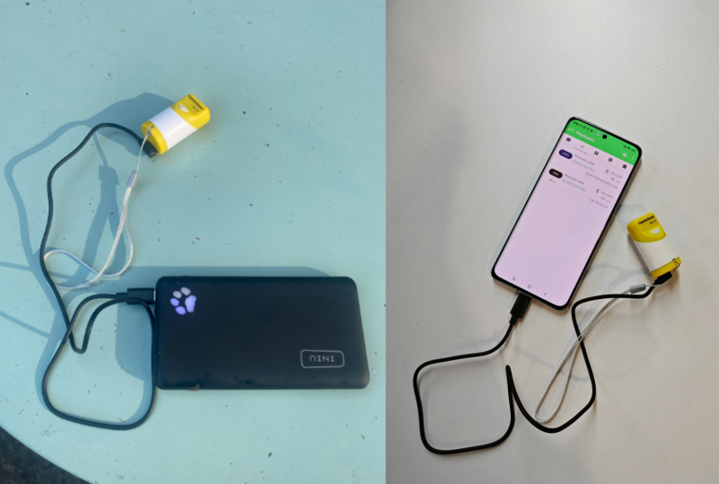

# Frequently Asked Questions
{ht_translation}`[简体中文]:[English]`

This page contains the most frequently questions from user. If this page's detail can't solve your problem, you can also talk in our forum: [community.heltec.cn](http://community.heltec.cn/)

&nbsp;

## After uploading the firmware, the device did not work.

- Your firmware is wrong, or you didn't click `Run` after uploading.

&nbsp;

## How to upload Meshtastic firmware

- The default firmware in the current version is Meshtastic. If you accidentally erase this code, please refer to this link for instructions on uploading the code: [WirelessBoot(Uploading Firmware) — esp32 latest documentation (heltec.org)](https://docs.heltec.org/en/node/esp32/capsule_sensor_v3/wireless_boot.html)

- Firmware download link:[Capsule Sensor V3 Meshtastic](https://resource.heltec.cn/download/Heltec%20Capsule%20Sensor%20V3/firmware.bin)

  

## How to increase the battery life of Meshtastic

The device has a low battery storage, and the Meshtastic consumes a lot of power, so we recommend using it with the power bank phone:

