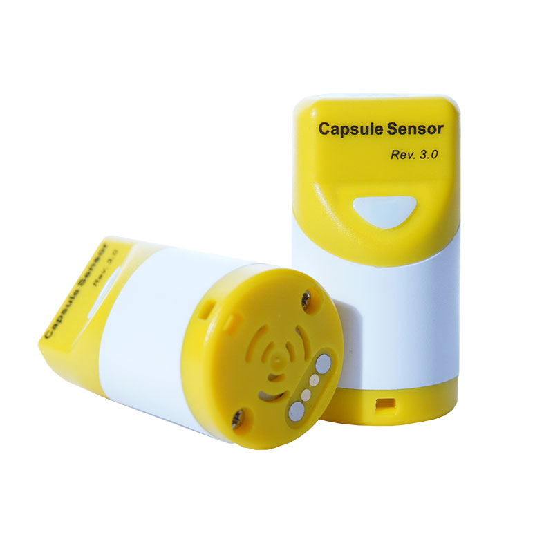

CapSule Sensor V3
=================
:ht_translation:`[简体中文]:[English]`

`CapSule Sensor V3 <https://heltec.org/project/heltec-capsule-sensor-v3>`_ is a IoT tiny device based on ESP32S3 and SX1262. It has excellent expansibility, and we provides a variety of compatible sensor modules and uploading the relevant code for it, using these resources, even if you are not an expert in IoT development, you can easily build many interesting applications or directly run some open source programs like Meshtastick.

Features
--------
- ESP32-S3 + SX1262, supports Wi-Fi, Bluetooth and LoRa.
- Modular design, with a BTB interface reserved at the bottom, capable of connecting and replacing different sensors.
- Built in 250mAh rechargeable battery, magnetic suction charging port.
- High strength plastic, IP65 waterproof.
- Support Heltec Wireless Boot system, download firmware, exchange information, and print logs through Wi-Fi.
- Meshtastic compatible.
- Secondary development can be done through Arduino, Platform.io, etc.  

Components
----------

.. toctree::
   :maxdepth: 2

   Upload Firmware <wireless_boot>
   Meshtastic Quick Start <meshtastic>
   LoRaWAN Quick Start <lorawan>
   Re-Development Via WirelessBoot<../wireless_boot/index>
   Frequently Asked Questions<frequently_asked_questions>
   Related Resources <related_resources>