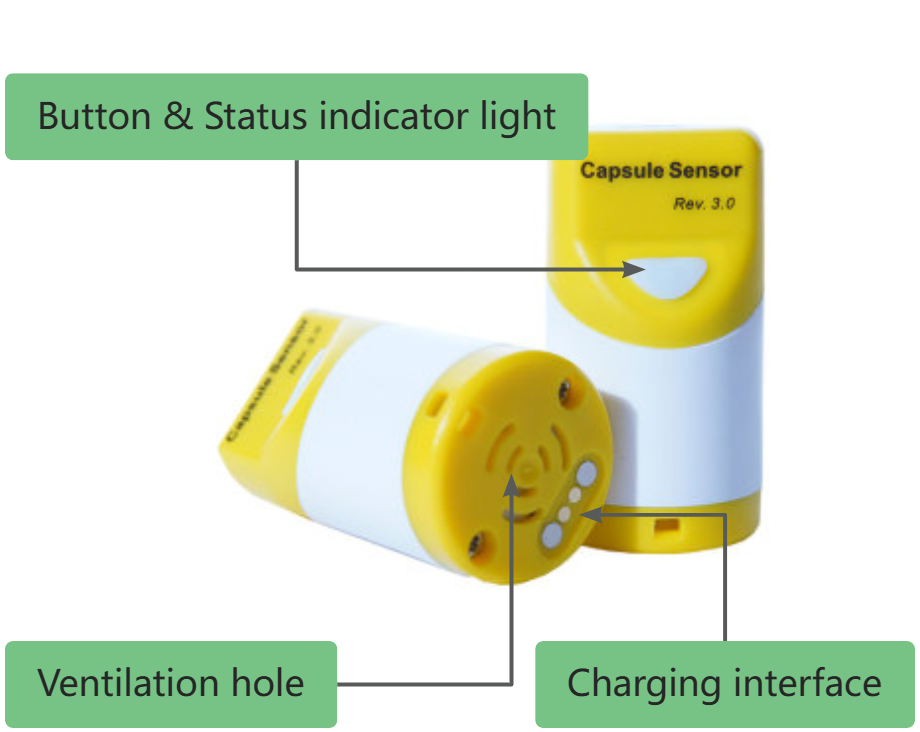

CapSule Sensor V3
=================
:ht_translation:`[简体中文]:[English]`

`CapSule Sensor V3 <https://heltec.org/project/heltec-capsule-sensor-v3>`_ is a IoT tiny device based on ESP32S3 and SX1262. It has excellent expansibility, and we provides a variety of compatible sensor modules and uploading the relevant code for it, using these resources, even if you are not an expert in IoT development, you can easily build many interesting applications or directly run some open source programs like Meshtastick.

Features
--------
- ESP32-S3 + SX1262, supports Wi-Fi, Bluetooth and LoRa.
- Modular design, with a BTB interface reserved at the bottom, capable of connecting and replacing different sensors.
- Built in 250mAh rechargeable battery, magnetic suction charging port.
- High strength plastic, IP65 waterproof.
- Support Heltec Wireless Boot system, download firmware, exchange information, and print logs through Wi-Fi.
- Meshtastic compatible.
- Secondary development can be done through Arduino, Platform.io, etc.  

Quick Started
-------------
Capsule Sensor V3 runs the LoRaWAN program by default and supports SnapEmu one-click QR code registration.  
For detailed information, please refer to the `Capsule Sensor LoRaWAN User Guide <lorawan>`_.

Update or Upload Firmware
-------------------------
If you want to update, run, or upload a different version or functionality of the firmware, please refer to the `Capsule Sensor Firmware Upload Guide <wireless_boot>`_.

Meshtastic
----------
Capsule Sensor is based on ESP32 and LoRa, making it ideal for use in the Meshtastic project. Given that this device differs from traditional development boards, we have provided documentation to explain it: `Meshtastic for Capsule Sensor <meshtastic>`.

Re-Development
--------------
Capsule Sensor allows users to perform secondary development through WirelessBoot technology.  For details, please refer to the `WirelessBoot User Guide <../wireless_boot/index>`_

FAQ
---
Capsule Sensor Frequently Asked Questions<frequently_asked_questions>

Related Resources
-----------------

- `Capsule Sensor V3 Datasheet <https://resource.heltec.cn/download/Heltec%20Capsule%20Sensor%20V3/CapSule%20Sensor%20V3.pdf>`_
- `Capsule Sensor V3 Schematic_Diagram <https://resource.heltec.cn/download/Heltec%20Capsule%20Sensor%20V3/Capsule_Main_Esp32_Schematic_Diagram.pdf>`_
- `Connector Pin Map <https://resource.heltec.cn/download/Heltec%20Capsule%20Sensor%20V3/capsule-connector.webp>`_
- `Connector Datashee <https://resource.heltec.cn/download/Heltec%20Capsule%20Sensor%20V3>`_
- `Meshtastic Firmware <https://resource.heltec.cn/download/Heltec%20Capsule%20Sensor%20V3/firmware.bin>`_
- `LoRaWAN firmware <https://resource.heltec.cn/download/Heltec%20Capsule%20Sensor%20V3/LoRaWAN_firmware>`_
- `Development Framework <https://docs.heltec.org/en/node/esp32/wireless_boot/quick_start.html#directly-upgrade-and-debug-devices-in-the-ide>`_ (Please use the WirelessBoot branch)
- `Heltec LoRa/LoRaWAN Code Repository <https://github.com/HelTecAutomation/Heltec_ESP32>`_