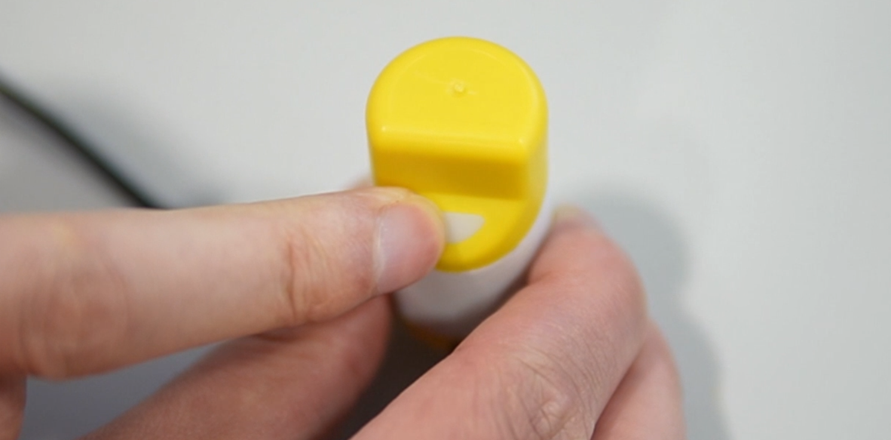
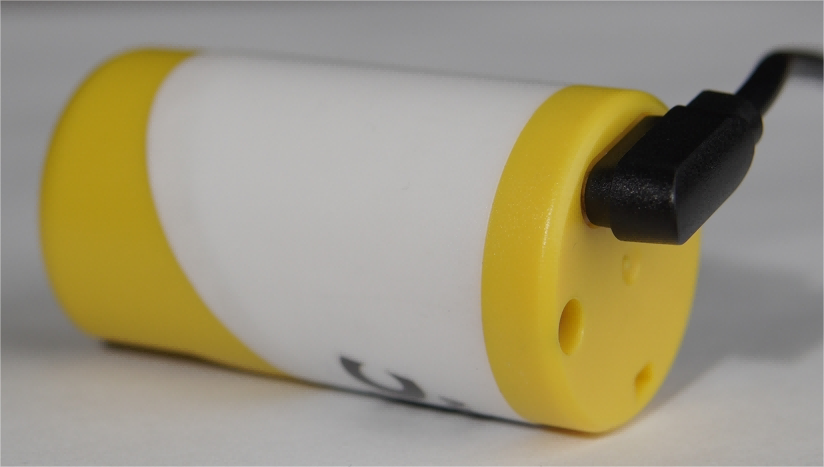

# Meshtastic Quick Start

{ht_translation}`[简体中文]:[English]`

This topic will cover the startup and shutdown of the device and how to quickly start a Meshtastic project through Capsule-V3.

## Preparation
1. [Capsule Sensor V3](https://heltec.org/project/heltec-capsule-sensor-v3/).

   The default program is Meshtastic. If you need to re-upload the firmware, please refer to this two link: 
   - [Meshtastic For Capsule Senor V3](https://resource.heltec.cn/download/Heltec%20Capsule%20Sensor%20V3/firmware.bin)
   - [How to upload firmware](https://docs.heltec.org/en/node/esp32/capsule_sensor_v3/wireless_boot.html)

2. Meshtastic APP, How to download it please refer to this link: [Downloads | Meshtastic](https://meshtastic.org/downloads/)


## Power On
Hold the button for 3 seconds until the white light comes on, Release the button.



## Opreting Meshtastic
1. Open the APP, click `+` to find your device.


2. Connect the device.


3. Default password: **123456**


4. Once paired, Click `UNSET` next to the device name. Select the region from the list according to your regional location. Of course, your hardware must support this frequency band.


``` {Tip} You can refer to this link for the relationship between LoRaWAN bands and regions: [LoRaWAN_frequency_plans_by_country](https://docs.heltec.org/general/lorawan_frequency_plans_by_country.html)
```

``` {Note} EU_433 and EU_868 have to adhere to an hourly duty cycle limitation of 10%. Your device will stop transmitting if you reach it, until it is allowed again

```

5. Click the option below to select the channel you want to join.


## Main Options
1. The map option will be able to view the location information of the companion, which can be provided by the GPS module on the device, or by the phone to which the device is connected.


2. The options below show some information about the companion device, such as latitude and longitude, signal strength, battery level, and so on.


3. This is where you'll see the messages you want to send and receive, and they'll be displayed on the device screen.


## More Settings and usage
Click the top right button to see more configurable options.


## Power Off

Long press the button for 3 seconds to turn off the phone, the light turns blue, and then goes out.

## Charging

The charging interface is shown in the following figure.



The charging voltage is 4~6V, which can be used for mobile phone charging.


