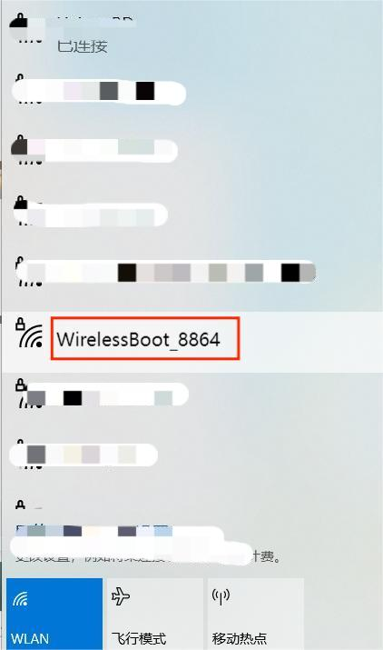
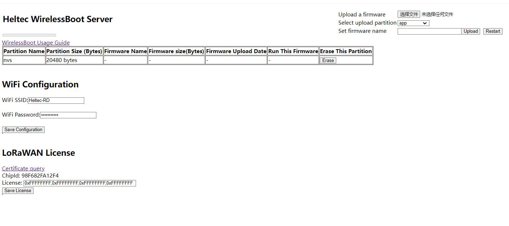
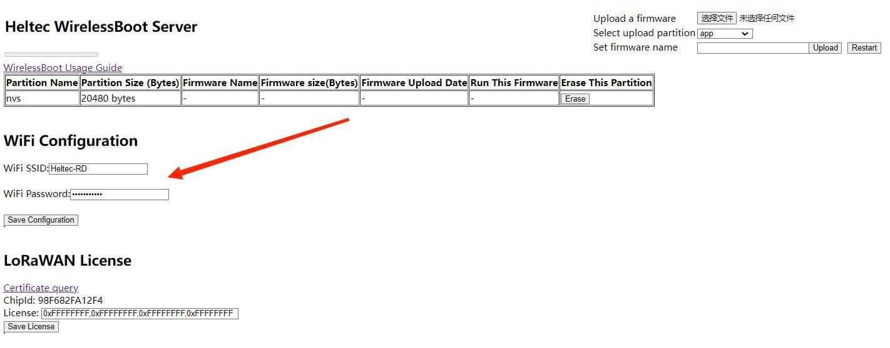

# Quick Start

{ht_translation}`[简体中文]:[English]`

CapSule Sensor V3 uses Wireless Boot to download firmware, exchange information, and print logs through WiFi. 

Long press the indicator light of the device for 16 seconds until the Blue light of the device is always on.

Find "WirelessBoot_xxxx" on your PC and connect, the password is "heltec.org".

Enter `192.168.4.1` in your browser to navigate to the WirelessBoot configuration page.

Enter the WiFi account and password, click `Save Configuration`.

At this point, the device connected to the local area network can interact with CapSule V3.

Take Arduino as an example, if your device is connected to the WiFi of CapSule at this time, you can choose this device at the port to replace the traditional serial port.

For more details on WirelessBoot:[https://docs.heltec.org/en/node/esp32/wireless_boot/index.html](https://docs.heltec.org/en/node/esp32/wireless_boot/index.html)
