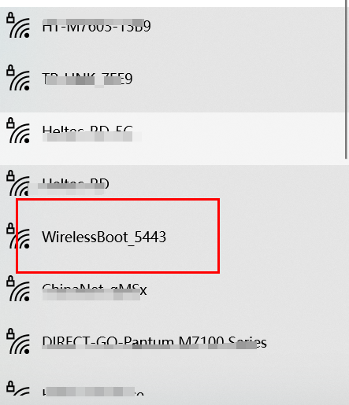
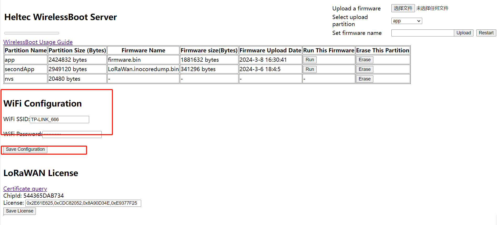
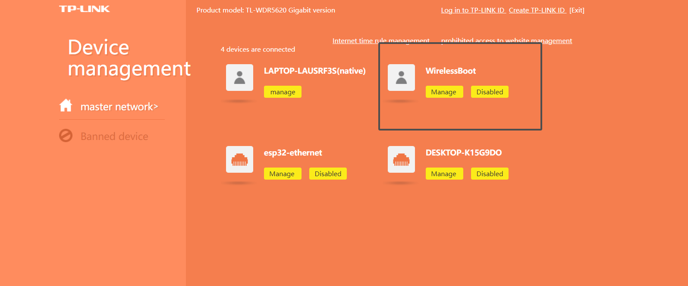
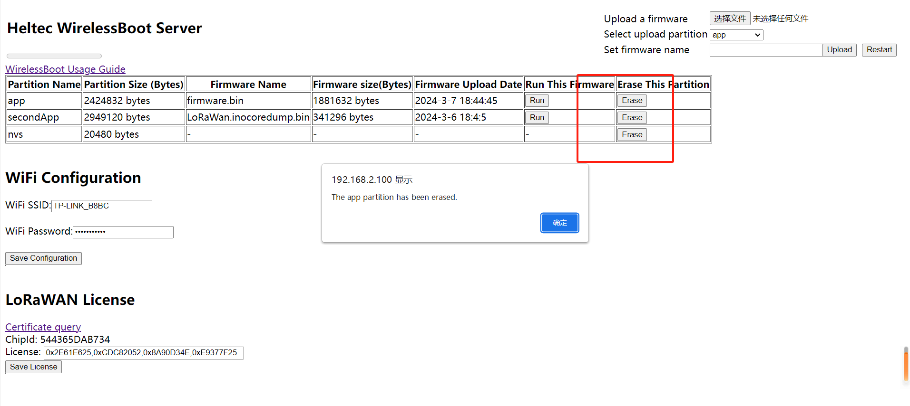
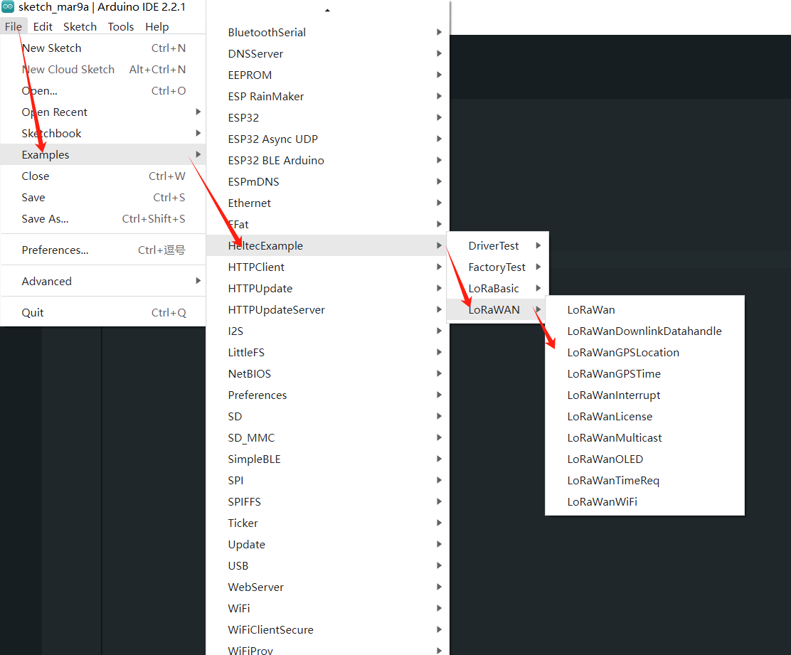

# Secondary Development (Upload Firmware)

{ht_translation}`[简体中文]:[English]`

CapSule Sensor V3 uses **WirelessBoot mode** to download firmware, exchange information, and print logs through WiFi. 

## Enter downloading mode(WirelessBoot)
1. Long press the indicator light of the device for 8 seconds until the Blue light of the device is always on.

``` {Note} Some early devices may require a regular press of 16 seconds.
```


2. Find "WirelessBoot_xxxx" on your PC and connect, the password is "heltec.org".



3. Enter `192.168.4.1` in your browser to navigate to the WirelessBoot configuration page.


``` {Tip} Although you can connect directly to the Capsule's AP hotspot for uploading, this approach is simpler, but may lack stability. Connecting the PC and the capsule to the same LAN is the more stable mode of operation.
```

4. Type the WiFi account and password, click `Save Configuration`.



5. Connect your computer to the LAN which the Capsule V3 is located.

------

## Upload Firmware via Local File
``` 
```

Two things to make sure before we start:

- Capsule-V3 is in WirelessBoot mode.
- PC and Capsule-V3 were connected to the same LAN.

1. After your device enters WirelessBoot mode,  visit the router address in the browser, find the IP address of the Capsule-V3(WirelessBoot).



2. Visit the Capsule-V3 IP in your browser to navigate to the WirelessBoot page.


3. Erase the original firmware.



4. Select the local firmware package.


5. Select the partition and upload it.


``` {Tip} Notice the progress bar at the top left, please upload one firmware before uploading another.
```

``` {Tip} Note the size of the capacity of each partition, do not allow the uploaded firmware size to exceed the capacity of the partition.
```

### Programming via Arduino

Before you start, make sure your device is in WirelessBoot mode and has the Heltec ESP32 development framework and libraries installed: [Heltec Esp32 development framework and library](https://docs.heltec.org/en/node/esp32/quick_start.html)

``` {Tip} The library also supports the ESP32 official development framework.

```

``` {Tip} Make sure the node is in wireless boot mode and that the computer and the node are connected to the same local area network.

```

1. Open the Arduino and click the `Tools` option. In the `Port` option, find **esp32s3_xxxx** and select it. 


```{Tip} If you can't find such an port, restart the Arduino and check whether your device is connected to the same LAN as the computer.

```

2. `Board` select **Heltec Cupsule Sensor V3**.


``` {Tip} Some special code here will also have other options to select, such as the LoRaWAN example in this example, you need to set the LoRa Region to the corresponding frequency.

```

3. Select the sample code.



```

4. Write the code and click `Upload` to upload the code.


------

### 
