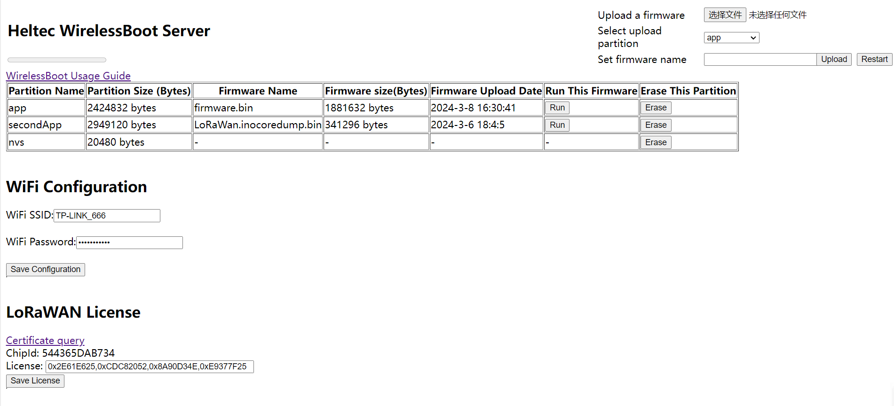
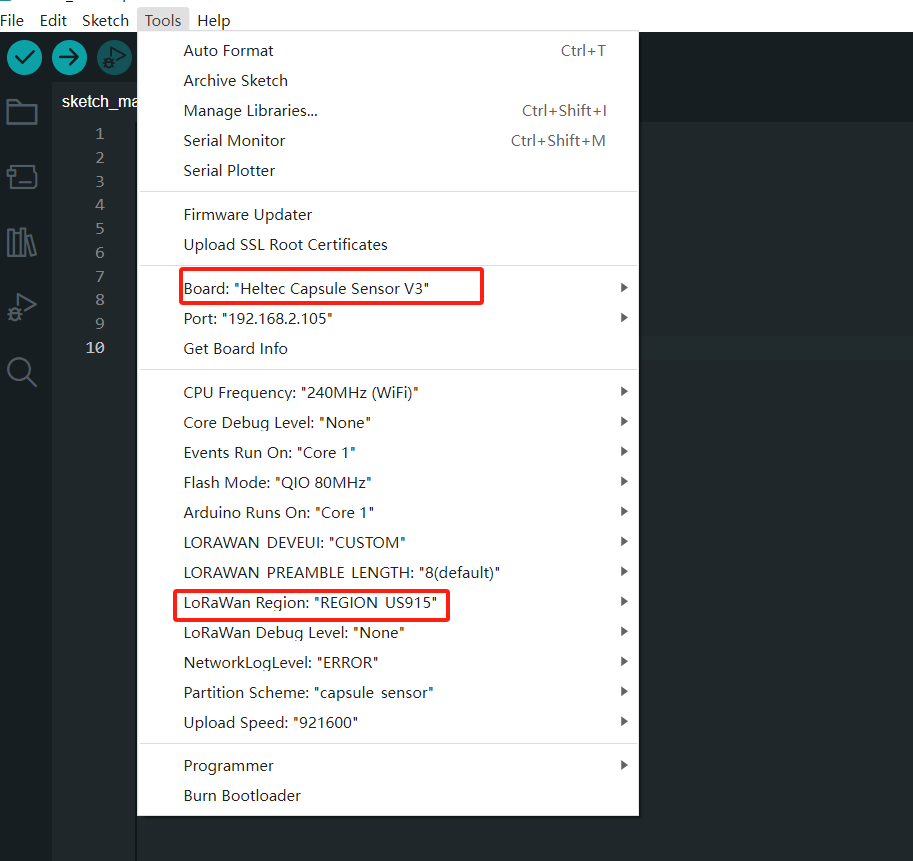

Quick Start

{ht_translation}`[简体中文]:[English]`

CapSule Sensor V3 uses Wireless Boot to download firmware, exchange information, and print logs through WiFi. 

## Run Wireless Boot
1. Long press the indicator light of the device for 16 seconds until the Blue light of the device is always on.


2. Find "WirelessBoot_xxxx" on your PC and connect, the password is "heltec.org".


3. Enter `192.168.4.1` in your browser to navigate to the WirelessBoot configuration page.



```{Tip} Although you can connect directly to the Capsule's AP hotspot for uploading, this approach is simpler, but may lack stability. Connecting the PC and the capsule to the same LAN is the more stable mode of operation.

```

4. Enter the WiFi account and password, click `Save Configuration`.


5. Connect your computer to the LAN where the Capsule V3 is located.

## Upload Firmware (Secondary Development)

- [Via Arduino](via-arduino-capsule)
- [Via Local File](via-local-file-capsule)

(via-arduino-capsule)=
### Via Arduino
[Arduino](https://www.arduino.cc/) is the one we recommend, and Heltec provides a dedicated development environment, which you can install by following this link: [Heltec ESP32 DEV-Environment](https://docs.heltec.org/en/node/esp32/esp32_general_docs/quick_start.html).

``` {Tip} Make sure the node is in wireless boot mode and that the computer and the node are connected to the same local area network.

```

1. Open the Arduino and click the `Tools` option. In the `Port` option, find **esp32s3_xxxx** and select it. 


```{Tip} If you can't find such an port, restart the Arduino and check whether your device is connected to the same LAN as the computer.

```

3. `Board` select **Heltec Cupsule Sensor V3**; `LoRa Region` select the frequency band corresponding to the device.

   

4. Select the sample code and upload it.


### Via Local File
``` {Tip} Make sure the node is in wireless boot mode and that the computer and the node are connected to the same local area network.

```

1. Type the router address in the browser, find the IP of the Capsule Sensor V3.


2. Enter the Capsule-V3 IP in your browser to navigate to the WirelessBoot page.


3. Erase the original firmware.


4. Select the local firmware package.


5. Select the partition and upload it.


``` {Tip} Notice the progress bar at the top left, please upload one firmware before uploading another.

```
``` {Tip} Note the size of the capacity of each partition, do not allow the uploaded firmware size to exceed the capacity of the partition.

```


