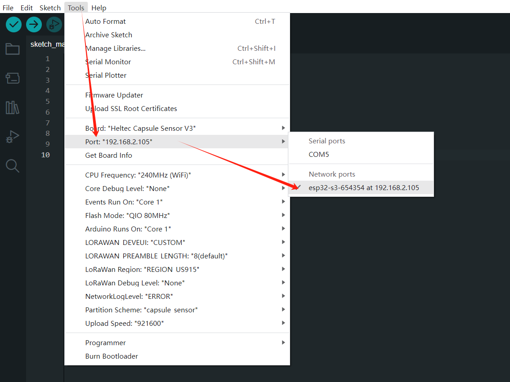
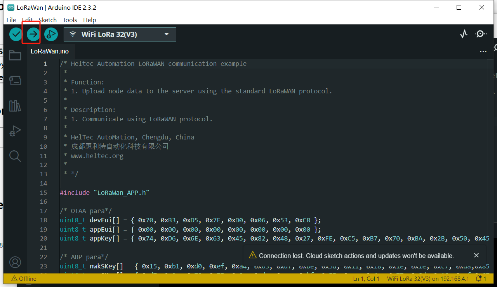

# Secondary development via Arduino

{ht_translation}`[简体中文]:[English]`

## Preparation
1. Install [Heltec Esp32 specific development frameworks and libraries](https://docs.heltec.org/en/node/esp32/quick_start.html)

``` {Tip} The library also supports the ESP32 official development framework.
```

2. Capsule Sensor V3 enters the WirelessBoot mode. Ensures that the WiFi of the Capsule and your computer in the same LAN.
    - [How to enter WirelessBoot mode](https://docs.heltec.org/en/node/esp32/capsule_sensor_v3/wireless_boot.html)


## Uploading demo code
1. Long press the indicator light of the device for 8 seconds until the Blue light of the device is always on.

``` {Note} Some early devices may require a regular press of 16 seconds.
```


2. Open the Arduino and click the `Tools` option. In the `Port` option, find **esp32s3_xxxx** and select it. 



```{Tip} If you can't find such a port, restart the Arduino and check whether your device is connected to the same LAN as the computer.
```

3. `Board` select **Heltec Cupsule Sensor V3**.


``` {Tip} Some special code here will also have other options to select, such as the LoRaWAN demo, you need to set the LoRa Region to the corresponding frequency.
```

4. Select a demo code.


5. Click `Upload` to upload the code.



