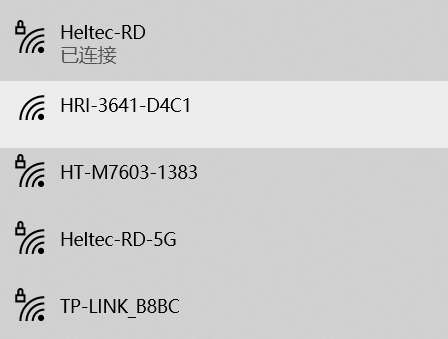
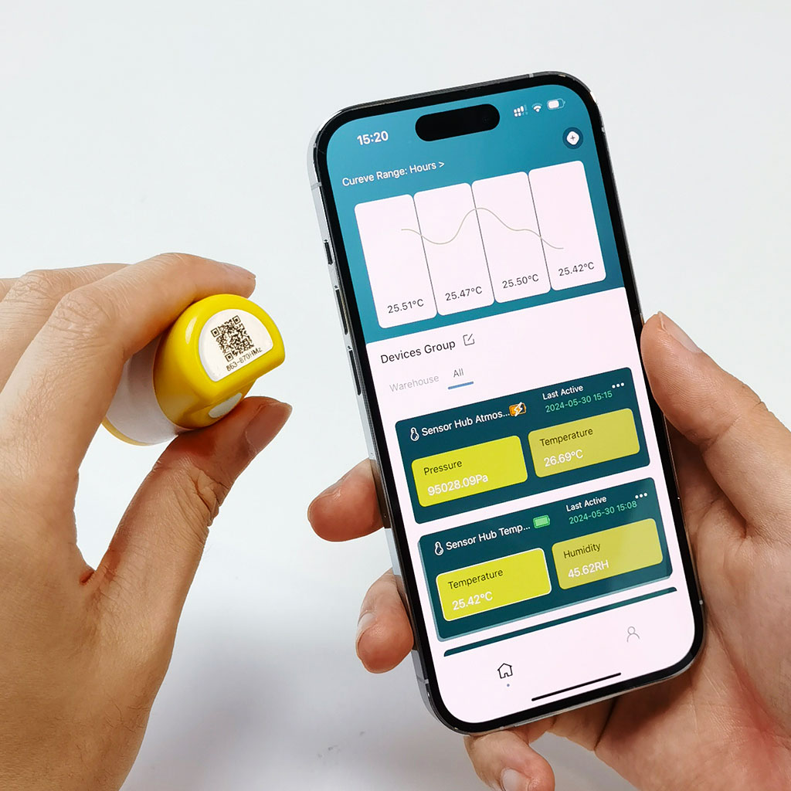
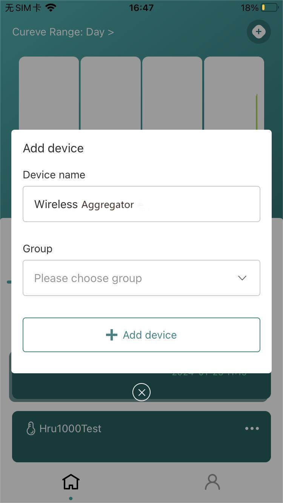
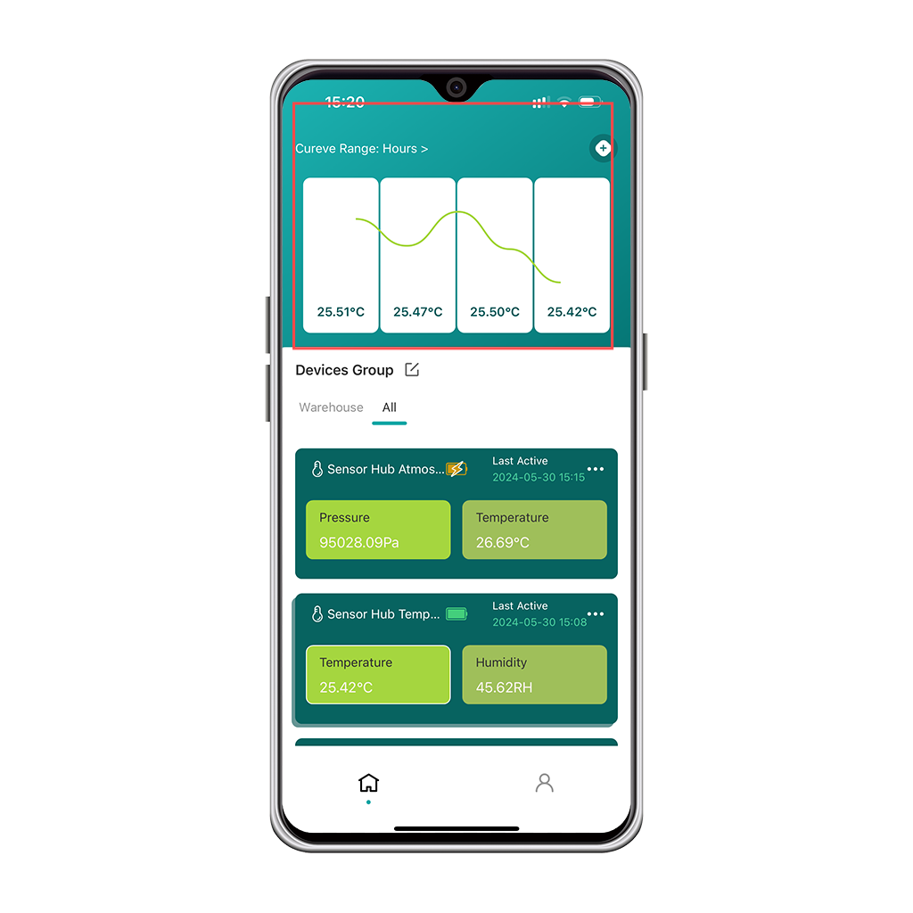

# LoRaWAN

{ht_translation}`[简体中文]:[English]`

This topic describes how to quickly get started with the LoRaWAN version of Capsule Sensor V3.

If you accidentally erase the code, please refer to the WirelessBoot theme: [How to refresh the firmware](https://docs.heltec.org/en/node/esp32/capsule_sensor_v3/wireless_boot.html).

[Capsule Sensor V3 LoRaWAN Firmware Download.](https://resource.heltec.cn/download/Heltec%20Capsule%20Sensor%20V3/LoRaWAN_firmware)

## Power On
Hold the button for 3 seconds until the white light comes on, then release the button.


------

## Configuration
1. Press the key three times quickly until the white LED and the blue LED light up at the same time and start flashing quickly. At this time, the device enters the configuration mode.

2. Use your phone or computer to search for the device's WiFi hotspot: HRI-3641_XXXX. Connect to this WiFi with the password: Heltec.org.

3. Once the connection is successful, visit 192.168.4.1 in your browser.

   

4. The parameters are described as follows:

   | Parameters  | Description                                                  |
   | ----------- | ------------------------------------------------------------ |
   | REGION      | LoRaWAN band, which must be consistent with the gateway      |
   | CLASS       | Working mode, support Class_A or Class_C                     |
   | OTAA/ABP    | Network access mode                                          |
   | ADR         | Data rate adaptation                                         |
   | DR          | Data rate                                                    |
   | Confirm     | Uplink message received confirmed                            |
   | DEVEUI      | A 64 bit extended unique identifier for your end device.     |
   | APPEUI      | AppEUl (JoinEUI) is a 64 bit extended unique identifier used to identify the Join Server during activation. |
   | APPKEY      | An end device specific encryption key used during OTAA to derive the AppSKey (in LoRaWAN 1.1x) or both the NwkSKey and AppSKey in LoRaWAN 1.0x |
   | Channel     | LoRaWAN channel                                              |
   | Interval(S) | LoRaWAN transmission interval                                |
   | Retry       | Number of retransmission attempts by LoRaWAN                 |
   | Product     | Product model                                                |
   | Firmware    | Firmware version                                             |
   | Battery     | Battery level                                                |
   | Charge      | Whether to charge                                            |

   5. Once configured, click `Summit` to submit. Press the device button, the white light will blink once, the device has started to work.

```{Note} The device has no action in configuration mode and will restart automatically after 10 minutes.
```

------

## Connecting to the server

Before that, make sure your lora gateway is registered with the relevant server and is working well.

We highly recommend the following three gateways:

[HT-M02](https://heltec.org/project/ht-m02-v2/)  [HT-M01S](https://heltec.org/project/ht-m01s-v2/)  [HT-M7603](https://heltec.org/project/ht-m7603/)

### Manual registration

When you are done in the configuration page, you can register the node with TTN/TTS, Chirpstack, SnapEmu, and other LoRaWAN servers by following this link: [Connect “ESP32 + LoRa” to LoRaWAN Server ](https://docs.heltec.org/en/node/esp32/esp32_general_docs/lorawan/connect_to_gateway.html)

### One-click scan registration
```{Note} Only devices with the LoRaWAN program already installed at the factory can use the one-click code scanning registration function. If you refresh your firmware, or modify device parameters, please use manual registration.
```

1. Install SnapEmu App. 

2. Open SnapEmu, click the `+` in the upper right corner, select `SCAN`.


3. Scan the device QR code. 



4. Fill in the device `group` and `Description`, then click `Add Device`.



5. Return to the APP home page and wait a few moments, the device is activated. Once the device has collected six data points, it can plot them by selecting hours, days, or weeks as units.



``` {Tip} Refresh the page method: Press and hold the area in the diagram to drop down. Once the device has collected six data points, it can plot them by selecting hours, days, or weeks as units.

```


