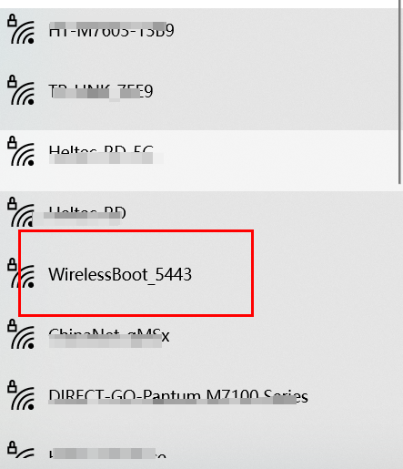
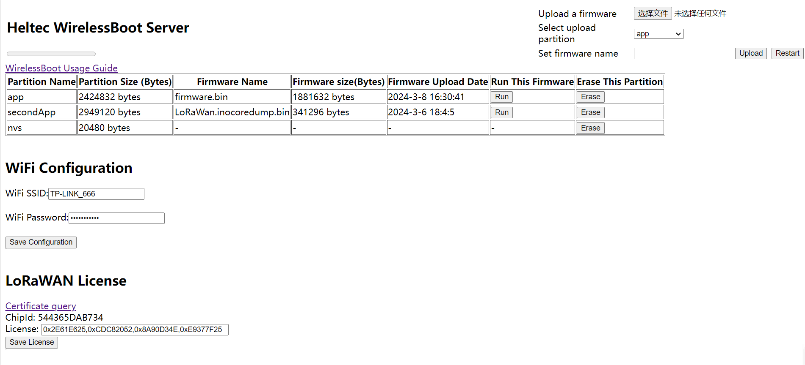
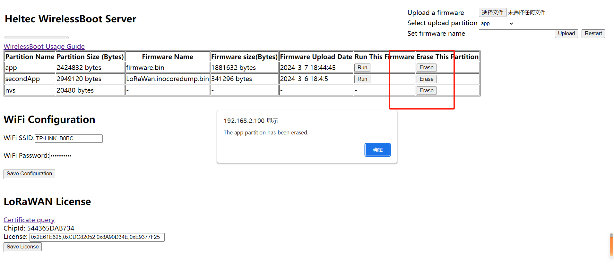
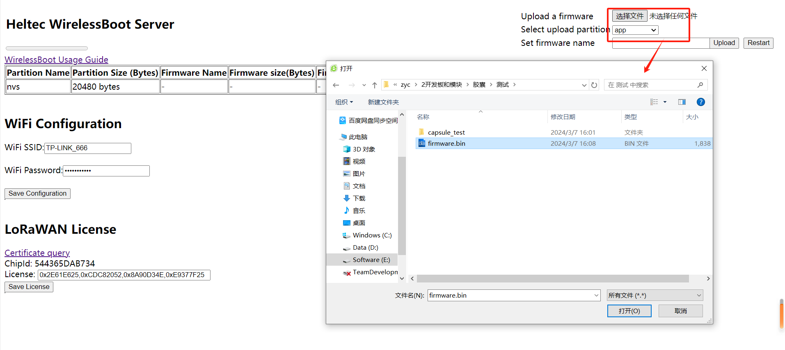
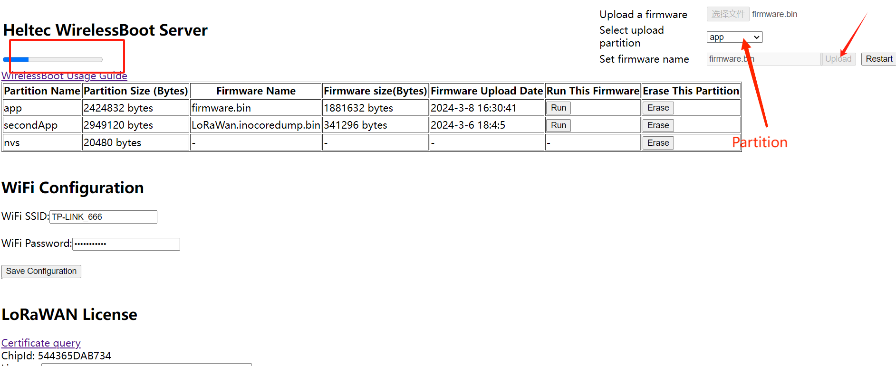
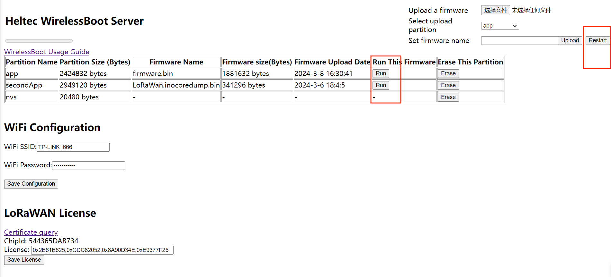
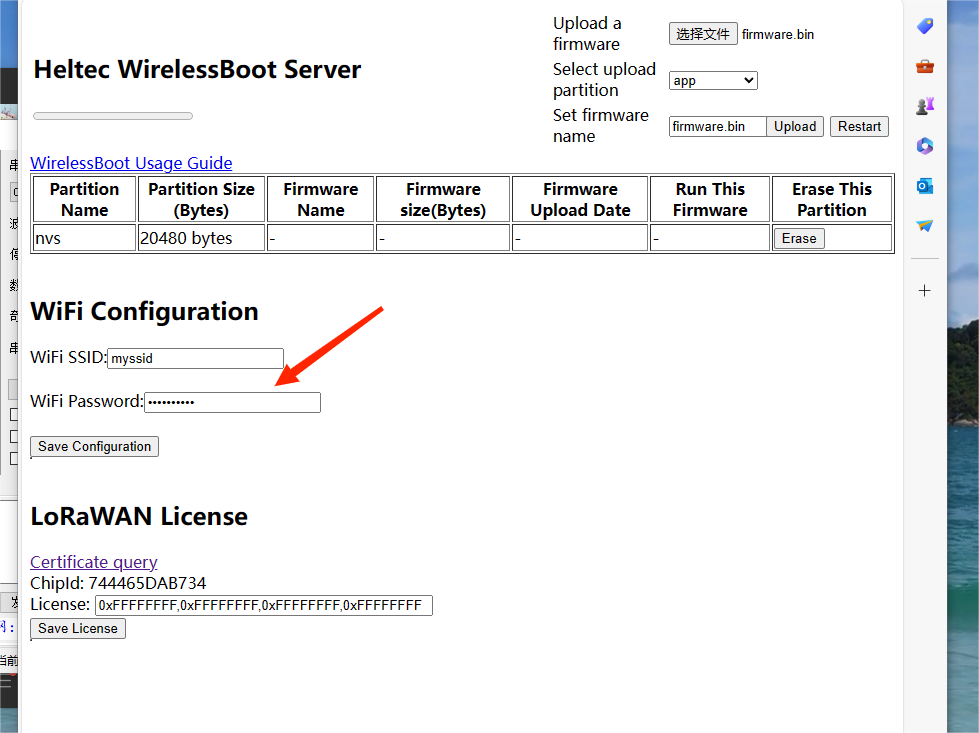
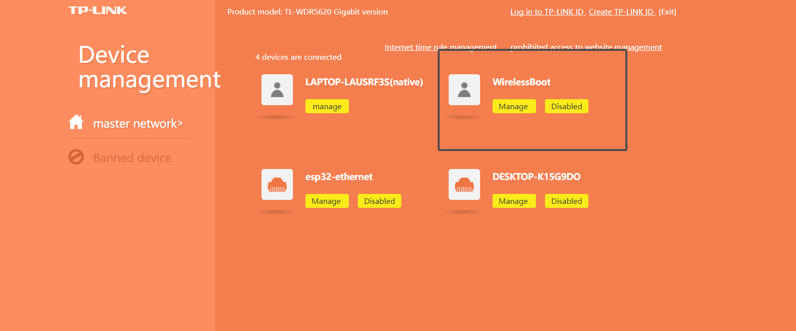

# WirelessBoot(Uploading Firmware)

{ht_translation}`[简体中文]:[English]`

Capsule Sensor V3 uses **WirelessBoot mode** to upload firmware, exchange information, and print logs through WiFi. For more details, please refer to this link: [WirelessBoot](https://docs.heltec.org/en/node/esp32/wireless_boot/index.html)

This topic describes how to enter WirelessBoot mode,and how to upload firmware in WirelessBoot mode.

## Enter WirelessBoot mode
1. Long press the indicator light of the device for 8 seconds until the Blue light of the device is always on.

``` {Note} Some early devices may require a regular press of 16 seconds.
```


2. Find "WirelessBoot_xxxx" on your PC and connect, the password is "heltec.org".



3. Visit `192.168.4.1` in your browser to navigate to the WirelessBoot configuration page.



(upload_firmware_via_local_file)=
## Uploading program
1. Erase the original firmware.



2. Select the local firmware package.



3. Select the partition and upload it.



``` {warning} The progress bar at the top left, please upload one firmware before uploading another.
```

``` {warning} The size of the capacity of each partition, do not allow the uploaded firmware size to exceed the capacity of the partition.
```

``` {warning} The name of the firmware should not be too long, otherwise it will not be uploaded.
```

4. After the upload is complete, click `Run`,  then `Restart`.

   

## More stable uploads

Although you can connect directly to the Capsule's AP hotspot for uploading, this approach is simpler, but may lack stability. Connecting the PC and the capsule to the same LAN is the more stable mode of operation.

1. In WirelessBoot mode, type the WiFi account and password, click `Save Configuration`.



2. Connect your computer to the LAN which the Capsule V3 is located.

3. After your device enters WirelessBoot mode,  visit the router address in the browser, find the IP address of the Capsule-V3(WirelessBoot).



4. Visit the Capsule-V3 IP in your browser to navigate to the WirelessBoot page.


5. Now you can upload the code for the device:
   - [Upload Firmware Via Local File](upload_firmware_via_local_file)
   - [Programming via Arduino](https://docs.heltec.org/en/node/esp32/capsule_sensor_v3/programming_via_arduino.html)

