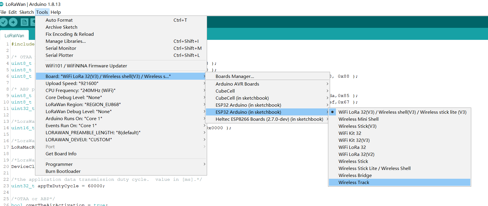
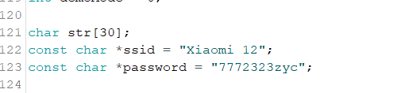
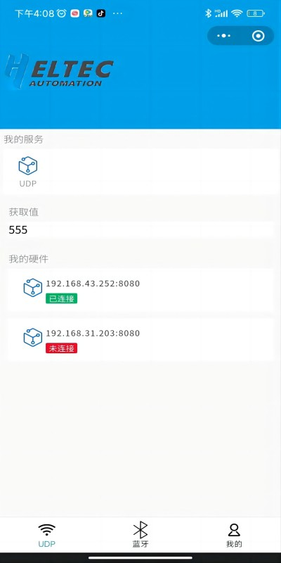
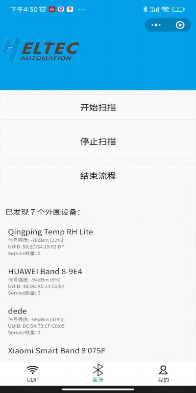

# Wireless Refresh

{ht_translation}`[简体中文]:[English]`

## Summary

Users can operate **Wireless Paper** via Bluetooth, Wi-Fi and LoRa.
This topic aims to describe a wireless refresh example: use WiFi and Bluetooth to refresh via wechat mini program. 
The APP is currently in beta, we will complete it soon.

## Example: Wireless refresh via APP

### Premise

+ Confirm whether the `USB driver` , `Git` and `Arduino IDE` has been installed correctly. If not, please refer to this two articles [establish serial connection](https://docs.heltec.org/general/establish_serial_connection.html) and [Install Git and Arduino IDE](https://docs.heltec.org/general/how_to_install_git_and_arduino.html).

+ Confirm that The Heltec ESP32 development environment is installed, please refer to[ESP32+LoRa Quick start](https://docs.heltec.org/en/node/esp32/quick_start.html).

### Downloading the program

Open `Arduino IDE` , click `tool`, select the development board model, port, RF parameters, etc. As shown below

Use `Arduino IDE` to open the example we provided or any other program that works, as shown below.Fill in the name and password of WIFI 
in the red box, **The device for WiFi refresh must be connected to the same WiFi as the development board**.

Click `uplaod`.

### Refresh via APP

Once the program is downloaded, Open the wechat mini program and find the name `就彻底`.

+ Via WiFi: Select "UDP", click `UDP`, enter the IP address and port of your device (it can be printed in the serial port),  click to connect. Enter what you want to refresh in `获取值`, click the device you want to refresh below.Wait a moment, refresh completed.

+ Via Bluetooth: Select "蓝牙", click "开始扫描", find the device and connect, after success, you can enter the content you want to refresh.

