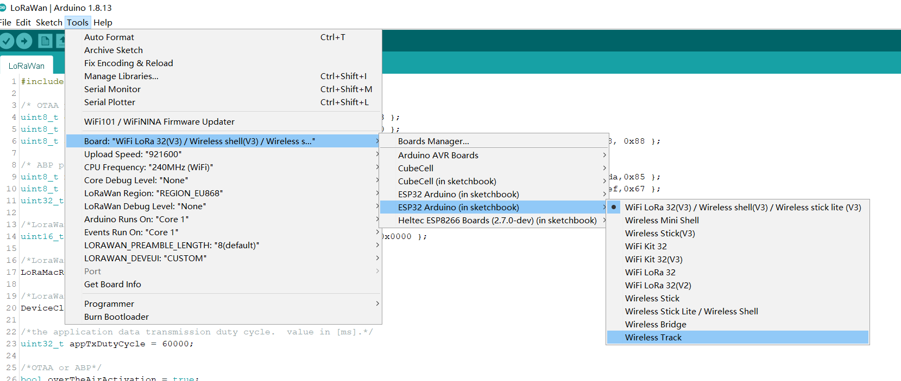
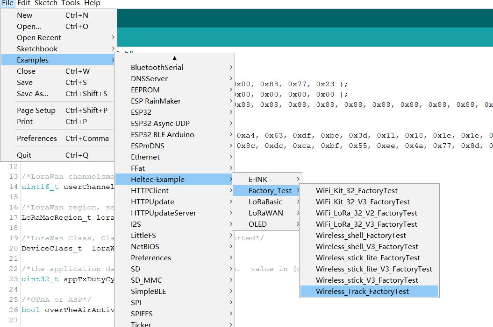
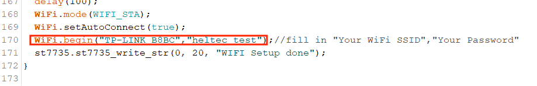

# Wireless Tracker Example Manual

{ht_translation}`[简体中文]:[English]`

## Summary

Wireless Tracker is a development kit based on ESP32-S3FN8. It integrates both SX1262 and UC6580 to provide fast GNSS solution for IoT. Collaborate with the sample programs and development tools we provide, you can track any object and then upload that data wirelessly by Wi-Fi, Bluetooth, LoRa.

The Heltec ESP32 development environment already contains the basic code. For the special codes related to the Heltec ESP32 development board, please refer to: [https://github.com/Heltec-Aaron-Lee/WiFi_Kit_series/tree/master/esp32/libraries/Heltec-Example](https://github.com/Heltec-Aaron-Lee/WiFi_Kit_series/tree/master/esp32/libraries/Heltec-Example) .


&nbsp;

## Example


```{Tip} Confirm whether the `USB driver` , `Git` and `Arduino IDE` has been installed correctly. If not, please refer to this two articles [establish serial connection](https://docs.heltec.org/general/establish_serial_connection.html) and [Install Git and Arduino IDE](https://docs.heltec.org/general/how_to_install_git_and_arduino.html).

```

```{Tip} Confirm that The Heltec ESP32 development environment is installed, please refer to[ESP32+LoRa Quick start](https://docs.heltec.org/en/node/esp32/quick_start.html)

```

Open `Arduino IDE` , click `tool`, select the development board model, port, RF parameters, etc. As shown below



Follow the path below to find the program and upload it.



Enter your WIFI account and password in the red box below.



This is a test program, after the download is complete, the screen will display some basic information about the development board, long press the `User` key and you can see the screen showing your current location.
