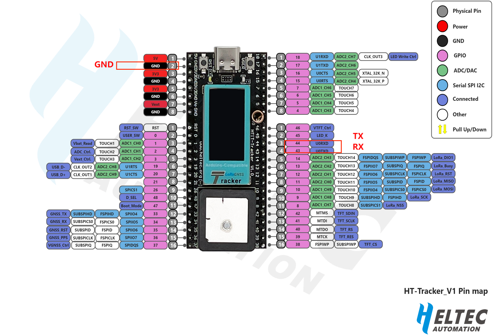

# Wireless Tracker Quick Start
{ht_translation}`[简体中文]:[English]`

Wireless Tracker integrates ESP32+LoRa+GNSS, and its quick start can refer to the ESP+LORA series: [Heltec ESP32+LoRa Series Quick Start](https://docs.heltec.org/en/node/esp32/quick_start.html).

&nbsp;

On **special occasions**, some of the current data of the development board may not be directly printed through the USB interface. Therefore, we recommend you to install a USB to serial port module ( [UART-programer](https://heltec.org/product/uart_programmer/) ).

While the device is connected to USB, the RX/TX/GND pins of the [UART-programer](https://heltec.org/product/uart_programmer/) are connected to the 43/44/GND pins of the development board, respectively.Then print the data you want through the UART interface.

