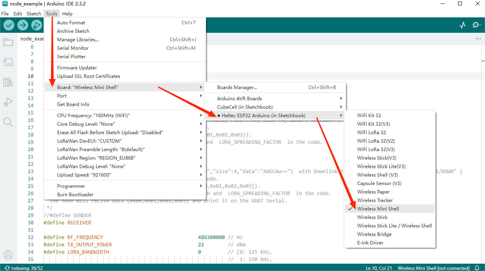
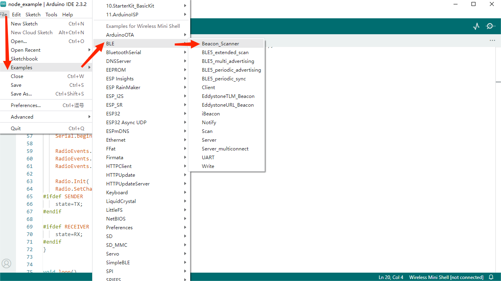
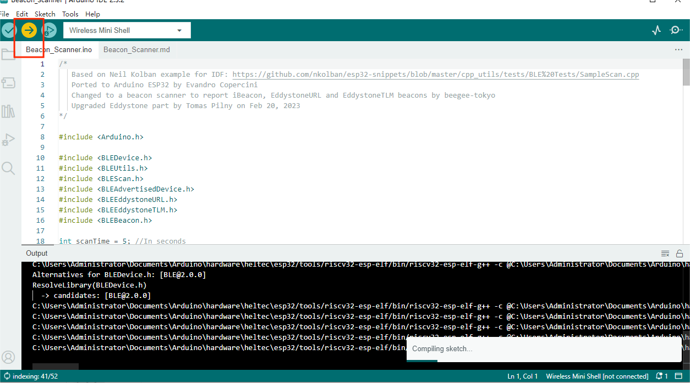

# Example Manual

{ht_translation}`[简体中文]:[English]`

## Precondition

Make sure you have installed **Heltec ESP32 development framework** and **Heltec ESP32 library** successfully. If you don't have it installed, please refer[ESP32 series QuickStart](https://docs.heltec.org/en/node/esp32/esp32_general_docs/quick_start.html#).

 **Heltec ESP32 development framework**  already contains the basic code.

 **Heltec ESP32 library**  contains lora related code, factory test code, and some corresponding extensions.

## Example

Open `Arduino IDE` , click `tool`, select `Board`, `Port` . ESP32-C3 should select Wireless Mini Shell, As shown below：

Follow the path below to find the demo code.

Open and upload it.

Some special code is in Heltec Esp32 Lib.

