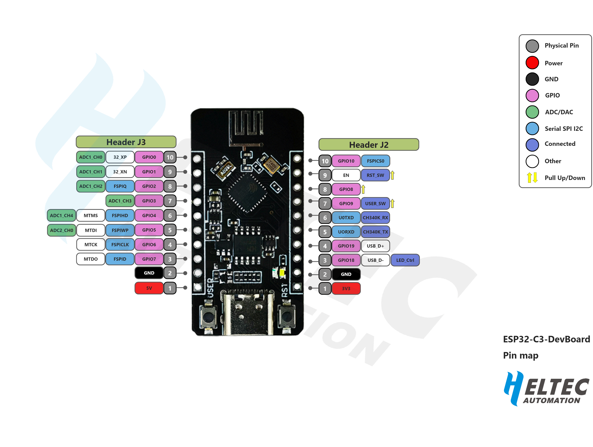

Heltec ESP32-C3
===============
:ht_translation:`[简体中文]:[English]`

ESP32-C3FN4 is a 32-bit microprocessor based on RISC-V architecture. It is a very low-power and high-integration MCU system-level chip (SOC), 
integrating 2.4 GHz Wi-Fi and low-power Bluetooth (Bluetooth® LE) dual-mode wireless communication. Internal integration 4MB flash, contains SPI, I2C, UART, ADC, etc.

Related Resources
-----------------

.. toctree::
   :maxdepth: 1

   Datasheet <https://resource.heltec.cn/download/ESP32-C3_DevBoard/ESP32-C3_DevBoard(Rev1.1).pdf>
   Schematic diagram <https://resource.heltec.cn/download/ESP32-C3_DevBoard/ESP32-C3_DevBoard_Schematic_Diagram.pdf>
   Pin Map <https://resource.heltec.cn/download/ESP32-C3_DevBoard/ESP32%20C3_DevBoard.png>

Get Start
---------

.. toctree::
   :maxdepth: 1

   Framework and libraries installation <../quick_start>
   Running example code<example>

Heltec General Docs
-------------------
-->[General Docs]<-- <https://docs.heltec.org/general/index.html>
    
