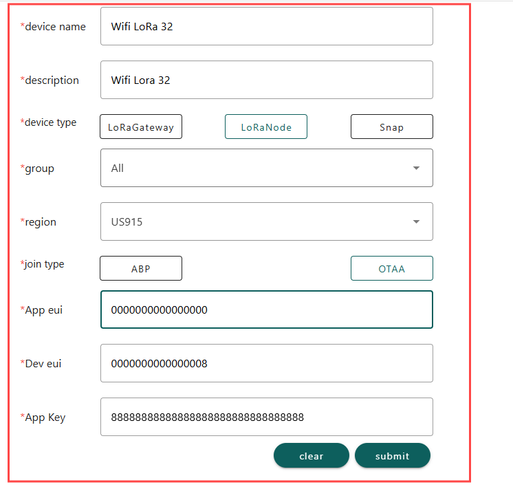
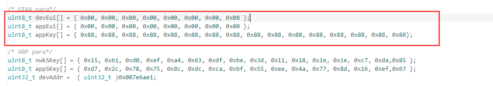
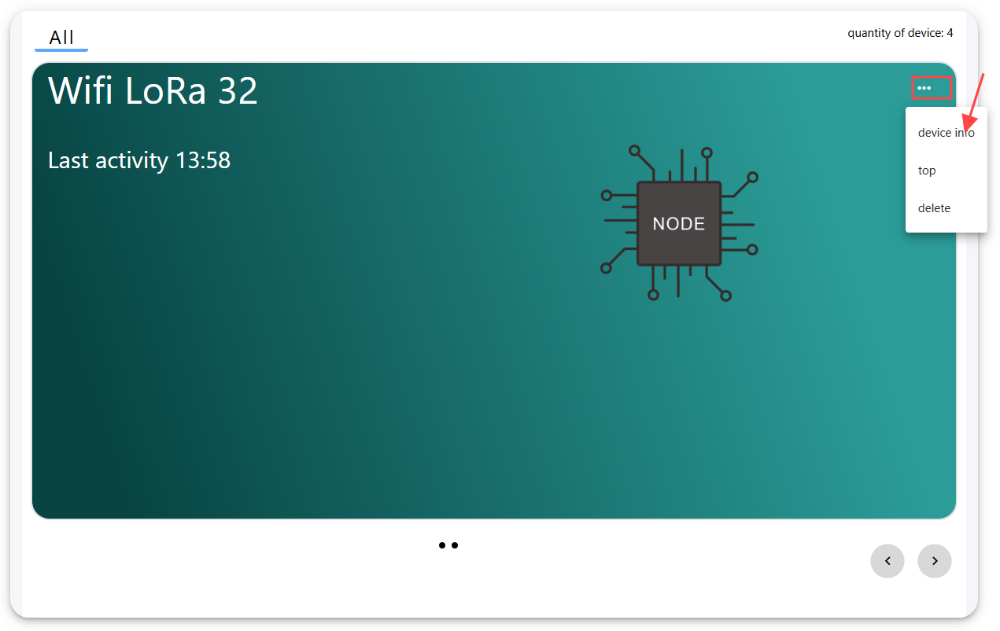
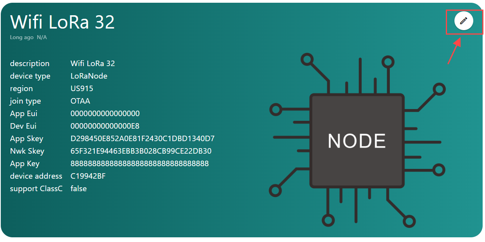
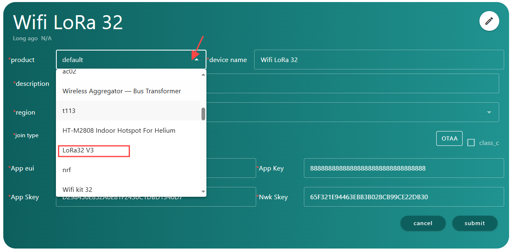

# Heltec WiFi LoRa 32 V3  Connect  to Snapemu

## Register a LoRa Node in Snapemu

*User log in to [Snapemu](https://platform.snapemu.com/dashboard/) by using their Heltec website account.* 

*User successfully logs in, this interface will be displayed.* 

*Registering the device, click where shown below.*

*Fill in configuration information on this interface and submit it after completion.*

   - `device name` and `description` can be filled in freely, and they will become the name and remark of the device displayed on the platform. 
   - `group` denotes the grouping of the device on SnapEmu.
   - `Device type` This device is a node, so choose "LoRaNode".
   - `Region` Match the frequency band of the LoRaNode.
   - `jointype`  All choose OTAA mode
   - `Appeui` and `Deveui`  and `AppKey`   need to match the LoRaWAN code, which can be customized by the user. When registering, only the numerical value needs to be filled in. 

*After running the lorawan code, the device will be automatically activated, and if everything goes smoothly, it will be as shown in the figure. Then click here to select the corresponding product image.*

The final result will be as shown in the figure.

