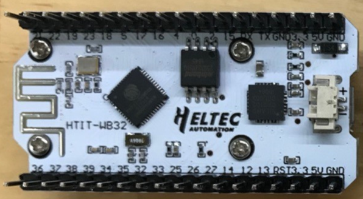
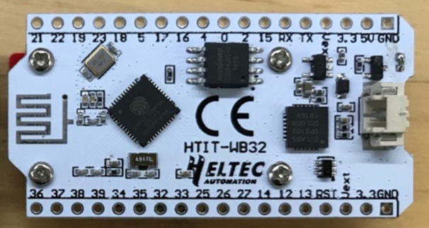
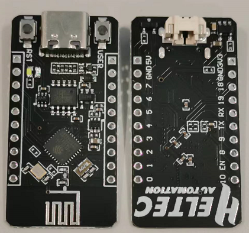

# Hardware Update Logs

{ht_translation}`[简体中文]:[English]`

## Wifi Kit 32  Hardware Update Logs

### V1

- First release
- 2017-06-01 public sale

- [Pinout diagram for V1](http://resource.heltec.cn/download/WiFi_Kit_32/WIFI%20Kit%2032_pinoutDiagram_V1.pdf)
- [Schematic diagram for V1](http://resource.heltec.cn/download/WiFi_Kit_32/WIFI_Kit_32_Schematic_diagram_V1.PDF)

&nbsp;

### V2

- 2019-05 public sale;
- Fixed charging status (orange LED) blinking problem;
- 4MB (32M-bits) FLASH upgrade to 8MB (64M-bits) FLASH;
- Better 2.4GHz antenna design and impendence matching;
- Basic low power design (800uA in deep sleep);
- Add battery power detection circuit. Use ADC2_4 (GPIO 13) to read battery voltage;
- Add Vext power output pin, users can use this pin to drive some external device (sensor, motor etc.), when system need into deep sleep mode, Vext can be turn off. **This pin was controlled by GPIO21, for example:**

  - Turn ON: `digitalWrite(21, LOW);`

  - Turn OFF: `digitalWrite(21, HIGH);`
- Circuit optimization, system more stable;
- Better power manage system design.
- [Pinout diagram for V2](http://resource.heltec.cn/download/WiFi_Kit_32/WIFI_Kit_32_pinoutDiagram_V2.pdf);
- [Schematic diagram for V2](http://resource.heltec.cn/download/WiFi_Kit_32/WIFI_Kit_32_Schematic_diagram_V2.pdf);

&nbsp;

### V2.1

- 2019-10 public sale;
- Fix battery voltage read can't work together with Wi-Fi bug, change battery voltage reading pin to GPI37 (use ADC1_1), please refer to this example: [ADC_Read_Voltage/Battery_power](https://github.com/HelTecAutomation/Heltec_ESP32/blob/master/examples/ESP32/ADC_Read_Voltage/Battery_power/Battery_power.ino).
- [Pinout diagram for V2.1](https://resource.heltec.cn/download/WiFi_Kit_32/WIFI_Kit_32_pinoutDiagram_V2.1.pdf);
- [Schematic diagram for V2.1](https://resource.heltec.cn/download/WiFi_Kit_32/WIFI_Kit_32_Schematic_diagram_V2.1.PDF);

### V3

- 2022-09-15  public sale
- MCU is changed from ESP32-D0WDQ6 to ESP32-S3FN8. Specific differences of MCU are shown in：[https://products.espressif.com/#/product-comparison](https://products.espressif.com/#/product-comparison).
- USB interface changed from Micro USB to Type-C.
- The size, appearance, pin layout and power pins remain unchanged, but the GPIO sequence has changed. Please refer to [Pinout diagram](https://resource.heltec.cn/download/WiFi_Kit_32_V3/HTIT-WB32_V3.png).
- [Pinout diagram of V3](https://resource.heltec.cn/download/WiFi_Kit_32_V3/HTIT-WB32_V3.png).
- [Schematic diagram of V3](https://resource.heltec.cn/download/WiFi_Kit_32_V3/HTIT-WB32_V3_Schematic_Diagram.pdf).

&nbsp;

## ESP32-C3 Hardware Update Logs

### V1

- First release
- 2022-09-15 public sale

- [Pinout diagram for V1](https://resource.heltec.cn/download/ESP32-C3_DevBoard/ESP32%20C3_DevBoard.png)
- [Schematic diagram for V1](https://resource.heltec.cn/download/ESP32-C3_DevBoard/ESP32-C3_DevBoard_Schematic_Diagram.pdf)
