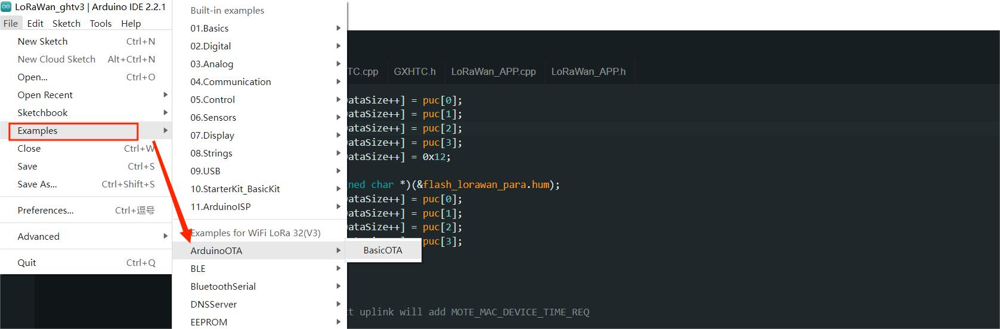

# Heltec ESP32 Extended Library
{ht_translation}`[简体中文]:[English]`

This article describes the installation of the Heltec ESP32 extended library.

[Heltec ESP32 Library](library)  contains extended examples such as **LoRa/LoRaWAN related examples**, **factory test code**, **display related example code**, **Sensor example code**, **GPS example code**, and more.

## Required Framework
The framework the library depends on, you can choose any of them:

- [Heltec ESP32 Frame Work 3.0.2](installing_development_framework_and_library) 
- [espressif/arduino-esp32 at 3.0.2](https://github.com/espressif/arduino-esp32/tree/3.0.2)

Framework already includes a lot of basic sample code, such as WIFI, BLE, I2C, SPI, HTTP, etc.

``` {warning} Framework v3.0.0 and Library v2.0.0 are updated together, Older frameworks and libraries are no longer applicable to the new ones.
```

## Installation
**There are two methods to install the library, choose one of they:**

- [Via Arduino IDE](esp32-via_arduino_ide)
- [Via Git](esp32-via_git)

(esp32-via_arduino_ide)=

### Via Arduino IDE

 Click on the `Library Manager` icon on the left side, search for "HELTEC ESP32", select the latest version and install

  

--------

(esp32-via_git)=

### Via Git

You can refer to this link:

- [Heltec ESP32 Series Library](https://github.com/HelTecAutomation/Heltec_ESP32)

  Follow the instructions in the `Readme.MD` to install.

## How to use
1. Connect your node to the computer with a USB cable.

2. Open Arduino IDE, Correctly select a board and relevant options in the `Tools` menu:


3. Then select an example.



4. To execute the code in a library, you need to mouse over, scroll down, find the library, and find the code in it.


5. Compile & Upload


``` {tip} If you cannot upload the code, please manually enter the BOOTLOADER mode: hold down the PRG (USER/BOOT) key and do not release it, press the RST key once, and then release the PRG (USER/BOOT).
```