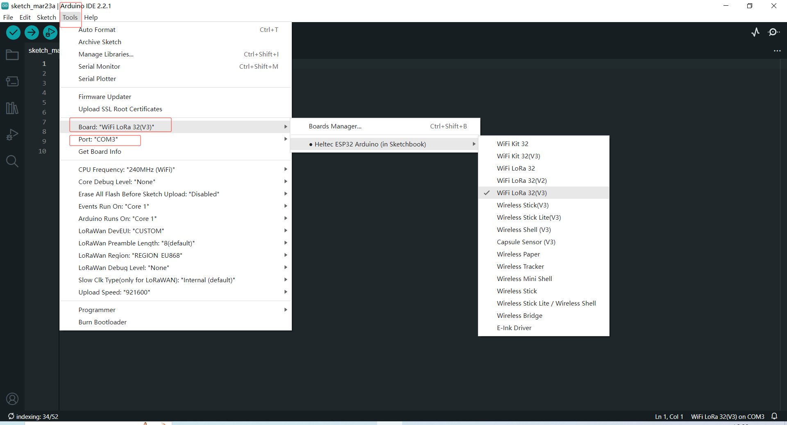
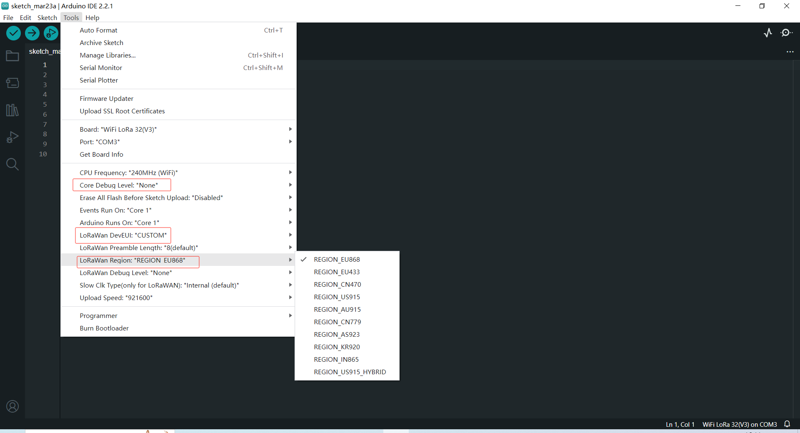
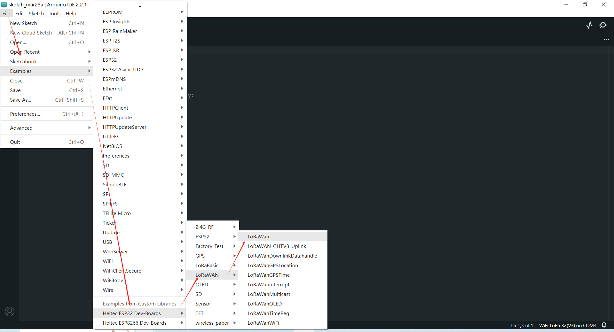
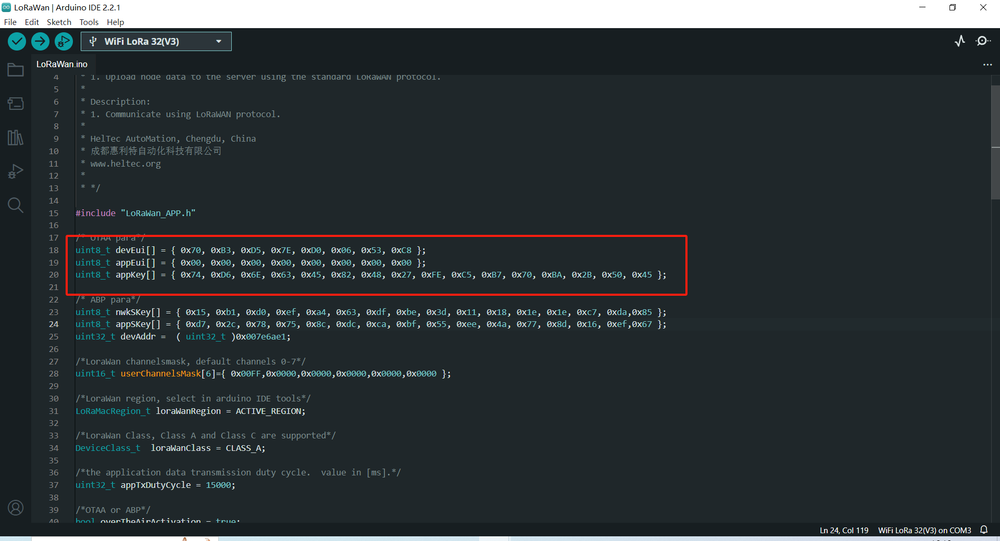
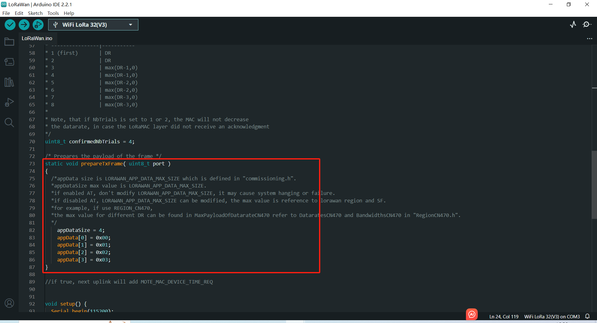
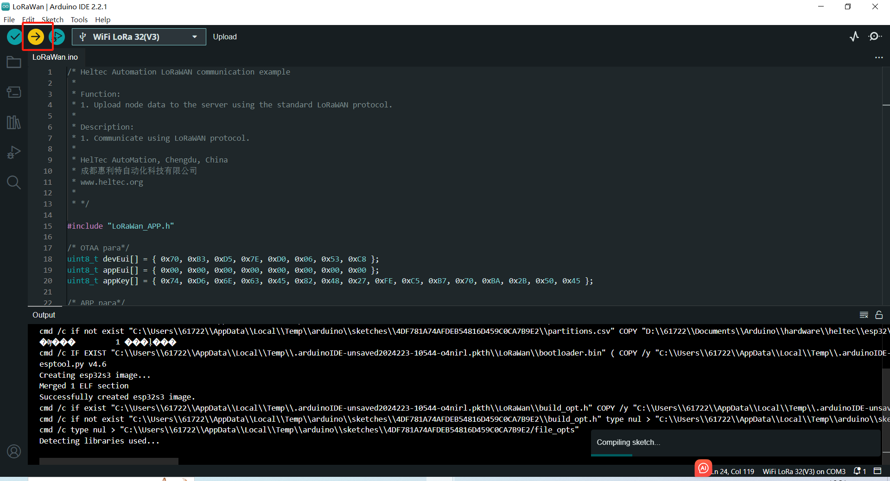

# "ESP32 + LoRa" Preparation & Config Parameters
{ht_translation}`[简体中文]:[English]`

## Preparation
1. Install Arduino IDE. How to install please click [here](https://docs.heltec.org/general/how_to_install_git_and_arduino.html).
2. Install [Heltec ESP32 series Arduino development framework](https://github.com/Heltec-Aaron-Lee/WiFi_Kit_series).  Installation manual  please refer to [here](https://docs.heltec.org/en/node/esp32/quick_start.html).
3. Install [Heltec_ESP32 Library](https://github.com/HelTecAutomation/Heltec_ESP32).
4. An [ESP32 + LoRa node](https://heltec.org/product-category/lora/lrnode/esp32-lora/).
5. High quality USB cable. 

## Configure Parameters
1. Connect the development board to the computer through USB data cable.

2. Open the Arduino and in the `Tools` option, select the appropriate `Board`, `Port`.



3. In `Tools` option, `Board`, `Upload Speed`, `CPU Frequency`, `Core Debug Level`, `PSRAM` are ESP32 chip's normal option, just keep default. Special notice the `LoRaWan Region`, `LoRaWan Debug Level`, `LoRaWANDEVEUI`.



  - **LoRaWan Region** -- LoRaWAN protocol region definition, strictly follow [LoRaWAN™ 1.0.2 Regional Parameters rB](https://resource.heltec.cn/download/LoRaWANRegionalParametersv1.0.2_final_1944_1.pdf);
  - **LoRaWan Debug Level** -- Messages printed via serial.
    - None -- Default;
    - Freq -- Uplink/downlink frequency;
    - Freq && DIO -- Uplink/downlink frequency and DIO interrupt information;
    - Freq && DIO && PW -- Uplink/downlink frequency, DIO interrupt information and low power status.
  - **LORAWAN_DEVEUI** -- LoRaWAN Device EUI generate method
    - CUSTOM -- Defined by the user in the DevEui array of the code, 8 bytes;
    - Generate By ChipID -- Generated according to the Chip ID of the chip. Selecting this option will override the setting in the DevEui array in the code.

4. Follow the path shown below to open the LoraWAN demo code.



5. Fill in **DevEu** **AppEui** **AppKey** in the following figure in the red box in the example format, which will be used in the website registration.



  - DevEui -- Mote device IEEE EUI (big endian), 8 bytes;
  - AppEui -- Application IEEE EUI (big endian), 8 bytes;
  - AppKey -- AES encryption/decryption cipher application key, 16 bytes;

```{Tip} This example uses the OTAA pattern as an example, and for the differences in the ABP pattern, please refer to this link: [ABP mode](https://docs.heltec.org/general/lorawan_abp/config_parameter.html)
```

6. Effective load is here.



``` {Note} Print too much messages may cause the system unstable.
```

7. Other relevant parameters are in the `.ino` file, You can come back to it after you know lorawan well.

8. Click `Upload` to upload the code.



