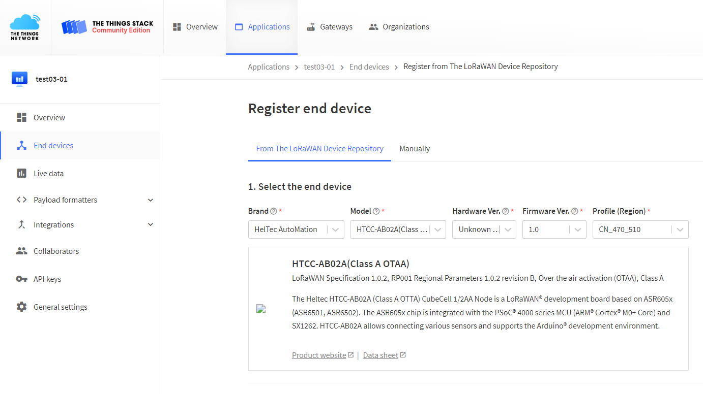

# Connect "ESP32 + LoRa" to LoRaWAN Server
{ht_translation}`[简体中文]:[English]`

## Preparation
1. A ESP32 + LoRa node that's configured and uploaded code, as described in the previous topic:: **[“ESP32 + LoRa” Node Preparation & Config Parameters](https://docs.heltec.org/en/node/esp32/lorawan/config_parameter.html)**
2. A LoRa server, We recommend the following three:
    - [TTN/TTS](https://console.thethingsnetwork.org/)
    - [ChirpStack](https://www.chirpstack.io/)
    - [SnapEmu](https://platform.snapemu.com/)

3. A Gateway that matches the **LoRaWAN region** of the node, and already is connected to the lora server. If you are using Heltec Gateway, you can find out how to connect to the server in the [Heltec Gateway documentation](https://docs.heltec.org/)

## Connect to LoRaWAN Server

Before that, make sure there is a LoRa Gateway active in your server.

- [Connect to TTN/TTS](connect-to-ttn)
- [Connect to ChirpStack](connect-to-chirpstack)
- [Connect to SnapEmu](connect-to-snapemu)

(connect-to-ttn)=
### Connect to TTN/TTS

Register a new device in TTN or TTS “Applications” page. Select the corresponding Brand, Model, Hardware Version, Firmware Version, Region.

Select the frequency plan, and fill in the corresponding AppEUI, DevEUi, AppKey, and register the device.

After registration is complete, if all is well, you will see the device active.

(connect-to-chirpstack)=
### Connect to ChirpStack
Register a new device in ChirpStack’s “Applications” page. Enter the device name, description, DevEUI. Select Device-profile.

Enter the Application key of the device.

After registration is complete, if all is well, you will see the device active.

## Important Hints

Please double check the following two things:

1. The LoRaWAN parameters is the same as server!
2. The listening frequency of your LoRa Gateway is the same as ESP32 LoRa node's sending frequency. We strictly follow [LoRaWAN™ 1.0.2 Regional Parameters rB](https://resource.heltec.cn/download/LoRaWANRegionalParametersv1.0.2_final_1944_1.pdf);

