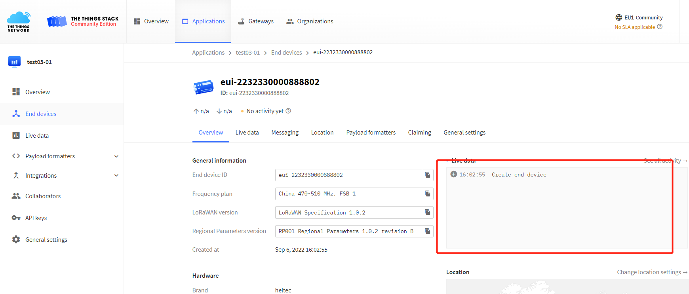

# Connect "ESP32 + LoRa" to LoRaWAN Server
{ht_translation}`[简体中文]:[English]`

## Preparation
1. A ESP32 + LoRa node that's configured and uploaded code, as described in the previous topic:: **[“ESP32 + LoRa” Node Preparation & Config Parameters](https://docs.heltec.org/en/node/esp32/lorawan/config_parameter.html)**
2. A LoRa server, We recommend the following three:
    - [TTN/TTS](https://console.thethingsnetwork.org/)
    - [ChirpStack](https://www.chirpstack.io/)
    - [SnapEmu](https://platform.snapemu.com/)

3. A Gateway that matches the **LoRaWAN region** of the node, and already is connected to the lora server. If you are using Heltec Gateway, you can find out how to connect to the server in the [Heltec Gateway documentation](https://docs.heltec.org/)

------

## Connect to LoRaWAN Server

Before that, make sure there is a LoRa Gateway active in your server.

- [Connect to TTN/TTS](connect-to-ttn)
- [Connect to ChirpStack](connect-to-chirpstack)
- [Connect to SnapEmu](connect-to-snapemu)

------

(connect-to-ttn)=
### Connect to TTN/TTS

1. Log in to the [TTS server web page](lora.heltec.org), register a new “Applications” .

    

2. Create application


3. You can freely fill in the Application information in the red box, and click `Creat application` when you're done.

   

4. Register an end device.

   

5. Choose `Enter end device specifics manually`, Select the frequency band corresponding to the node, 

   

6. The LoRaWAN version is chosen to be 1.0.2 B

   

   The `Show advanced activation, LoRaWAN class and cluster settings` option has some other LoRaWAN parameter Settings such as OTAA/ABP.CLASS A/C, these parameters default to OTAA and CLASS A, in general need to be consistent with the node Settings.

   

7. Fill in JoinEUI and click confirm.

   

   ``` {Tip} In code or some application products, JoinEUI is represented as AppEUI.
   ```

   

8. Fill in DevEUI and AppKey.

   

   ``` {Tip} The End device ID is automatically generated when you fill in DevEUI.
   ```

   

9. Click to register.


After registration is complete, if all is well, you will see the device active.



------

(connect-to-chirpstack)=
### Connect to ChirpStack
Register a new device in ChirpStack’s “Applications” page. Enter the device name, description, DevEUI. Select Device-profile.


Enter the Application key of the device.


After registration is complete, if all is well, you will see the device active.


------

(connect-to-snapemu)=

### Manual registration on snapemu
First of all, users should confirm whether the LoraWan program has been downloaded for Wifi Lora 32. If it has been downloaded, you can skip this step. If not, we will provide you with a download tutorial. 


1.Install Arduino IDE. How to install please click here.https://www.arduino.cc/en/software

2.Install Heltec ESP32 series Arduino development framework. Installation manual please refer to here.https://docs.heltec.org/en/node/esp32/esp32_general_docs/quick_start.html

3.Install Heltec_ESP32 Library.

4.An ESP32 + LoRa node.

5.High quality USB cable.

Configure Parameters

1.Connect the development board to the computer through USB data cable.

2.Open the Arduino and in the option, select the appropriate ToolsBoardPort

3.In option are ESP32 chip’s normal option, just keep default. Special notice the ToolsBoardUpload SpeedCPU FrequencyCore Debug LevelPSRAMLoRaWan RegionLoRaWan Debug LevelLoRaWANDEVEUI


*LoRaWan Region – LoRaWAN protocol region definition, strictly follow LoRaWAN™ 1.0.2 Regional Parameters rB;

*LoRaWan Debug Level – Messages printed via serial.

None – Default;

Freq – Uplink/downlink frequency;

Freq && DIO – Uplink/downlink frequency and DIO interrupt information;

Freq && DIO && PW – Uplink/downlink frequency, DIO interrupt information and low power status.
*
LORAWAN_DEVEUI – LoRaWAN Device EUI generate method

CUSTOM – Defined by the user in the DevEui array of the code, 8 bytes;

Generate By ChipID – Generated according to the Chip ID of the chip. Selecting this option will override the setting in the DevEui array in the code.

4.Follow the path shown below to open the LoraWAN demo code.


Compile & Upload


If everything goes well,this interface will be displayed.


5.Fill in DevEu AppEui AppKey in the following figure  in the example format, which will be used in the website registration.


*DevEui – Mote device IEEE EUI (big endian), 8 bytes;

*AppEui – Application IEEE EUI (big endian), 8 bytes;

*AppKey – AES encryption/decryption cipher application key, 16 bytes;


Tip

This example uses the OTAA pattern as an example


Then, users can quickly configure the node according to this document.

Register a LoRa node in Snapemuhttps://platform.snapemu.com/

User log in to Snapemu by using their Heltec website account.


User successfully logs in, this interface will be displayed.


Registering the device, click where shown below.


For exampie


device name and can be filled in freely, and they will become the name and remark of the device displayed on the platform.description

Group denotes the grouping of the device on SnapEmu.

device type This device is a node, so choose “LoRaNode”.

Region Match the frequency band of the node..

DevEUI Node ID,piease follow download tutorial.


If everything goes well, it will be as shown in two  picturs..


