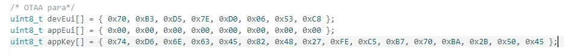
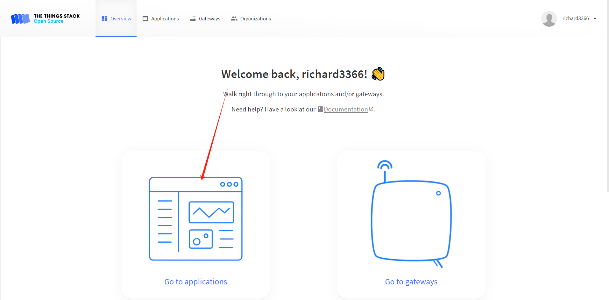
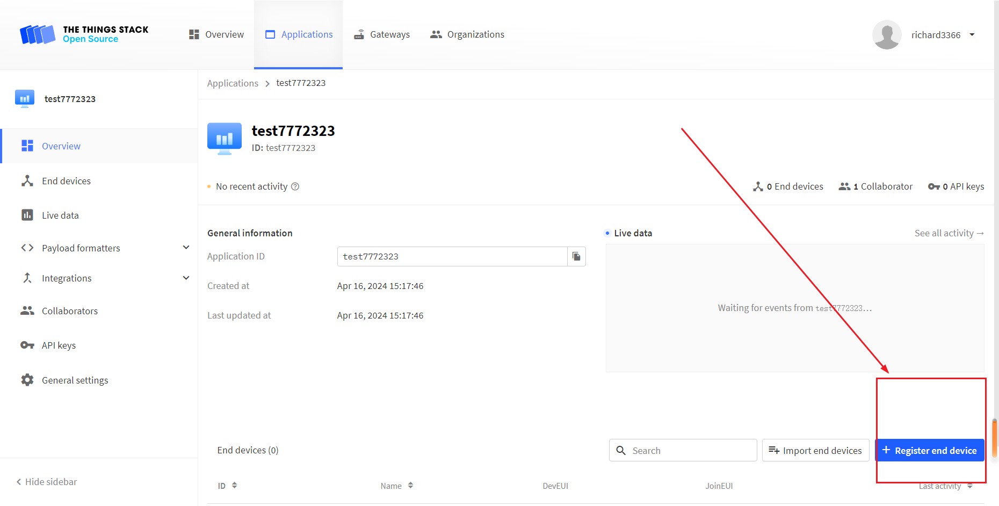
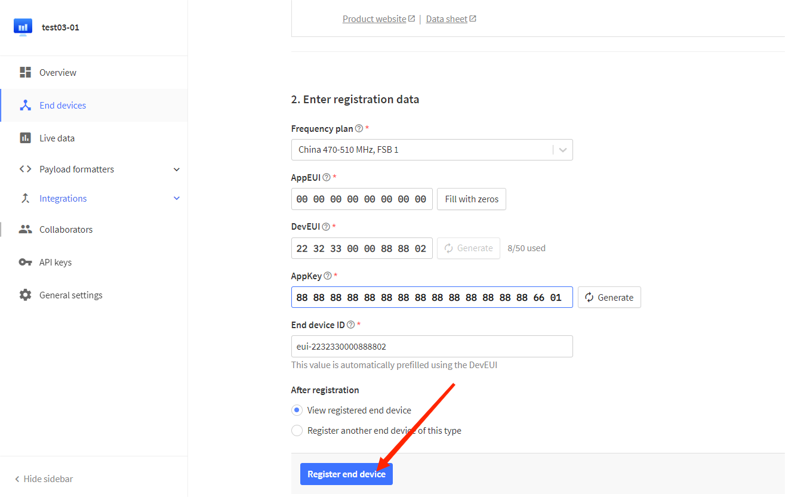

# Connect "ESP32 + LoRa" to LoRaWAN Server
{ht_translation}`[简体中文]:[English]`

## Preparation
1. A ESP32 + LoRa node that's configured and uploaded code, as described in the previous topic:: **[“ESP32 + LoRa” Node Preparation & Config Parameters](https://docs.heltec.org/en/node/esp32/lorawan/config_parameter.html)**
2. A LoRa server, We recommend the following three:
    - [TTN/TTS](https://console.thethingsnetwork.org/)
    - [ChirpStack](https://www.chirpstack.io/)
    - [SnapEmu](https://platform.snapemu.com/)

3. A Gateway that matches the **LoRaWAN region** of the node, and already is connected to the lora server. If you are using Heltec Gateway, you can find out how to connect to the server in the [Heltec Gateway documentation](https://docs.heltec.org/)

------

## Important to know

```{Tip} Regardless of which LoRaWAN NS, the parameters that need to be configured are similar. Ensuring that the relevant configurations of NS and Node are consistent is the key to ensuring successful LoRaWAN communication.

```


**Device Type**

Generally, you will be asked to select a LoRa Gateway or LoRa Node.

**LoRaWAN Class**

`OTAA` or `ABP`, choose one of the while working, keep LoRa Node and NS select the same LoRaWAN Class.

*For development devices with source code, you may see something like this:*


*For ready to use devices with configuration page, you may see some thing like this:*


**Region**

LoRaWAN protocol agreement RF communication parameters. For technical details, please refer to [LoRaWAN™ 1.0.2 Regional Parameters](https://resource.heltec.cn/download/LoRaWANRegionalParametersv1.0.2_final_1944_1.pdf), also the [LoRaWAN Frequency Plans](https://docs.heltec.org/general/lorawan_frequency_plans.html) and [LoRaWAN Frequency Plans and Regulations by Country/Region](https://docs.heltec.org/general/lorawan_frequency_plans_by_country.html) can make sense to you.

The region setting of `LoRa Node`, `LoRa Gateway`, `LoRaWAN NS` should be strictly the same.

*For development devices with source code, you may see something like this:*


*For ready to use devices with configuration page, you may see some thing like this:*


**OTAA Parameter**

For OTAA LoRaWAN Class, mainly include`DevEUI`, `AppEUI` (Also called `JoinEUI`), `AppKey`, the LoRa Node and NS should strictly keep the same.

*For development devices with source code, you may see something like this:*



*For ready to use devices with configuration page, you may see some thing like this:*


```{Note} If you select ABP Class, you do not need to set OTAA parameters.

```

**ABP Parameter**

For ABP LoRaWAN Class, mainly include `NetworkSecuritykey`, `ApplicationSecuritykey`, `DeviceAddress`, the LoRa Node and NS should strictly keep the same.

*For development devices with source code, you may see something like this:*


*For ready to use devices with configuration page, you may see some thing like this:*


```{Note} If you select ABP Class, you do not need to set OTAA parameters.

```

## Connect to LoRaWAN Server

Before that, make sure there is a LoRa Gateway active in your server.

- [Connect to TTN/TTS](connect-to-ttn)
- [Connect to ChirpStack](connect-to-chirpstack)
- [Connect to SnapEmu](connect-to-snapemu)

------

(connect-to-ttn)=
### Connect to TTN/TTS

1. Log in to the [TTS server web page](lora.heltec.org), register a new “Applications” .

    

2. Create application


3. You can freely fill in the Application information in the red box, and click `Creat application` when you're done.

   

4. Register an end device.

   

5. Choose `Enter end device specifics manually`, Select the frequency band corresponding to the node, 

   

6. The LoRaWAN version is chosen to be 1.0.2 B

   

   The `Show advanced activation, LoRaWAN class and cluster settings` option has some other LoRaWAN parameter Settings such as OTAA/ABP.CLASS A/C, these parameters default to OTAA and CLASS A, in general need to be consistent with the node Settings.

   

7. Fill in JoinEUI and click confirm.

   

   ``` {Tip} In code or some application products, JoinEUI is represented as AppEUI.
   ```

   

8. Fill in DevEUI and AppKey.

   

   ``` {Tip} The End device ID is automatically generated when you fill in DevEUI.
   ```

   

9. Click to register.



After registration is complete, if all is well, you will see the device active.


------

(connect-to-chirpstack)=
### Connect to ChirpStack
Register a new device in ChirpStack’s “Applications” page. Enter the device name, description, DevEUI. Select Device-profile.


Enter the Application key of the device.


After registration is complete, if all is well, you will see the device active.


------

(connect-to-snapemu)=

### Manual registration on SnapEmu

Log-in to [SnapEmu](https://platform.snapemu.com/dashboard/) by using their [Heltec website](https://heltec.org) account. Access into the devices page to register new device. 


Click `+` and file in relevant device information.


In the `Add device` step, file in the LoRa Node parameters and double check to make sure the content are the same with each other. If everything goes well, LoRa Node is successfully registered after `Submit`.

## Important Hints

Please double check the following two things:

1. The LoRaWAN parameters is the same as server!
2. The listening frequency of your LoRa Gateway is the same as ESP32 LoRa node's sending frequency. We strictly follow [LoRaWAN™ 1.0.2 Regional Parameters rB](https://resource.heltec.cn/download/LoRaWANRegionalParametersv1.0.2_final_1944_1.pdf);
