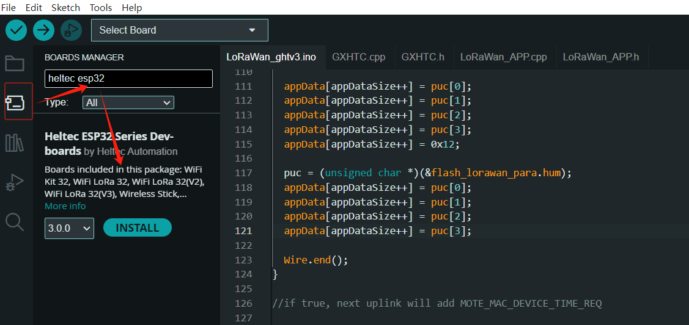

# Heltec ESP32 Series Quick Start
{ht_translation}`[简体中文]:[English]`

This article describes the installation of the Heltec ESP32 series development framework and library.

``` {tip} LoRaWAN related code has been stripped since version 3.0.0. Heltec ESP32 framework only contains the basic code now, For the special ESP32 codes, For example, LoRa/LoRaWAN related, display function related, factory test code, etc. please install [Heltec ESP32 Series Library](https://github.com/HelTecAutomation/Heltec_ESP32), In this topic, we'll also explain how to install the library.
```

``` {warning} Framework v3.0.0 and Library v2.0.0 are updated together, Older frameworks and libraries are no longer applicable to the new ones.
```

------

## Preparation
### Hardware
- [Heltec ESP32 Series Node](https://heltec.org/product-category/lora/lrnode/esp32-lora/)
- High quality USB_Type_C cable

``` {tip} Some cables only charge and do not transfer data, so you need to avoid this when uploading code.
```

### Software
- **USB driver**, you can refer to this articles [establish serial connection](https://docs.heltec.org/general/establish_serial_connection.html).
- [Install Git and Arduino IDE](https://docs.heltec.org/general/how_to_install_git_and_arduino.html).

------

## Installing development framework and Library
**There are three methods to install the development framework, choose one of they:**
- [Via Arduino IDE](esp32-via_arduino_ide)
- [Via Git](esp32-via_git)
- [Via Local File](esp32-via_local)

(esp32-via_arduino_ide)=

### Via Arduino IDE
#### Install Framework
  1. Open Arduino IDE, and click `File`->`Peferences`.

  

  

  2. **Input the last ESP32 package URL:** [https://resource.heltec.cn/download/package_heltec_esp32_index.json](https://resource.heltec.cn/download/package_heltec_esp32_index.json)

  

  3. Click on the `Boards Manager` icon on the left side, and enter "**heltec esp32**" in the search box that pops up, then select the latest version and click `INSTALL`	.

  

#### Install Heltec Esp32 Library

  Click on the `Library Manager` icon on the left side, search for "HELTEC ESP32", select the latest version and install

  

(esp32-via_git)=

### Via Git

  ``` {note} It is recommended to follow the path and file name as described below as much as possible to avoid unnecessary trouble.
  ```

  1. Installing Git.

  2. Check the following links for your operating system, the specific operation steps are detailed in the link:
  - [For Windows](https://github.com/Heltec-Aaron-Lee/WiFi_Kit_series/blob/master/InstallGuide/windows.md)
  - [For MacOS](https://github.com/Heltec-Aaron-Lee/WiFi_Kit_series/blob/master/InstallGuide/mac.md)
  - For Linux
    - [Debian/Ubuntu](https://github.com/Heltec-Aaron-Lee/WiFi_Kit_series/blob/master/InstallGuide/debian_ubuntu.md)
    - [Fedora](https://github.com/Heltec-Aaron-Lee/WiFi_Kit_series/blob/master/InstallGuide/fedora.md)
    - [OpenSUSE](https://github.com/Heltec-Aaron-Lee/WiFi_Kit_series/blob/master/InstallGuide/opensuse.md)

  ``` {TIP} After obtaining updates through "git pull", please execute "get. exe" under the path of "Arduino\hardware\heltec\esp32\tools" to obtain the latest compilation tool.
  ```

  3. The above is the framework installation. If you need to install the Heltec ESP32 extension library, you can refer to this link:
      - [Heltec ESP32 Series Library](https://github.com/HelTecAutomation/Heltec_ESP32)

  Follow the instructions in the `Readme.MD` to install.

(esp32-via_local)=

### Via Local File

  ``` {note} It is recommended to follow the path and file name as described below as much as possible to avoid unnecessary trouble.
  ```

  1. Download the development environment. [https://resource.heltec.cn/download/tools/framework](https://resource.heltec.cn/download/tools/framework)

  2. Open Arduino IDE, and click `File`->`Peferences`.

  

  3. Go to the folder in the red box.

  

  4. Create a new "hardware" folder in the Arduino folder. If there is already a "hardware" folder, you don't need to create a new one.

  

  5. Creat a new "heltec" folder in "hardware" folder.

  

  6. Go to the "heltec" folder and extract "esp32" into this folder.

  

  7. Go to the "heltec" folder, refer to the figure below to confirm whether the path in the red box is correct.

  

  8. Restart the Arduino IDE to confirm whether the development environment is installed successfully.

  

  9. For special code library, search for "HELTEC ESP32" in `Library Manager`, select the latest version and install:[ESP32 Series Library](https://github.com/HelTecAutomation/Heltec_ESP32). 

  

------------

## Programming
 Once you have the framework and libraries installed, connect your computer to the board and start programming nodes.
### Example
1. Connect your node to the computer with a USB cable.

2. Open Arduino IDE, Correctly select a board and relevant options in the `Tools` menu:


3. Then select an example.


``` {Tip} To execute the code in a library, you need to mouse over, scroll down, find the library, and find the code in it.
```

4. Compile & Upload


-----------

### New program
Open Arduino IDE, create a new  `.ino` file, then copy the below code.

```arduino
#include <heltec.h>

// the setup routine runs once when starts up
void setup(){

  // Initialize the Heltec ESP32 object
  Heltec.begin(true /*DisplayEnable Enable*/, true /*LoRa Disable*/, true /*Serial Enable*/, true /*PABOOST Enable*/, 470E6 /**/);
}

// the loop routine runs over and over again forever
void loop() {

}
```

compile it and upload, the  screen (if this board has a screen) will show and Arduino's serial monitor will print something, it means Heltec ESP32 board is running successfully!

