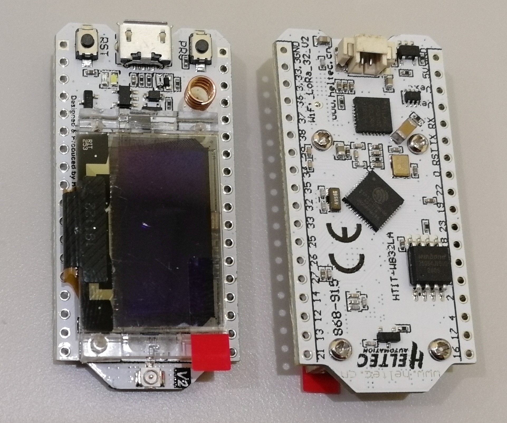
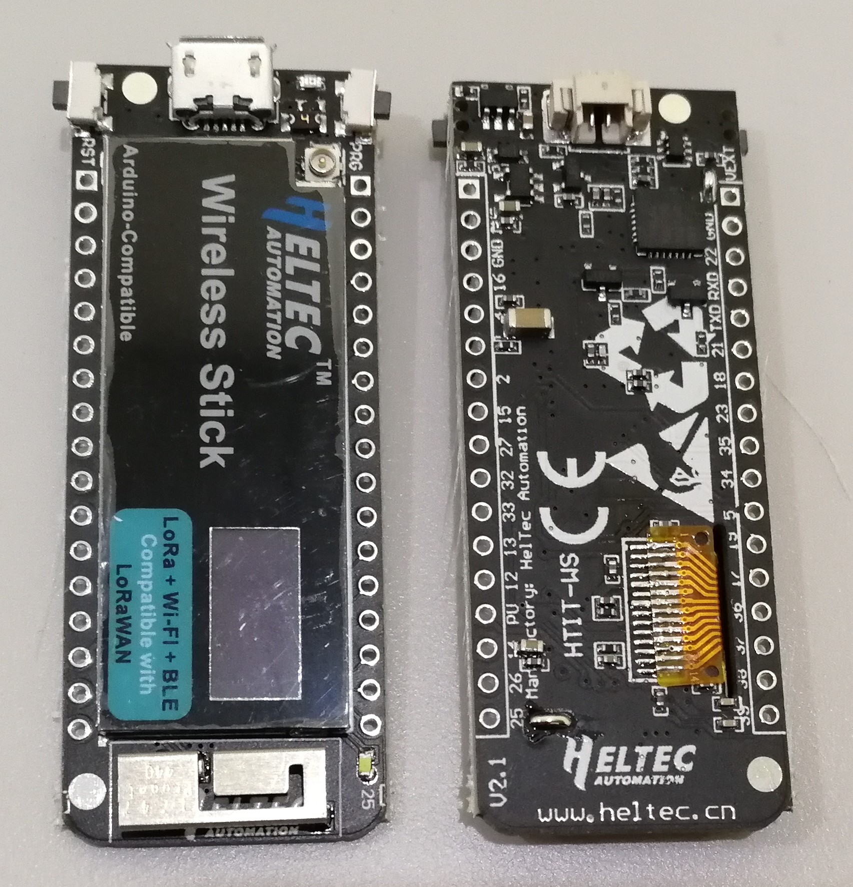
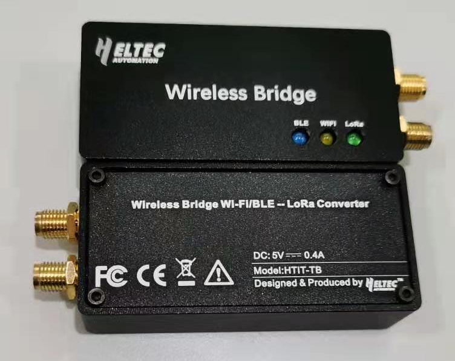
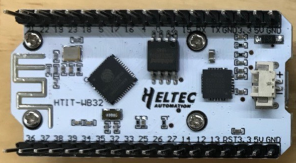
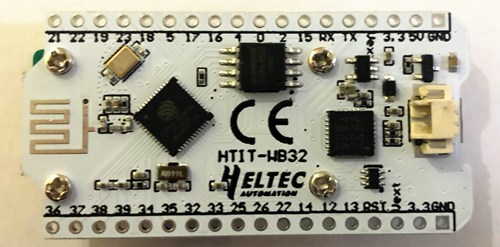
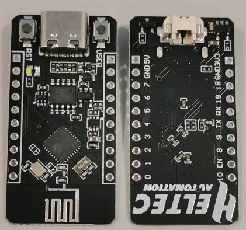

# Hardware Update Logs
{ht_translation}`[简体中文]:[English]`

## WiFi LoRa 32 Hardware Update Logs
### V1
- First release
- 2017-6-1 public sale

- [Pinout diagram of V1](http://resource.heltec.cn/download/WiFi_LoRa_32/WIFI_LoRa_32_V1.pdf)

- Schematic diagram of V1
  - [433, 470~510 Version](http://resource.heltec.cn/download/WiFi_LoRa_32/V1/WIFI_LoRa_32(433_470-510%20version)Schematic_diagram.PDF)
  - [868~915 Version](http://resource.heltec.cn/download/WiFi_LoRa_32/V1/WIFI_LoRa_32(868-915version)Schematic_diagram.PDF)

### V2

- 2018-9-15 public sale

- 4MB (32M-bits) FLASH upgrade to 8MB (64M-bits) FLASH;

- Use 40MHz HSE (V1 use 26MHz);

- Basic low power design (800uA in deep sleep);

- Add Vext power output pin, users can use this pin to drive some external device (sensor, motor etc.), when system need into deep sleep mode, Vext can be turn off.

  **This pin was controlled by GPIO21, for example:**

  ​		Turn ON:  `digitalWrite(21, LOW);`

  ​		Turn OFF: `digitalWrite(21, HIGH);`

- Changed some pin connection:

  

- Circuit optimization, system more stable;
- Better power manage system design;
- Better RF impendence matching.
- [Pinout diagram of V2](http://resource.heltec.cn/download/WiFi_LoRa_32/WIFI_LoRa_32_V2.pdf)
- Schematic diagram of V2
- [433, 470~510 Version](http://resource.heltec.cn/download/WiFi_LoRa_32/V2/WiFi_LoRa_32_V2(433%2C470-510).PDF)
- [868~915 Version](http://resource.heltec.cn/download/WiFi_LoRa_32/V2/WIFI_LoRa_32_V2(868-915).PDF)

### V2.1

- 2019-6-15  public sale
- Change the RF switch from PE4259 to UPG2179, and change the RF part to the official recommended value;
- Change the power detection pin from 13(ADC2: 4) to 37(ADC1: 1).
- [Pinout diagram of V2.1](https://resource.heltec.cn/download/WiFi_LoRa_32/WIFI_LoRa_32_V2.1.pdf)
- Schematic diagram of V2.1
  - [433, 470~510 Version](https://resource.heltec.cn/download/WiFi_LoRa_32/V2.1/WiFi_LoRa_32_V2.1(433%2C470-510).PDF)
  - [868~915 Version](https://resource.heltec.cn/download/WiFi_LoRa_32/V2.1/WIFI_LoRa_32_V2.1(868-915).PDF)

### V3

- 2022-09-15  public sale

- MCU is changed from ESP32-D0WDQ6 to ESP32-S3FN8. Specific differences of MCU are shown in：[https://products.espressif.com/#/product-comparison](https://products.espressif.com/#/product-comparison).
- USB interface changed from Micro USB to Type-C.
- LoRa chip changed from SX1276 to SX1262.
- The LoRa crystal oscillator is upgraded to temperature compensated crystal oscillator.
- The size, appearance, pin layout and power pins remain unchanged, but the GPIO sequence has changed. Please refer to [Pinout diagram](https://resource.heltec.cn/download/WiFi_LoRa32_V3/HTIT-WB32LA(F)_V3.png).
- [Pinout diagram of V3](https://resource.heltec.cn/download/WiFi_LoRa32_V3/HTIT-WB32LA(F)_V3.png).
- [Schematic diagram of V3](https://resource.heltec.cn/download/WiFi_LoRa32_V3/HTIT-WB32LA(F)_V3_Schematic_Diagram.pdf).

## Wireless Tracker

### V1.0

- First release
- 2023-6-30 public sale
- [Schematic diagram of Tracker 1.0](https://resource.heltec.cn/download/Wireless_Tracker/Wireless_Tacker1.0/HTIT-Tracker_V0.3.pdf)
- [Datasheet of Tracker 1.0](https://resource.heltec.cn/download/Wireless_Tracker/Wireless%20tracke.pdf)

### V1.1

- Fixed an issue where the GNSS module loses power when LoRa starts.
- The pins were modified.
- [Schematic diagram of Tracker 1.1](https://resource.heltec.cn/download/Wireless_Tracker/Wireless_Tacker1.1)
- [Datasheet of Tracker 1.1](https://resource.heltec.cn/download/Wireless_Tracker/Wireless%20Tracker%201.1.pdf)

## Wireless Paper

### V1.0

- First release
- 2023-7-30 public sale
- [Schematic diagram of Paper 1.0](https://resource.heltec.cn/download/Wireless_Paper/Wireless_Paper_V0.4_Schematic_Diagram.pdf)
- [Datasheet of Paper 1.0](https://resource.heltec.cn/download/Wireless_Paper/Wireless-Paper.pdf)
- [Sample code V1.0](https://github.com/Heltec-Aaron-Lee/WiFi_Kit_series/tree/master/esp32/libraries/Heltec-Example/examples/E-INK/HT_lCMEN2R13EFC1)

### V1.1

- Changed the E-ink, If the protective film label on the screen is green, that means the version is 1.1.
- [Sample code V1.1](https://github.com/Heltec-Aaron-Lee/WiFi_Kit_series/tree/master/esp32/libraries/Heltec-Example/examples/E-INK/QYEG0213RWS800_BWR)

## Wireless Stick  Hardware Update Logs

### V1

- First release
- 2017-6-1 public sale
- [Pinout diagram of V1](http://resource.heltec.cn/download/Wireless_Stick/Wireless_Stick.pdf)
- Schematic diagram of V1

  The schematic diagram of Wireless Stick is restricted technical data,it will become downloadable after purchase.Please read this document:[Get Limited Technical Resources](https://heltec-automation-docs.readthedocs.io/en/latest/general/view_limited_technical_data.html) .

### V3

- 2022-11-10  public sale
- MCU is changed from ESP32-D0WDQ6 to ESP32-S3FN8. Specific differences of MCU are shown in：[https://products.espressif.com/#/product-comparison](https://products.espressif.com/#/product-comparison).
- USB interface changed from Micro USB to Type-C.
- LoRa chip changed from SX1276 to SX1262.
- The LoRa crystal oscillator is upgraded to temperature compensated crystal oscillator.
- The size, appearance, pin layout and power pins remain unchanged, but the GPIO sequence has changed. Please refer to [Pinout diagram](https://resource.heltec.cn/download/Wireless_Stick_V3/HTIT-WS_V3.png).
- [Pinout diagram of V3](https://resource.heltec.cn/download/Wireless_Stick_V3/HTIT-WS_V3.png).
- [Schematic diagram of V3](https://resource.heltec.cn/download/Wireless_Stick_V3/HTIT-WS_V3_Schematic_Diagram.pdf).

## Wireless Stick Lite Hardware Update Logs

### V1

- First release
- 2017-6-1 public sale
- [Pinout diagram of V1](http://resource.heltec.cn/download/Wireless_Stick_Lite/Wireless_Stick_Lite.pdf)
- Schematic diagram of V1
- The schematic diagram of Wireless Stick Lite is restricted technical data,it will become downloadable after purchase.Please read this document:[Get Limited Technical Resources](https://heltec-automation-docs.readthedocs.io/en/latest/general/view_limited_technical_data.html) .

### V3

- 2022-09-15  public sale
- MCU is changed from ESP32-PICO-V3 to ESP32-S3FN8. Specific differences of MCU are shown in：[https://products.espressif.com/#/product-comparison](https://products.espressif.com/#/product-comparison).
- USB interface changed from Micro USB to Type-C.
- LoRa chip changed from SX1276 to SX1262.
- The LoRa crystal oscillator is upgraded to temperature compensated crystal oscillator.
- The size, appearance, pin layout and power pins remain unchanged, but the GPIO sequence has changed. Please refer to [Pinout diagram](https://resource.heltec.cn/download/Wireless_Stick_Lite_V3/HTIT-WSL_V3.png).
- [Pinout diagram of V3](https://resource.heltec.cn/download/Wireless_Stick_Lite_V3/HTIT-WSL_V3.png).
- [Schematic diagram of V3](https://resource.heltec.cn/download/Wireless_Stick_Lite_V3/HTIT-WSL_V3_Schematic_Diagram.pdf).

## Wireless Bridge

[简体中文](https://heltec-automation.readthedocs.io/zh_CN/latest/esp32/wireless_bridge/hardware_update_log.html)

### V1

- First release
- 2021-04-01 public sale

## Wifi Kit 32  Hardware Update Logs

### V1

- First release
- 2017-06-01 public sale
- [Pinout diagram for V1](http://resource.heltec.cn/download/WiFi_Kit_32/WIFI%20Kit%2032_pinoutDiagram_V1.pdf)
- [Schematic diagram for V1](http://resource.heltec.cn/download/WiFi_Kit_32/WIFI_Kit_32_Schematic_diagram_V1.PDF)

### V2

- 2019-05 public sale;
- Fixed charging status (orange LED) blinking problem;
- 4MB (32M-bits) FLASH upgrade to 8MB (64M-bits) FLASH;
- Better 2.4GHz antenna design and impendence matching;
- Basic low power design (800uA in deep sleep);
- Add battery power detection circuit. Use ADC2_4 (GPIO 13) to read battery voltage;
- Add Vext power output pin, users can use this pin to drive some external device (sensor, motor etc.), when system need into deep sleep mode, Vext can be turn off. **This pin was controlled by GPIO21, for example:**

- Turn ON: `digitalWrite(21, LOW);`
- Turn OFF: `digitalWrite(21, HIGH);`
- Circuit optimization, system more stable;
- Better power manage system design.
- [Pinout diagram for V2](http://resource.heltec.cn/download/WiFi_Kit_32/WIFI_Kit_32_pinoutDiagram_V2.pdf);
- [Schematic diagram for V2](http://resource.heltec.cn/download/WiFi_Kit_32/WIFI_Kit_32_Schematic_diagram_V2.pdf);

### V2.1

- 2019-10 public sale;
- Fix battery voltage read can't work together with Wi-Fi bug, change battery voltage reading pin to GPI37 (use ADC1_1), please refer to this example: [ADC_Read_Voltage/Battery_power](https://github.com/HelTecAutomation/Heltec_ESP32/blob/master/examples/ESP32/ADC_Read_Voltage/Battery_power/Battery_power.ino).
- [Pinout diagram for V2.1](https://resource.heltec.cn/download/WiFi_Kit_32/WIFI_Kit_32_pinoutDiagram_V2.1.pdf);
- [Schematic diagram for V2.1](https://resource.heltec.cn/download/WiFi_Kit_32/WIFI_Kit_32_Schematic_diagram_V2.1.PDF);

### V3

- 2022-09-15  public sale
- MCU is changed from ESP32-D0WDQ6 to ESP32-S3FN8. Specific differences of MCU are shown in：[https://products.espressif.com/#/product-comparison](https://products.espressif.com/#/product-comparison).
- USB interface changed from Micro USB to Type-C.
- The size, appearance, pin layout and power pins remain unchanged, but the GPIO sequence has changed. Please refer to [Pinout diagram](https://resource.heltec.cn/download/WiFi_Kit_32_V3/HTIT-WB32_V3.png).
- [Pinout diagram of V3](https://resource.heltec.cn/download/WiFi_Kit_32_V3/HTIT-WB32_V3.png).
- [Schematic diagram of V3](https://resource.heltec.cn/download/WiFi_Kit_32_V3/HTIT-WB32_V3_Schematic_Diagram.pdf).

## ESP32-C3
### V1

- First release
- 2022-09-15 public sale
- [Pinout diagram for V1](https://resource.heltec.cn/download/ESP32-C3_DevBoard/ESP32%20C3_DevBoard.png)
- [Schematic diagram for V1](https://resource.heltec.cn/download/ESP32-C3_DevBoard/ESP32-C3_DevBoard_Schematic_Diagram.pdf)

## Wifi Kit 8  Hardware Update Logs
{ht_translation}`[简体中文]:[English]`
### V1

- First release
- 2017-6-1 public sale
- [Pinout diagram](https://resource.heltec.cn/download/WiFi_Kit_8/WIFI_Kit_8_Pinout_Diagram.pdf)
- [Schematic diagram](https://resource.heltec.cn/download/WiFi_Kit_8/WIFI_Kit_8_Schematic_diagram.PDF)

## Wireless Shell

**Wireless Shell is equivalent to Wireless Stick Lite without peripheral circuit,so peripheral circuit needs to be added when using,such as power supply part, serial port part,etc.**

### V1

- First release
- 2017-06-01 public sale
- [Pinout diagram of V1](http://resource.heltec.cn/download/Wireless_Shell/Wireless_Shell.pdf)
- Schematic diagram of V1

  The schematic diagram of Wireless Shell is restricted technical data,it will become downloadable after purchase.Please read this document:[Get Limited Technical Resources](https://docs.heltec.org/general/view_limited_technical_data.html) .

### V3

- 2022-09-15  public sale
- MCU is changed from ESP32-PICO-V3 to ESP32-S3FN8. Specific differences of MCU are shown in：[https://products.espressif.com/#/product-comparison](https://products.espressif.com/#/product-comparison).
- LoRa chip changed from SX1276 to SX1262.
- The LoRa crystal oscillator is upgraded to temperature compensated crystal oscillator.
- The size, appearance, pin layout and power pins remain unchanged, but the GPIO sequence has changed. Please refer to [Pinout diagram](https://resource.heltec.cn/download/Wireless_Shell_V3/HTIT-Wsh_V3.png).
- [Pinout diagram of V3](https://resource.heltec.cn/download/Wireless_Shell_V3/HTIT-Wsh_V3.png).

## HT-CT62

**HT-CT62 only have ESP32 and RF relevant circuit inside. In order to program it, need connect to an external UART-USB bridge. CH340G, CP2102 etc.**

### V1

- First release
- 2022-09-15 public sale
- [Pinout diagram of V1](https://resource.heltec.cn/download/HT-CT62/HT-CT62.png)
