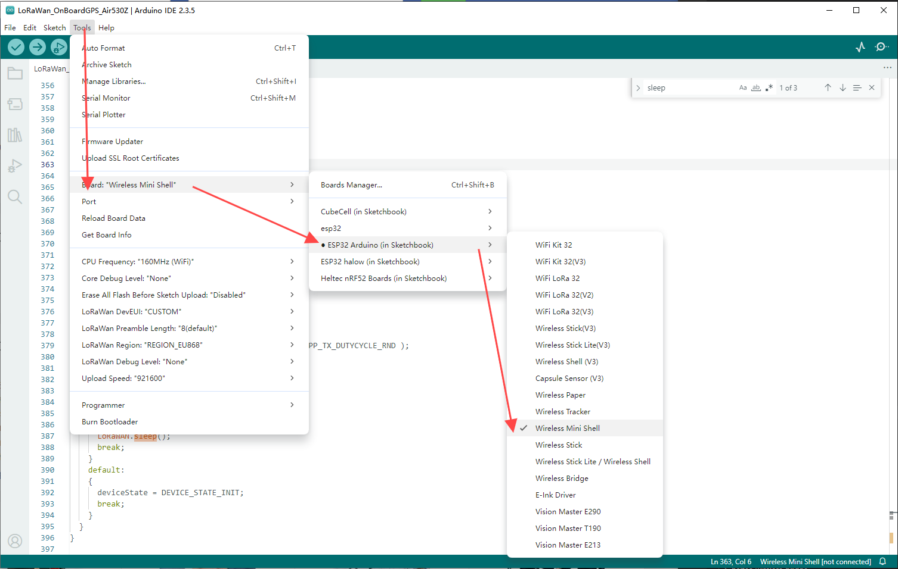

# How to programming a ESP32 Module
{ht_translation}`[简体中文]:[English]`

This document uses Wireless_ Shell as an example.

## Hardware Connection
Wireless_ Shell only have ESP32 and RF relevant circute inside. In order to program it, need connect to a external UART-USB bridge. CH340G, CP2102 etc. Here are three common circuit connection methods:

1. Using the [Heltec Esp32 Dev Backplane](https://heltec.org/project/esp-dev-backplane/)
For first-time users who want to test the module's performance, you can directly purchase a backplane. If you are unable to solder, Heltec staff can pre-solder it for you.

2. Designing Your Own Circuit
You can refer to the HT-CT62 [Recommend circuit ](https://resource.heltec.cn/download/Wireless_Shell/wireless_shell_reference_hardware_design.pdf) to design and fabricate your own PCB.

3. For Large-Scale Programming Without a Backplane
Users who need to program modules in bulk without using a backplane can contact Heltec's official technical support to purchase the HT-CT62 dedicated fixture: support@heltec.cn

## Preparation

- Install the ESP32 development framework correctly: [Heltec ESP32 Series Quick Start — esp32 latest documentation](https://docs.heltec.org/en/node/esp32/esp32_general_docs/quick_start.html);
- Connect your redesigned board to a computer, make sure useing a high quality Micro USB cable;
- Use the serial port debugging assistant to open the serial port and check whether the serial port can print information normally.

## Program via Arduino IDE

1. Open Arduino, select "Tools" ->"Board" ->"Wireless mini shell"

2. Select the port.

3. You can select the corresponding example in the sample library.

4. You can also write your own code in the `New Sketch`.

5. Click to `Upload`.