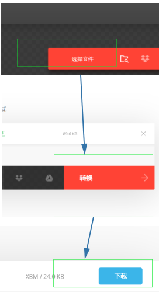
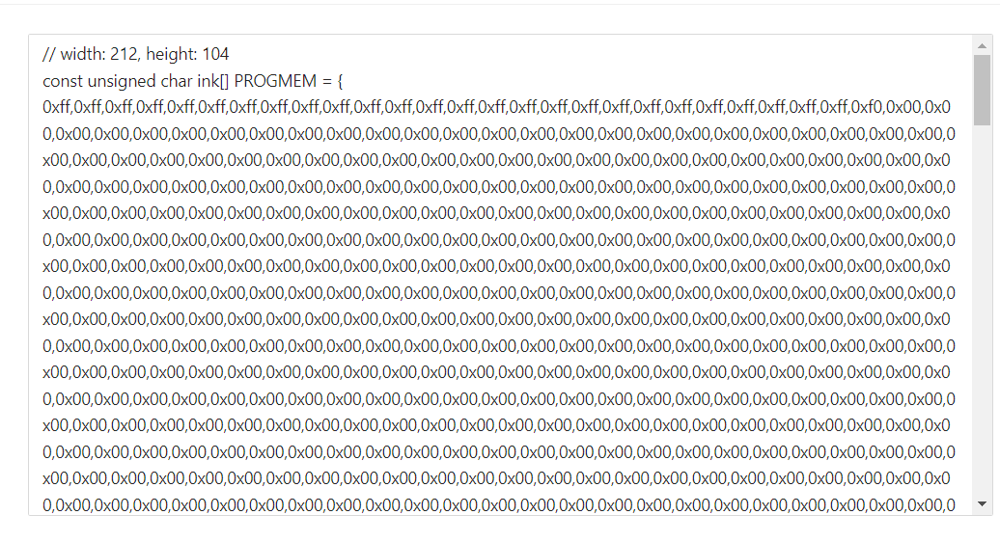
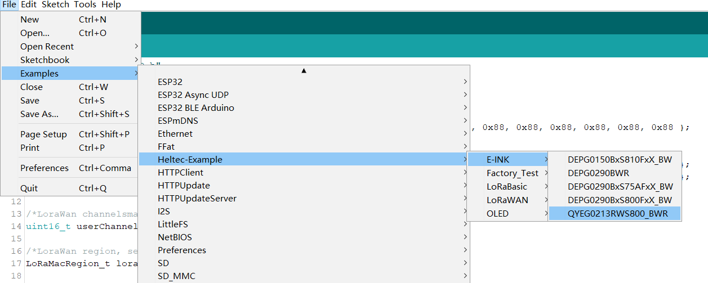
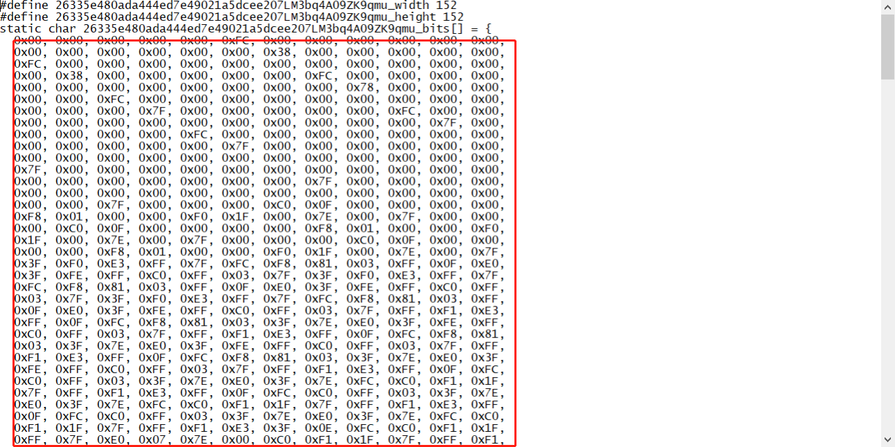
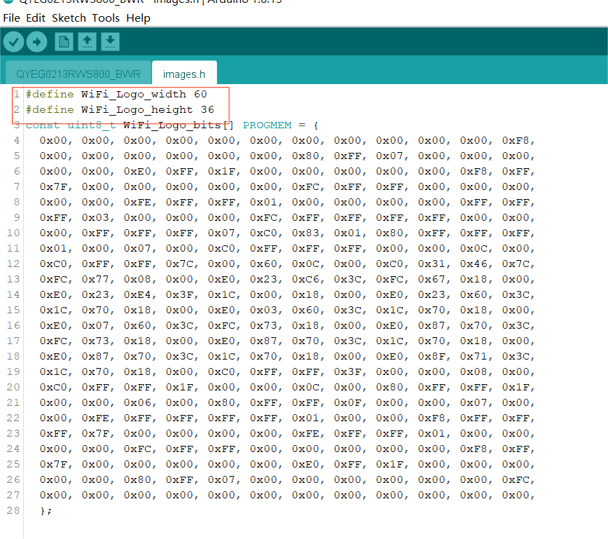
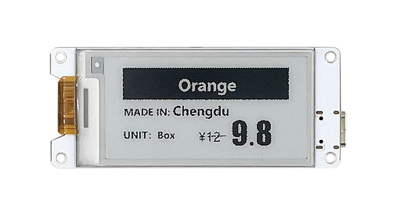

# Via Program Refresh

{ht_translation}`[简体中文]:[English]`

## Summary

This topic aims to describe refreshing the HT-DE01 by downloading the program through the USB interface.

## Image coding
Using program refresh paper, you'll need a tool for image transcoding, in this case [**Convertio**](https://convertio.co/zh/xbm-converter/).

+ Open **Convertio**: https://convertio.co/zh/xbm-converter/, and select the image that needs to be taken, select XBM as the conversion format.



+ Save the picture you get, open it via `txt`, and copy the code in red box as show below.



## Downloading the program

+ Confirm whether the `USB driver`, `Git` and `Arduino IDE` has been installed correctly. If not, please refer to this two articles [establish serial connection](https://docs.heltec.org/general/establish_serial_connection.html) and [Install Git and Arduino IDE](https://docs.heltec.org/general/how_to_install_git_and_arduino.html).

+ Confirm that The Heltec ESP32 development environment is installed, please refer to[ESP32+LoRa Quick start](https://docs.heltec.org/en/node/esp32/quick_start.html).

Connect the HT-DE01 to the computer using a TYPE-C wire. Use Arduino IDE to open the example we provided or any other program that works, as shown below.



```{Tip} If you cannot find the size of your E-INK in the above path, please download our dedicated [E-Ink library](https://github.com/HelTecAutomation/e-ink).

```

Replace the contents of `image.h` with the file **Convertio** generated earlier, as shown below.



```{Tip} Be careful to fill in the data of Weight and Hight in the red box part of the figure, rather than copying this part directly.

```



Click upload, when the program is uploaded, the image is displayed on E-Ink.

