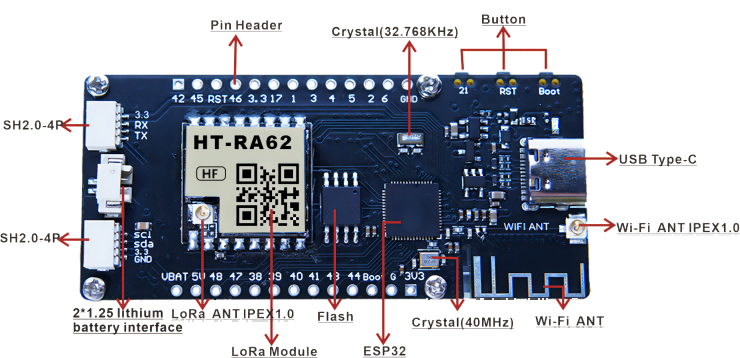

Vision Master E213
==================
:ht_translation:`[简体中文]:[English]`

Vision Master E213 (HT-VME213) is an E-Ink development kit with multiple wireless drive methods. Collaborate with the sample programs and development tools we provide, users can operate the display via Bluetooth, Wi-Fi and LoRa.

- Schematic diagram
   - `V1 <https://resource.heltec.cn/download/HT-VME213/HT-VME213%20Schematic%20Diagram.pdf>`_.

- Pin Map 
   - `V1 <https://resource.heltec.cn/download/HT-VME213/HT-VME213%20pin%20map.png>`_.

- Datasheet 
   - `V1 <https://resource.heltec.cn/download/HT-VME213/HT-VME213%20Datasheet.pdf>`_.

- Related resources
   - `Resources <https://resource.heltec.cn/download/HT-VME213/>`_.

.. toctree::
   :maxdepth: 2
    
    Quick Start(Development framework and special libraries) <https://docs.heltec.org/en/node/esp32/quick_start.html>
    Sample Code<example>
    LoRaWAN demo <https://docs.heltec.org/en/node/esp32/lorawan/index.html>
    Meshtastick Quick Start <https://docs.heltec.org/en/node/esp32/meshtastick.html>
    Frequently Asked Questions<frequently_asked_questions>
    Hardware Update Log<hardware_update_log>
    -->[General Docs]<-- <https://docs.heltec.org/general/index.html>
