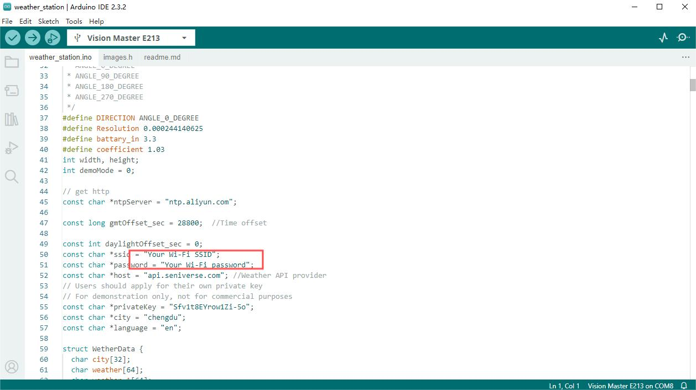

# Example Manual

{ht_translation}`[简体中文]:[English]`

## Preparation
### Software

**Before you get started, make sure you have the libraries installed. The library relies on the [Heltec Esp32 framework](https://github.com/Heltec-Aaron-Lee/WiFi_Kit_series) or the [Espressif official Arduino-Esp32 framework](https://github.com/espressif/arduino-esp32).**

How to installed, please refer to [ESP32 series QuickStart](https://docs.heltec.org/en/node/esp32/esp32_general_docs/quick_start.html#).

### Hardware
Connect [Vision Master E290](https://heltec.org/project/vision-master-e290/) to your computer with a high-quality data cable, and make sure you can find the correct device port and upload code. If you can't find the device port, or you can't upload the code, follow this link: [Frequently Asked Questions](https://docs.heltec.org/en/node/esp32/ht_vme290/frequently_asked_questions.html)

------

## Sample Code

### Weather Station

[Github Link](https://github.com/HelTecAutomation/Heltec_ESP32/tree/master/examples/VME213/weather_station)

This demo will fetch weather and time information over the network and print it to the device display.


1.  Open the ArduinoIDE and select the appropriate board and serial port from the Tools menu.

   

2. Follow the following path to select the example.

   

3. In this code you need to fill in the available Wi-Fi.

   

   ```{Warning} If you don't connect  Wi-Fi, the display won't work.
   ```

4. The current code fetches the weather and time data through API of the corresponding website. If you want to change the data source, please refer to the `Readme.md` file of the code.

   

------


