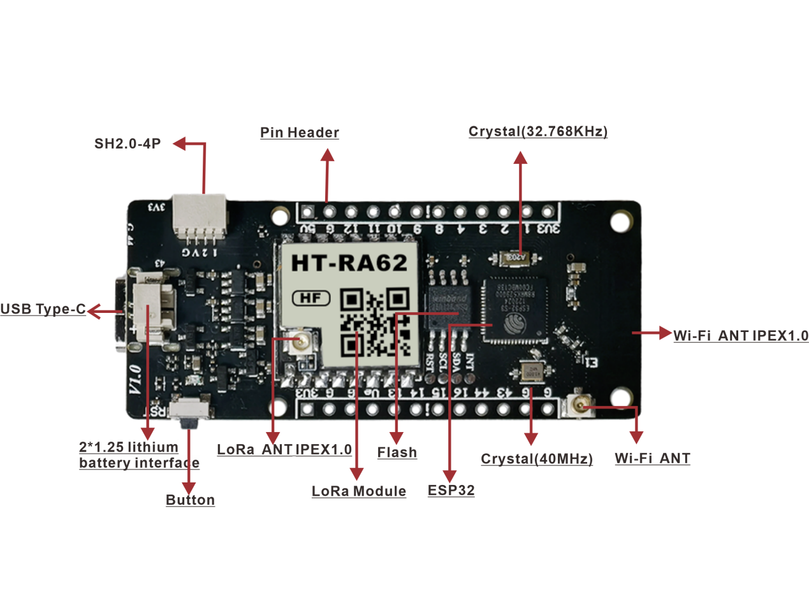

Vision Master T190
==================
:ht_translation:`[简体中文]:[English]`

Vision Master T190 (HT-VMT190) is a development kit with ESP32-S3 and LoRa Module (optional). The onboard 1.9-inch TFT-LCD display contains 170 (RGB)X320 dots and can display up to 262k colors.

- Schematic diagram `V1 <https://resource.heltec.cn/download/HT-VME213/HT-VME213%20Schematic%20Diagram.pdf>`_.

- Pin Map `V1 <https://resource.heltec.cn/download/HT-VME213/HT-VME213%20pin%20map.png>`_.

- Datasheet `V1 <https://resource.heltec.cn/download/HT-VME213/HT-VME213%20Datasheet.pdf>`_.

- Related resources
   - `Resources <https://resource.heltec.cn/download/HT-VME213/>`_.

.. toctree::
   :maxdepth: 1
    
    Quick Start(Development framework and special libraries) <https://docs.heltec.org/en/node/esp32/quick_start.html>
    Sample Code<example>
    LoRaWAN demo <https://docs.heltec.org/en/node/esp32/lorawan/index.html>
    Meshtastick Quick Start <https://docs.heltec.org/en/node/esp32/meshtastick.html>
    Frequently Asked Questions<frequently_asked_questions>
    Hardware Update Log<hardware_update_log>
    -->[General Docs]<-- <https://docs.heltec.org/general/index.html>
