# Meshtastic
{ht_translation}`[简体中文]:[English]`

**Meshtastic®** is a project that enables you to use inexpensive LoRa radios as a long range off-grid communication platform in areas without existing or reliable communications infrastructure. This project is 100% community driven and open source! For a more detailed description of Meshtastic please refer to their website and forum: [https://meshtastic.org/](https://meshtastic.org/).

This topic describes how to get started with Meshtastic. 

Currently, Heltec recommends the following devices for Meshtastic:

| Product | Pic | Description |
|-|:-|:-:|
| [WiFi LoRa 32 V3](https://heltec.org/project/wifi-lora-32-v3/) |N/A| it is known as **Heltec V3** |
| [Wireless Tracker](https://heltec.org/project/wireless-tracker/)|N/A| it comes with a GPS module. |
| [Wireless Stick Lite](https://heltec.org/project/wireless-stick-lite-v2/) |N/A| no screen |
| [Wireless Paper](https://heltec.org/project/wireless-paper/) |N/A| It comes with E-Ink screen |
| [Wireless Bridge](https://heltec.org/project/wireless-bridge/) |N/A| It has a strong aluminum alloy shell |
| [Capsule Sensor V3](https://heltec.org/project/heltec-capsule-sensor-v3/) |N/A| Stylish LoRaWAN toys that can integrate GPS modules|
| [Wireless Mini Shell(HT-CT62)](https://heltec.org/project/ht-ct62/) |N/A| Cost-effective LoRa+ESP32-C3 module |

*This topic uses WiFi LoRa 32 V3 as an example.*

## Install ESP32 USB to Serial Drivers
Use a USB cable to connect your computer to your device. Open your `Device Manager`, `Port`, if your computer doesn't recognize the device, You may need to install a driver from Silicon Labs for the CP210X USB to UART bridge: [CP210X USB to UART bridge - Download](https://www.silabs.com/developers/usb-to-uart-bridge-vcp-drivers?tab=overview)

``` {Tip} After installing the driver, make sure to reboot your computer to finish the installation process.

```

## Flash Firmware
**The Web-Based Installer requires either Chrome or Edge browsers but is an excellent choice for quickly flashing devices. This method is highly recommended for firmware flashing, especially for new users of the project, as it is easy to use.**

1. Plug in your device.

2. Visit [flasher.meshtastic.org](https://flasher.meshtastic.org/) requires Chrome or Edge browser. Follow the instructions, select the model of the corresponding board.

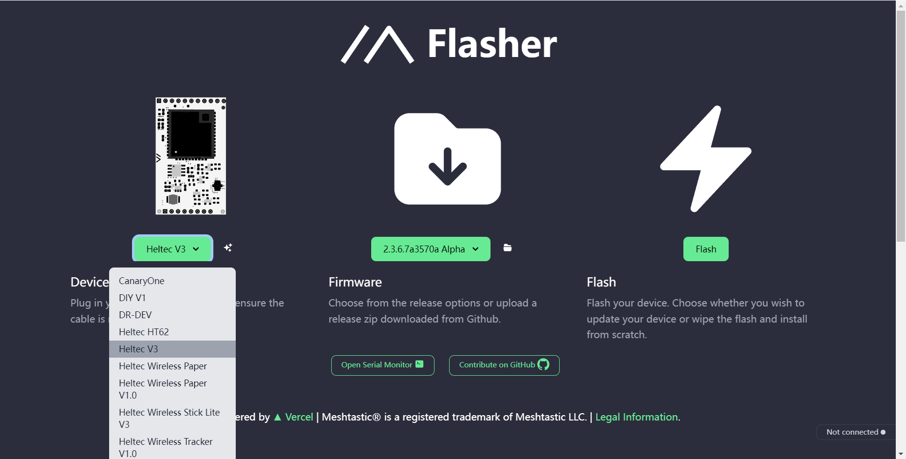

4. Select the appropriate firmware version; the latest stable version is generally recommended.

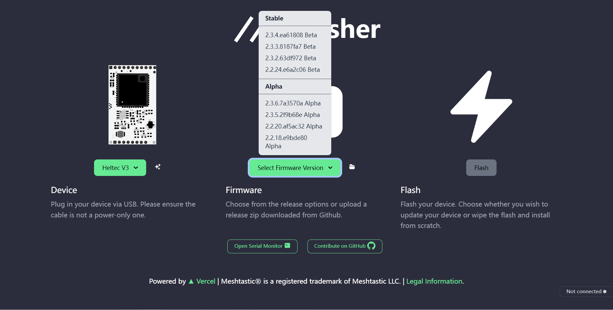

5. Click button to flash.

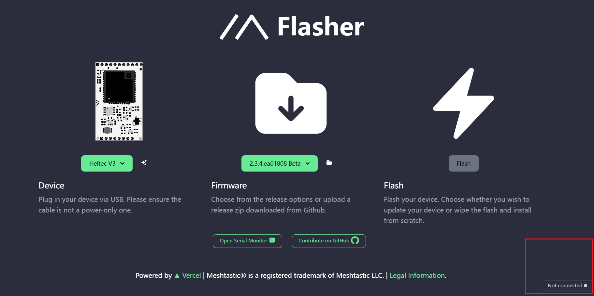

``` {Tip} Network issues can cause Flash buttons to fail to click. Of course, sometimes it appears gray, but it can still be manipulated.

```

6. Continue.

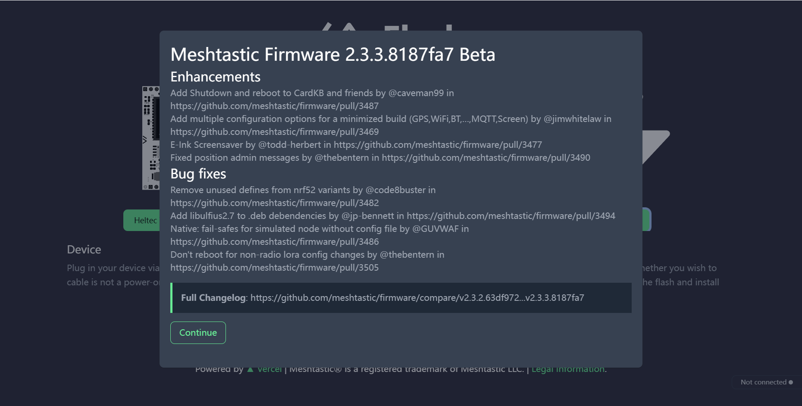

7. Click the `Full Erase and Install`, then `Erase flash and install`.

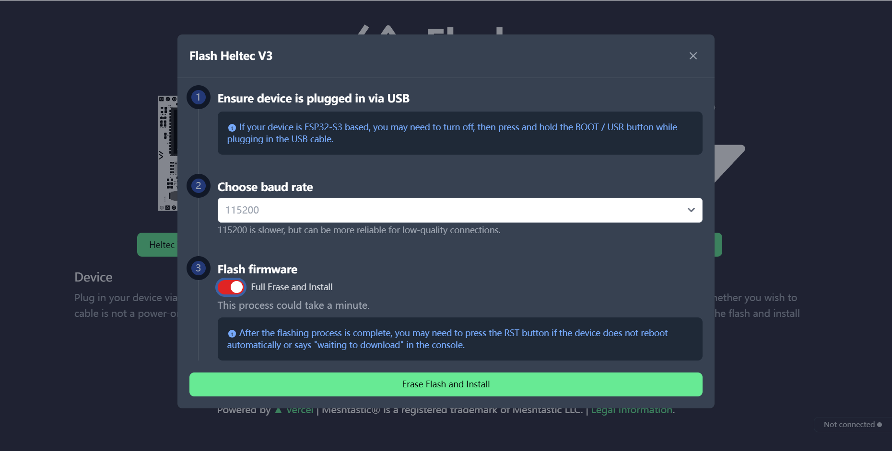

``` {Tip} Network problems cause Flash pages to stay in "Conneting......".

```

8. Wait for the firmware to flash, and your device screen will display Meshtastic.

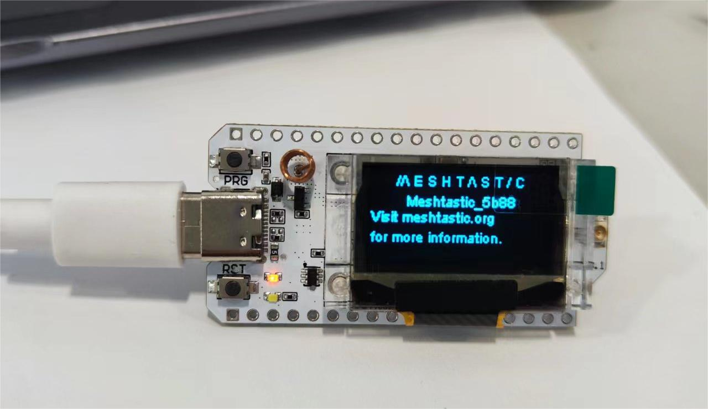

## Install the Meshtastic App
- [Android APP](https://meshtastic.org/docs/software/android/installation/)
- [Web Client](https://client.meshtastic.org/)
- [iOS/iPadOS/macOS App](https://meshtastic.org/docs/software/apple/installation/)

***Let's take Android as an example to show you how to use the APP at an entry-level. We will continue to update IOS Web operations in the future.***

## Set Regional Settings
In order to start communicating over the mesh, you must set your region. This setting controls which frequency range your device uses and should be set according to your regional location.
1. Open the app, find your device via Bluetooth as shown below. Click to connect the device. 

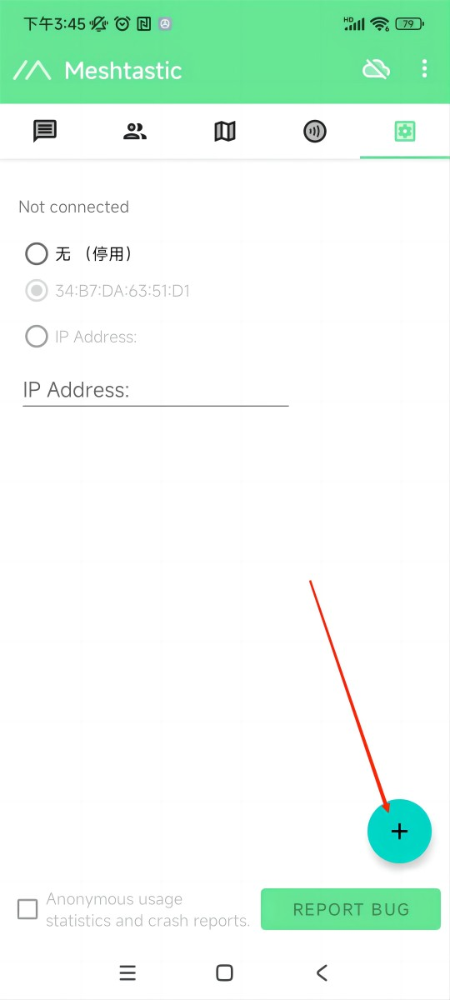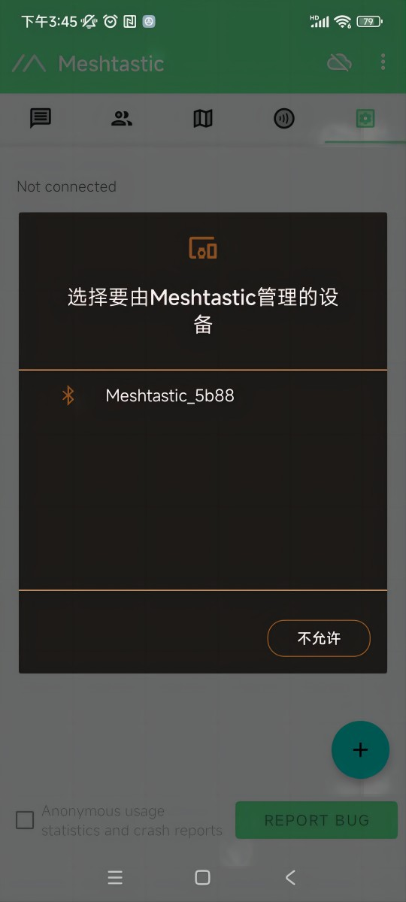

``` {Tip} If a window asks for a CAPTCHA appears, you need to look at your device's screen. The default CAPTCHA for devices without a screen is usually 123456. If not, contact the firmware issuer.

```

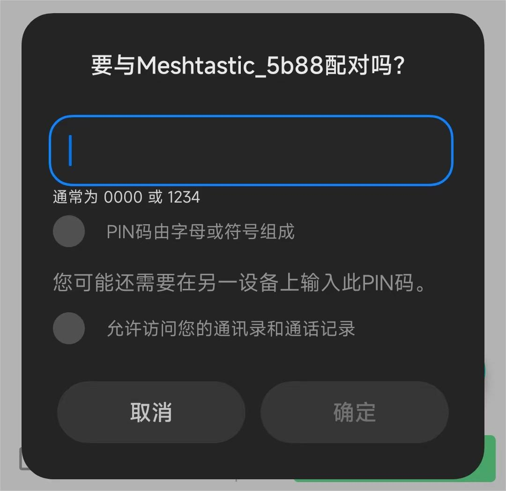

3. Once paired, Click "UNSET" next to the device name. Select the region from the list according to your regional location. Of course, your hardware must support this frequency band.


 You can refer to this link for the relationship between LoRaWAN bands and regions：[LoRaWAN_frequency_plans_by_country](https://docs.heltec.org/general/lorawan_frequency_plans_by_country.html)

``` {Note} EU_433 and EU_868 have to adhere to an hourly duty cycle limitation of 10%. Your device will stop transmitting if you reach it, until it is allowed again

```

5. Click the option below to select the channel you want to join。

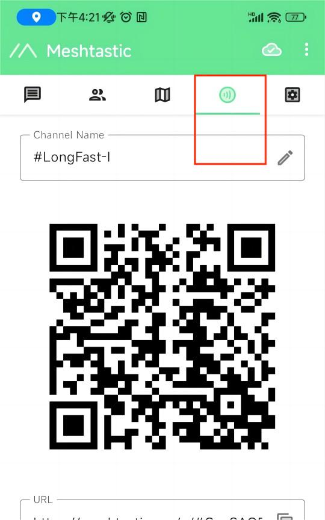

## Get started with Meshtastic
1. The map option will be able to view the location information of the companion, which can be provided by the GPS module on the device, or by the phone to which the device is connected.


2. The options below show some information about the companion device, such as latitude and longitude, signal strength, battery level, and so on.


3. This is where you'll see the messages you want to send and receive, and they'll be displayed on the device screen.

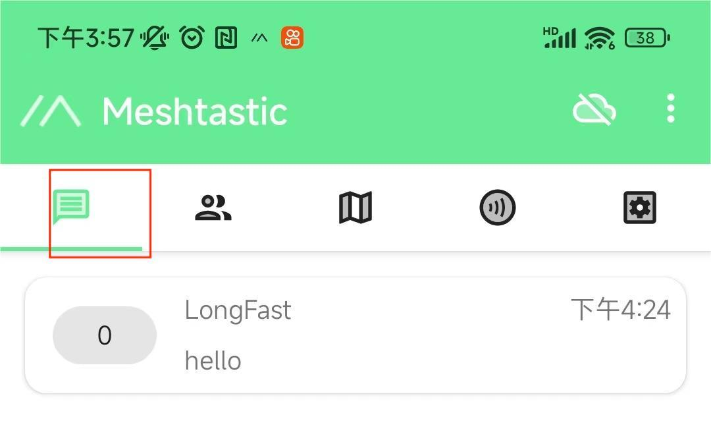

## More Settings and usage
Click the top right button to see more configurable options.


