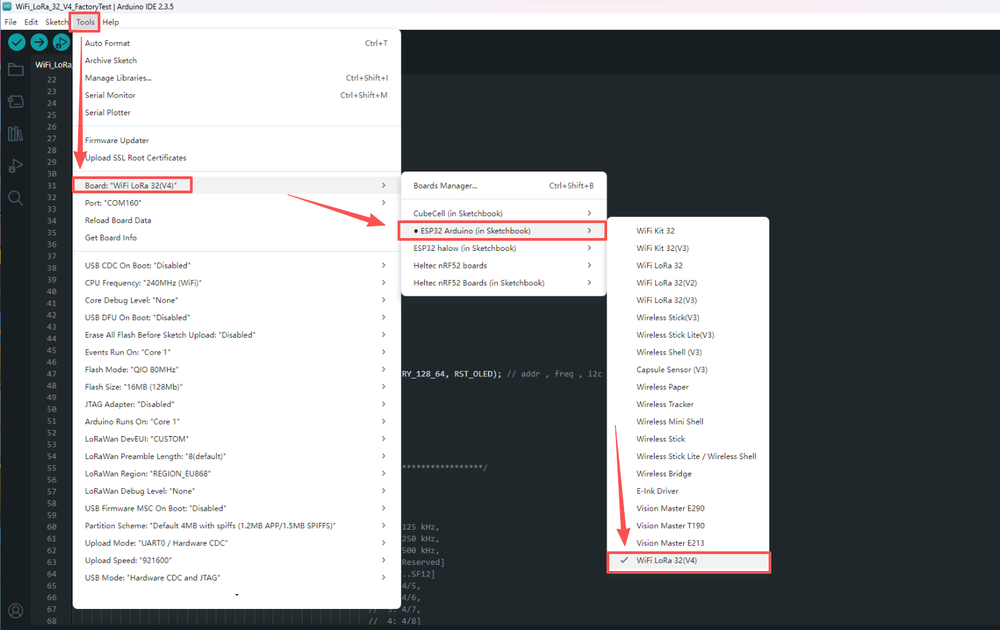
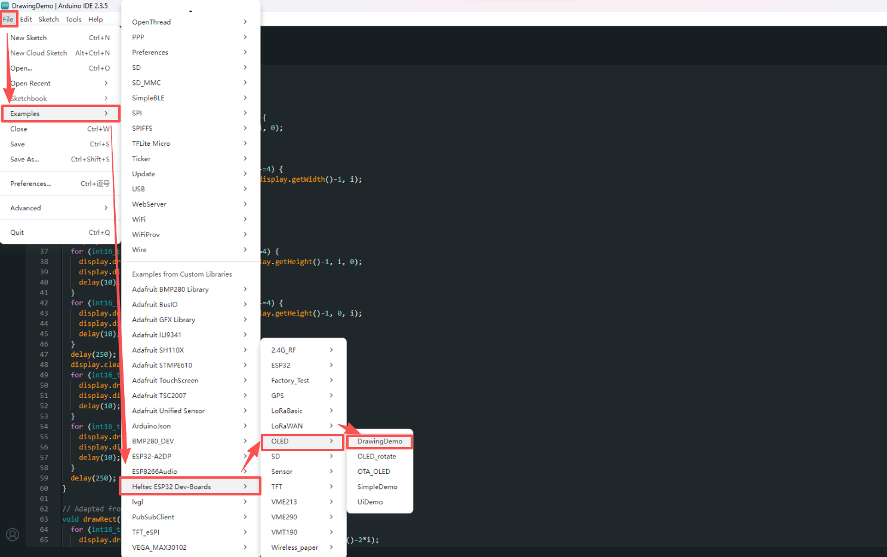
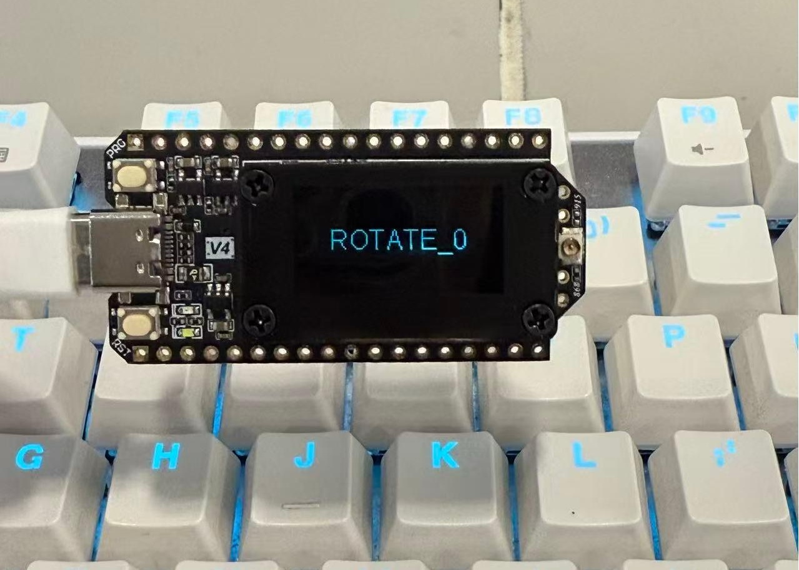
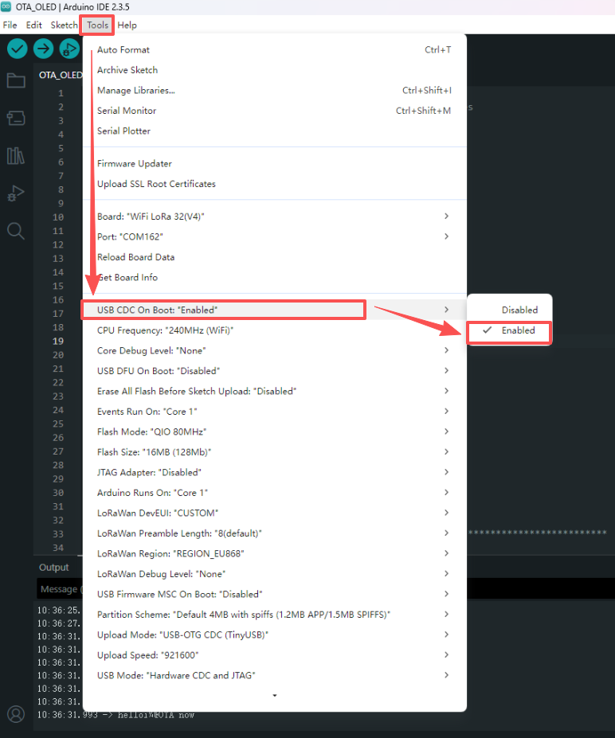
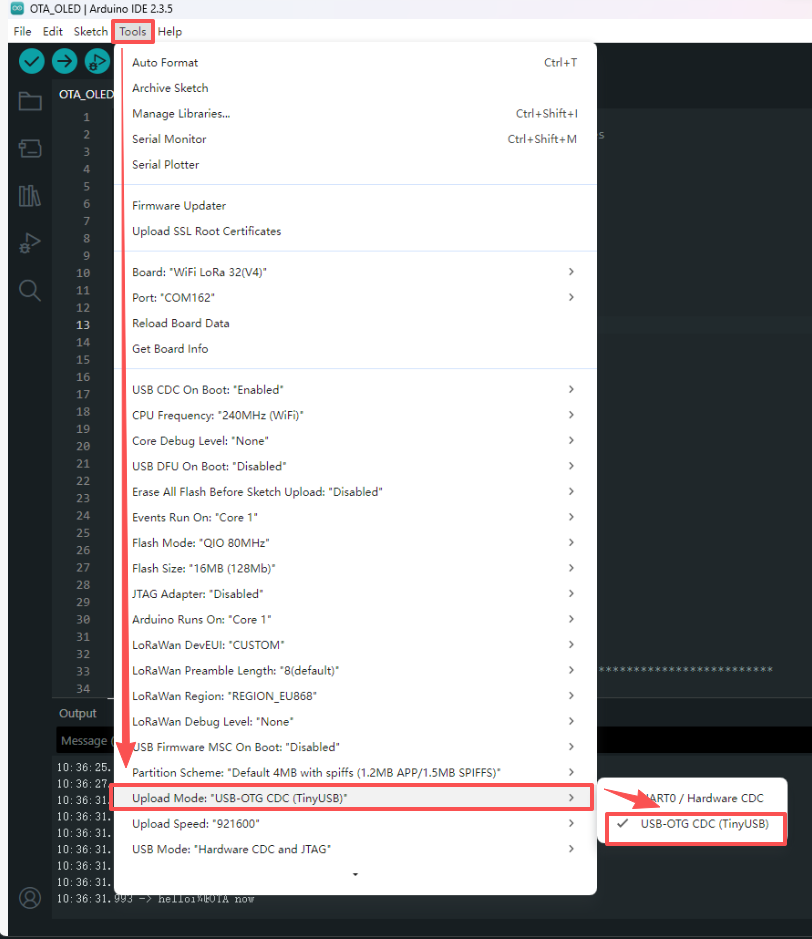

# Example Manual

{ht_translation}`[简体中文]:[English]`

## Precondition

1. Install Heltec ESP32 development framework. If you don't have it installed, please refer[ESP32 series QuickStart](https://docs.heltec.org/en/node/esp32/esp32_general_docs/quick_start.html#).

   The Heltec ESP32 development Framework already contains the basic code.

2. Install Heltec ESP32 library. If you don't have it installed, please refer[ESP32 series QuickStart](https://docs.heltec.org/en/node/esp32/esp32_general_docs/quick_start.html#).

   The library contains the lora code, factory test code, and some corresponding extensions.

## Factory test demo

1. Open `Arduino IDE` , click `tool`, select `Board`, `port` parameters, etc. As shown below

2. Follow the path below to find the program and upload it.

3. Once the firmware has been successfully flashed, the hardware status will appear as illustrated in the figure.

4. To perform debugging via serial output, the USB CDC On Boot option needs to be `Enabled` in the `tool`.

5. And then set the upload mode to `USB-OTG-CDC (TinyUSB)`.

This is a test program, can test that your board is functioning correctly.

