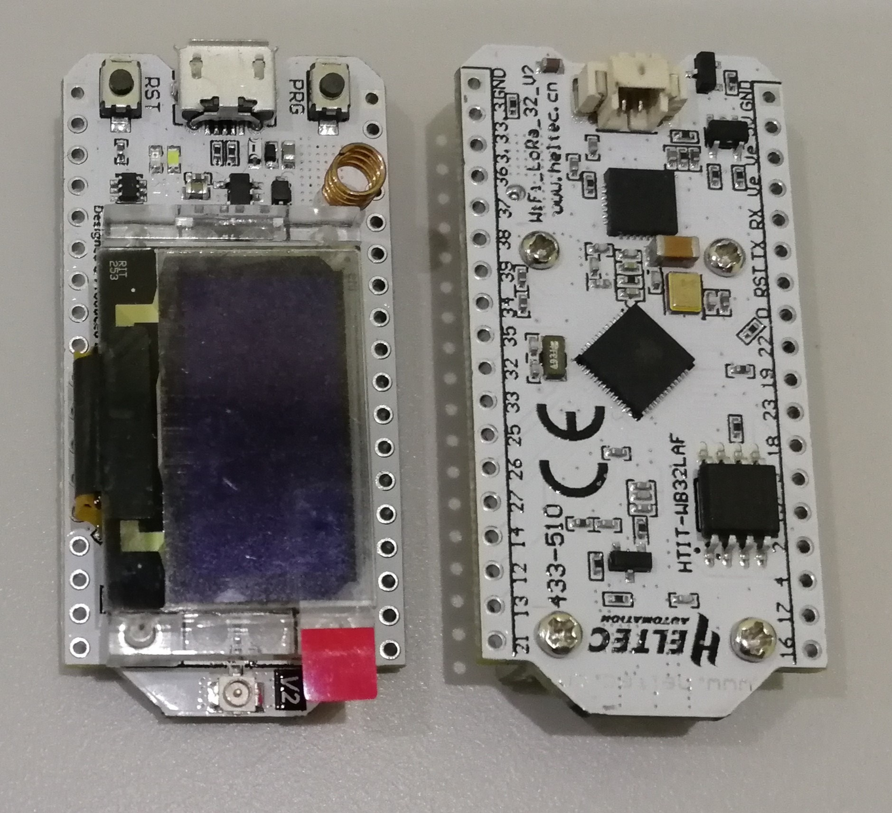
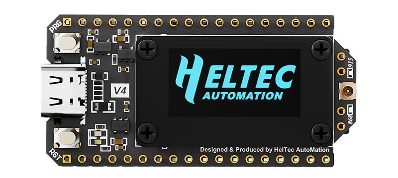

# Hardware Update Logs
{ht_translation}`[简体中文]:[English]`

## V1
- First release
- 2017-6-1 public sale

- [Pinout diagram of V1](http://resource.heltec.cn/download/WiFi_LoRa_32/WIFI_LoRa_32_V1.pdf)

- Schematic diagram of V1
  - [433, 470~510 Version](http://resource.heltec.cn/download/WiFi_LoRa_32/V1/WIFI_LoRa_32(433_470-510%20version)Schematic_diagram.PDF)
  - [868~915 Version](http://resource.heltec.cn/download/WiFi_LoRa_32/V1/WIFI_LoRa_32(868-915version)Schematic_diagram.PDF)

## V2

- 2018-9-15 public sale

- 4MB (32M-bits) FLASH upgrade to 8MB (64M-bits) FLASH;

- Use 40MHz HSE (V1 use 26MHz);

- Basic low power design (800uA in deep sleep);

- Add Vext power output pin, users can use this pin to drive some external device (sensor, motor etc.), when system need into deep sleep mode, Vext can be turn off.

  **This pin was controlled by GPIO21, for example:**

  ​		Turn ON:  `digitalWrite(21, LOW);`

  ​		Turn OFF: `digitalWrite(21, HIGH);`

- Changed some pin connection:

  

- Circuit optimization, system more stable;
- Better power manage system design;
- Better RF impendence matching.
- [Pinout diagram of V2](http://resource.heltec.cn/download/WiFi_LoRa_32/WIFI_LoRa_32_V2.pdf)
- Schematic diagram of V2
- [433, 470~510 Version](http://resource.heltec.cn/download/WiFi_LoRa_32/V2/WiFi_LoRa_32_V2(433%2C470-510).PDF)
- [868~915 Version](http://resource.heltec.cn/download/WiFi_LoRa_32/V2/WIFI_LoRa_32_V2(868-915).PDF)

## V2.1

- 2019-6-15  public sale
- Change the RF switch from PE4259 to UPG2179, and change the RF part to the official recommended value;
- Change the power detection pin from 13(ADC2: 4) to 37(ADC1: 1).
- [Pinout diagram of V2.1](https://resource.heltec.cn/download/WiFi_LoRa_32/WIFI_LoRa_32_V2.1.pdf)
- Schematic diagram of V2.1
  - [433, 470~510 Version](https://resource.heltec.cn/download/WiFi_LoRa_32/V2.1/WiFi_LoRa_32_V2.1(433%2C470-510).PDF)
  - [868~915 Version](https://resource.heltec.cn/download/WiFi_LoRa_32/V2.1/WIFI_LoRa_32_V2.1(868-915).PDF)

## V3

- 2022-09-15  public sale

- MCU is changed from ESP32-D0WDQ6 to ESP32-S3FN8. Specific differences of MCU are shown in：[https://products.espressif.com/#/product-comparison](https://products.espressif.com/#/product-comparison).

- USB interface changed from Micro USB to Type-C.

- LoRa chip changed from SX1276 to SX1262.

- The LoRa crystal oscillator is upgraded to temperature compensated crystal oscillator.

- The size, appearance, pin layout and power pins remain unchanged, but the GPIO sequence has changed. Please refer to [Pinout diagram](https://resource.heltec.cn/download/WiFi_LoRa32_V3/HTIT-WB32LA(F)_V3.png).

- [Pinout diagram of V3](https://resource.heltec.cn/download/WiFi_LoRa32_V3/HTIT-WB32LA(F)_V3.png).

- [Schematic diagram of V3](https://resource.heltec.cn/download/WiFi_LoRa32_V3/HTIT-WB32LA(F)_V3_Schematic_Diagram.pdf).

## V3.1
- Remove the ideal diode part.
- Increase the 2.4G RF and crystal distance.
- Change the USB-Type-C port to support C to C.

## V3.2
The new [Schematic Diagram](https://resource.heltec.cn/download/WiFi_LoRa_32_V3/HTIT-WB32LA(F)_V3.1_Schematic_Diagram.pdf)

- Vext changed to LDO.

- Modified the layout according to espressif's suggestions for changes.

- Modify the problem of easy adhesion of some parts.

- The charging chip is changed to LGS4056H.

- Modified voltage detection circuit, now need to pull up the ADC_Ctrl(GPIO 37).
  
## V4.0

- MCU: 
  - From ESP32-S3N8 to ESP32-S3R2
  - Flash has been upgraded from 8MB built-in to 16MB external, with the addition of 2M PSRAM.

- Power:
  - Add SH1.25-2P solar energy interface.

- Wireless performance:
  - LoRa transmission power upgraded from 21 ± 1dBm to 28 ± 1dBm.
  - 2.4G antenna, upgraded from metal spring antenna to FPC antenna.

- Peripheral Interface:
  - Cancel CP2102.
  - Add SH1.25-8Pin GNSS interface.
  - Pin expansion from 36Pin to 40Pin, providing more GPIO.

- Process and Design:
  - The screen connection method has changed from welding to B2B interface, supporting free disassembly and assembly of the screen.
  - The pin process has changed from silver plating to gold plating, resulting in better conductivity and oxidation resistance.
  - There is a plastic screen stand as mechanical protection
