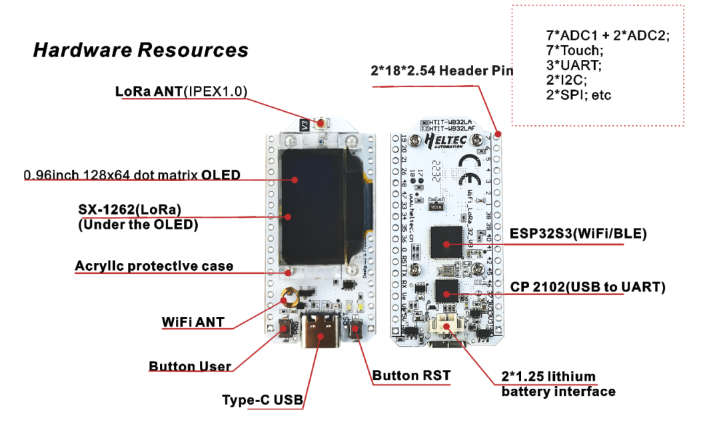

WiFi LoRa 32
============
:ht_translation:`[简体中文]:[English]`

WiFi LoRa 32 is a classic IoT dev-board designed & produced by HeltecAutomation(TM), it's a highly integrated product based on ESP32-S3 + SX1262, it has
Wi-Fi, BLE, LoRa functions, also Li-Po battery management system, 0.96" OLEDarealso included. It's the best choice for smart cities, smart farms, smart home, and IoT makers.

Related Resources
-----------------

.. toctree::
   :maxdepth: 1

   Datasheet <https://resource.heltec.cn/download/WiFi_LoRa_32_V3/HTIT-WB32LA_V3(Rev1.1).pdf>
   Schematic diagram <https://resource.heltec.cn/download/WiFi_LoRa_32_V3/HTIT-WB32LA(F)_V3.1_Schematic_Diagram.pdf>
   Pin Map <https://resource.heltec.cn/download/WiFi_LoRa_32_V3/HTIT-WB32LA(F)_V3.png>
   Hardware Update Log <hardware_update_log>

Get Start
---------

.. toctree::
   :maxdepth: 1

   Framework and libraries installation <https://docs.heltec.org/en/node/esp32/esp32_general_docs/quick_start.html>
   Running example code<example>

Application and Extension
-------------------------

.. toctree::
   :maxdepth: 1

   LoRaWAN Sample Code <https://docs.heltec.org/en/node/esp32/esp32_general_docs/lorawan/index.html>
   Meshtastic Introduction <https://docs.heltec.org/en/node/esp32/esp32_general_docs/meshtastick.html>

Frequently Asked Questions
--------------------------

.. toctree::
   :maxdepth: 1

   Frequently Asked Questions <frequently_asked_questions>

Related Links
-------------

.. toctree::
   :maxdepth: 1

   WiFi LoRa 32 Related Links <related_links>
   
Heltec General Docs
-------------------
-->[General Docs]<-- <https://docs.heltec.org/general/index.html>
