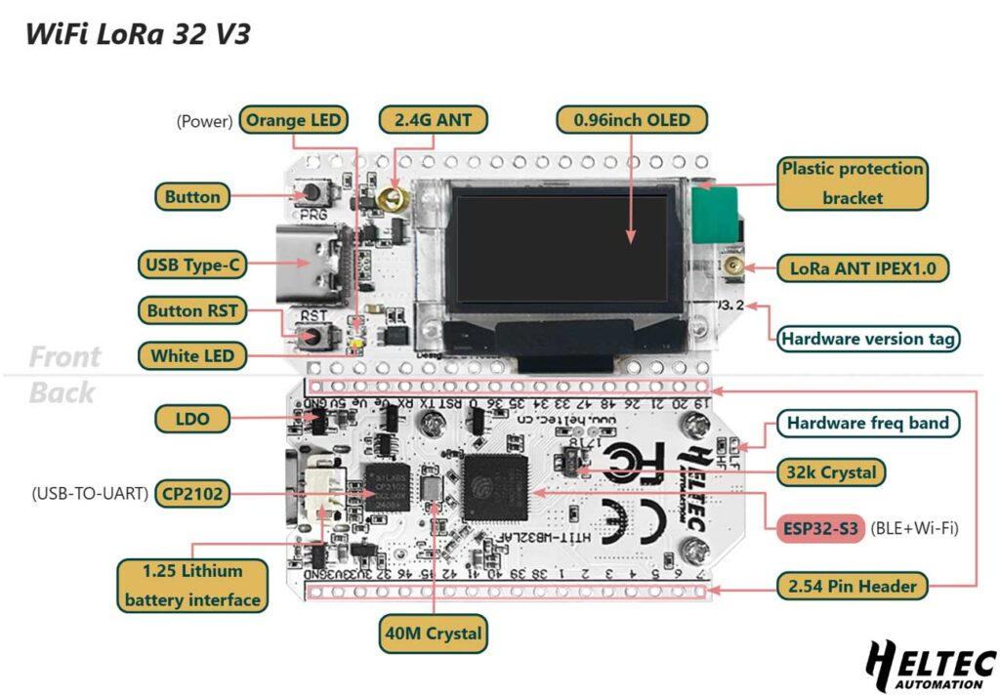

WiFi LoRa 32
============
:ht_translation:`[简体中文]:[English]`

WiFi LoRa 32 is a classic IoT dev-board designed & produced by HeltecAutomation(TM), it's a highly integrated product based on ESP32-S3 + SX1262, it has
Wi-Fi, BLE, LoRa functions, also Li-Po battery management system, 0.96" OLEDarealso included. It's the best choice for smart cities, smart farms, smart home, and IoT makers.

Important Resources
-------------------

.. toctree::
   :maxdepth: 1

   Datasheet <https://resource.heltec.cn/download/WiFi_LoRa_32_V3/HTIT-WB32LA_V3.2.pdf>
   Schematic diagram <https://resource.heltec.cn/download/WiFi_LoRa_32_V3/WiFi_LoRa_32_V3.2_Schematic_Diagram.pdf>
   Pin Map <https://resource.heltec.cn/download/WiFi_LoRa_32_V3/Wi-Fi_LoRa32_V3.2_Pinmap.png>
   Older Version resource <https://resource.heltec.cn/download/WiFi_LoRa_32_V3>

Get Start
---------

.. toctree::
   :maxdepth: 1

   Framework and Libraries installation <https://docs.heltec.org/en/node/esp32/esp32_general_docs/quick_start.html>
   Running example code<example>

Application and Extension
-------------------------

.. toctree::
   :maxdepth: 1

   LoRaWAN Sample <https://docs.heltec.org/en/node/esp32/esp32_general_docs/lorawan/index.html>
   Meshtastic Introduction <https://docs.heltec.org/en/node/esp32/esp32_general_docs/meshtastick.html>

Frequently Asked Questions
--------------------------

.. toctree::
   :maxdepth: 1

   Frequently Asked Questions <frequently_asked_questions>

Hardware Update Log
--------------------

.. toctree::
   :maxdepth: 1

   Hardware Update Log <hardware_update_log>

Related Links
-------------

- `Heltec esp32 series framework on Github <https://github.com/Heltec-Aaron-Lee/WiFi_Kit_series>`_
- `Heltec Esp32 library on Github <https://github.com/HelTecAutomation/Heltec_ESP32>`_
- `License Enquiry <https://resource.heltec.cn/search>`_
- `How to use license <https://docs.heltec.org/general/how_to_use_license.html>`_
- `Meshtastic Flasher <https://flasher.meshtastic.org/>`_
- `Meshtastic LoRa 32 Peripherals <https://meshtastic.org/docs/hardware/devices/heltec-automation/lora32/peripherals/>`_
- `LoRaWAN Parameters Instruction <https://docs.heltec.org/general/lorawan_parameters.html>`_
- `LoRaWAN example Sub-Band usage <https://docs.heltec.org/general/sub_band_usage.html>`_
- `LoRaWAN ABP Mode <https://docs.heltec.org/general/lorawan_abp/index.html>`_
- `LoRa Node to Node <https://docs.heltec.org/general/lora_node_to_node.html>`_
  
Heltec General Docs
-------------------
-->[General Docs]<-- <https://docs.heltec.org/general/index.html>
