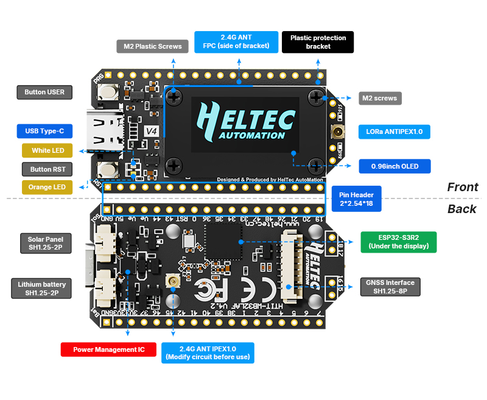

WiFi LoRa 32
============
:ht_translation:`[简体中文]:[English]`

WiFi LoRa 32 is a classic IoT dev-board designed & produced by HeltecAutomation(TM), it's a highly integrated product based on ESP32-S3 + SX1262, it has
Wi-Fi, BLE, LoRa functions, also Li-Po battery management system, 0.96" OLEDarealso included. It's the best choice for smart cities, smart farms, smart home, and IoT makers.

Version Comparison
------------------

======================  ========================  ========================  
Feature Item            V3 Version                V4 Version                
======================  ========================  ========================  
MCU                     ESP32-S3N8                ESP32-S3R2                
Flash                   8MB integrated            External 16MB Flash       
Charging Chip           Standard Li-ion battery   Support solar charging    
Solar Input Port        /                         New SH1.25-2P port        
LoRa TX Power           21±1 dBm                  28±1 dBm                  
2.4G Antenna            Metal spring antenna      FPC antenna + IPEX port   
USB-UART Chip           Integrated CP2102         Removed CP2102            
GPS Port                /                         New SH1.25-8Pin port      
Expansion Pins          36P                       40P                       
Screen Connection       Welding                   B2B Connector             
Pins                    Silver plating            Immersion gold            
Screen Frame            Partial protection        Full protection           
======================  ========================  ========================  

.. note::
   V4 builds upon V3 with multiple functional improvements, but the fundamental operation remains consistent between the two.

Important Resources
-------------------

.. toctree::
   :maxdepth: 1

   Datasheet <https://resource.heltec.cn/download/WiFi_LoRa_32_V4/datasheet/WiFi_LoRa_32_V4.2.0.pdf>
   Schematic diagram <https://resource.heltec.cn/download/WiFi_LoRa_32_V4/Schematic/WiFi_LoRa_32_V4.1_alpha.pdf>
   Pin Map <https://heltec.org/wp-content/uploads/2025/09/V4_pinmap-scaled.png>
   Older Version resource <https://resource.heltec.cn/download/WiFi_LoRa_32_V3>

Get Start
---------

.. toctree::
   :maxdepth: 1

   Framework and Libraries installation <https://docs.heltec.org/en/node/esp32/esp32_general_docs/quick_start.html>
   Running example code<example>

Application and Extension
-------------------------

.. toctree::
   :maxdepth: 1

   LoRaWAN Sample <https://docs.heltec.org/en/node/esp32/esp32_general_docs/lorawan/index.html>
   Meshtastic Introduction <https://docs.heltec.org/en/node/esp32/esp32_general_docs/meshtastick.html>

Frequently Asked Questions
--------------------------

.. toctree::
   :maxdepth: 1

   Frequently Asked Questions <frequently_asked_questions>

Hardware Update Log
--------------------

.. toctree::
   :maxdepth: 1

   Hardware Update Log <hardware_update_log>

Related Links
-------------

- `Heltec esp32 series framework on Github <https://github.com/Heltec-Aaron-Lee/WiFi_Kit_series>`_
- `Heltec Esp32 library on Github <https://github.com/HelTecAutomation/Heltec_ESP32>`_
- `License Enquiry <https://resource.heltec.cn/search>`_
- `How to use license <https://docs.heltec.org/general/how_to_use_license.html>`_
- `Meshtastic Flasher <https://flasher.meshtastic.org/>`_
- `Meshtastic LoRa 32 Peripherals <https://meshtastic.org/docs/hardware/devices/heltec-automation/lora32/peripherals/>`_
- `LoRaWAN Parameters Instruction <https://docs.heltec.org/general/lorawan_parameters.html>`_
- `LoRaWAN example Sub-Band usage <https://docs.heltec.org/general/sub_band_usage.html>`_
- `LoRaWAN ABP Mode <https://docs.heltec.org/general/lorawan_abp/index.html>`_
- `LoRa Node to Node <https://docs.heltec.org/general/lora_node_to_node.html>`_
  
Heltec General Docs
-------------------
-->[General Docs]<-- <https://docs.heltec.org/general/index.html>

