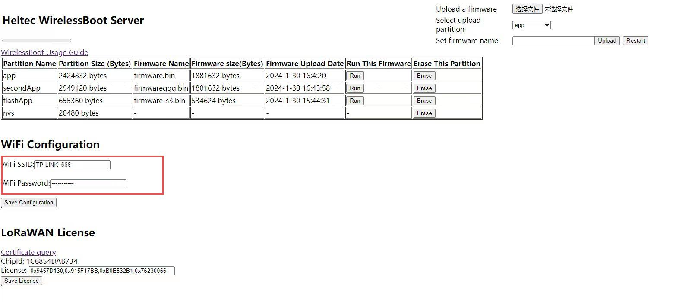

# Heltec WirelessBoot System
{ht_translation}`[简体中文]:[English]`

***The document is still under construction...***

Wireless Boot is a boot loader system for ESP32 MCU. You can download firmware, exchange information, and print logs through WiFi. Therefor, devices no longer requires a USB-UART bridge, which can reduce the hardware cost of the system and reduce device size.

&nbsp;

```{Tip} You can understand it as a special OTA program, but it can running in the devices' Boot loader

```



## Quick Start

ESP32 WirelessBoot have 3 modes:

1. Download or upgrade firmware through a webpage;
2. Directly upgrade and debug devices in the IDE (Arduino, Platform.io, etc.);
3. Replacing serial ports through WiFi interaction

## Partition Map