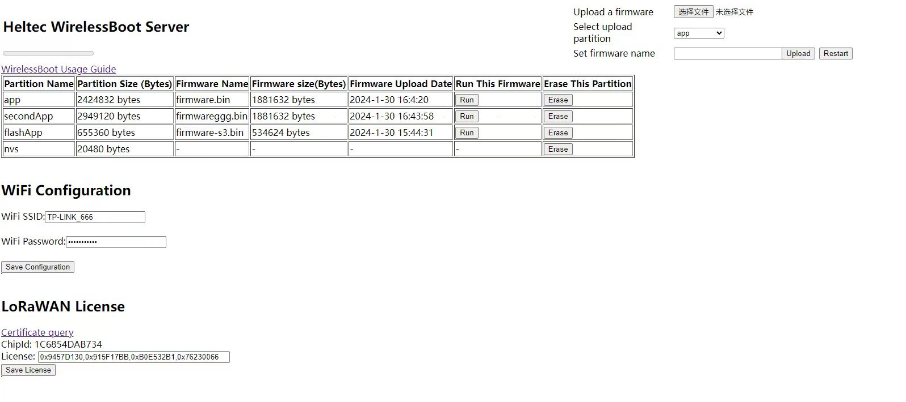

# Heltec WirelessBoot System
{ht_translation}`[简体中文]:[English]`

This topic describe the quick start and application mode for WirelessBoot .

``` {Tip} WirelessBoot technology is used for devices that do not have an external USB or serial port. You can download firmware, exchange information, and print logs through WiFi. Therefor, devices no longer requires a USB-UART bridge, which can reduce the hardware cost of the system and reduce device size.

```

------

## Install WirelessBoot Firmware

For **devices that already have WirelessBoot firmware preinstalled**, such as Capsule Sensor V3, please skip this step, go to [Enter WirelessBoot Mode](enter_wirelessboot_mode).

For **devices without WirelessBoot firmware**, follow the steps below.

1. Download the relevant WirelessBoot firmware.

[Heltec WirelessBoot Firmware download page](https://resource.heltec.cn/download/WirelessBoot)

2. Download and install ESP32 flash tool.

[Esp32 Flash tool](https://www.espressif.com.cn/sites/default/files/tools/flash_download_tool_3.9.7_1.zip)

3. Connect the hardware serial port. Devices like Capsule Sensor V3 may require proprietary tools, which you can purchase from [Heltec Automation](https://heltec.org/).


4. Click to run `flash_download_tool_xxx.exe`.


5. Select the corresponding MCU type,`Delepod`, `UART` , click `OK`.

``` {Tips} Please check the corresponding product manual for CPU model.

```


6. Click on the location in the figure and select the downloaded WirelessBoot firmware.


7. Fill in the address. It depends on the chip type, the Esp32-S3 is "0". You can check the chip manual or contact the manufacturer of the product.

   

8. Select the corresponding serial port and click Start. 

   

(enter_wirelessboot_mode)=
## Enable WirelessBoot Mode
1. Enter WirelessBoot mode. Here is the entry method for some products:
   - **Capsule Sensor V3**: Long press the button 8 seconds( 16 seconds on some older versions), util the blue LED stays on.

(enable_wirelessboot)=
2. Once the device is in WirelessBoot mode, you can use PC to find its AP hotspot: **WirelessBoot_xxxx**.


3. Connect the device's AP hotspot. Password: "heltec.org".

4. Visit the configuration page IP address. Usually, the IP address of Heltec's device is set to "**192.168.4.1**" and the password is **"heltec.org**".



5. In the configuration page, enter your LAN WiFi account and password, and click `Save Configuration`.


At this point, if your PC and the device are on the same LAN, you can use WirelessBoot to access the device. Please refer to the topics below for specific application scenarios.

------

## Typical Application Mode
- [Upload or upgrade firmware via web page](upgrade_firmware).
- [Directly upgrade and debug devices in the IDE (Arduino, Platform.io, etc.)](redevelop).
- [Replacing serial ports through WiFi interaction](print_logs).

(upgrade_firmware)=
### Upload or upgrade firmware via web page
1. Enable WirelessBoot on the device. If you don't know how to do this, please refer to this topic: [Enable WirelessBoot](enable_wirelessboot).

2. Connect your PC and device are on the same LAN.

3. Locate the device IP in the router.

   

4. Visit this IP address to navigate to the WirelessBoot configuration page.

   

5. Erase old firmware that is not needed.

   

6. Select the firmware. Select the partition you want to upload, Click `Upload` to upload the firmware.

   

``` {Tips} The firmware size should not be larger than the partition capacity. If it fails to upload, your firmware name may be too long.

```

7. After uploading the firmware successfully, click `Run` to run the firmware, after the prompt is successful, remember to restart.

   

------

(redevelop)=

### Directly upgrade and debug devices in the IDE.
#### Installing development environment
The development environment of Capsule Sensor V3 is a branch of Heltec-Esp32-development environment: **WirelessBoot-Framework**.

1. Install [Heltec ESP32 development environment](https://github.com/Heltec-Aaron-Lee/WiFi_Kit_series/tree/WirelessBoot-Framework).

``` {Tip} If you don't know how to install, check out the [Readme.MD](https://github.com/Heltec-Aaron-Lee/WiFi_Kit_series/blob/master/README.md) file.

```
2. If you already have a development environment installed, update to the latest version.

   ```
   git pull
   ```

3. Switch to the WirelessBoot branch by entering the following command:

   ```
   git branch --set-upstream-to=origin/WirelessBoot-Framework
   ```

4. Getting branch updates

   ```
   git pull
   ```
#### Work with Arduino IDE
1. Enable WirelessBoot on the device. If you don't know how to do this, please refer to this topic: [Enable WirelessBoot](enable_wirelessboot).

2. Connect your PC and device are on the same LAN.

3. Open Arduino IDE.

4. Click `Tools`, select the appropriate `Board` and `Port`.

   

5. At this point, you can program the device through the IDE. You can choose a sample code or write your own and upload it to your device. 

   

------

(print_logs)=
### Replacing serial ports through WiFi interaction
#### Installing development environment
The development environment of Capsule Sensor V3 is a branch of Heltec-Esp32-development environment: **WirelessBoot-Framework**.

1. Install [Heltec ESP32 development environment](https://github.com/Heltec-Aaron-Lee/WiFi_Kit_series/tree/WirelessBoot-Framework).

``` {Tip} If you don't know how to install, check out the [Readme.MD](https://github.com/Heltec-Aaron-Lee/WiFi_Kit_series/blob/master/README.md) file.

```

2. If you already have a development environment installed, update to the latest version.

   ```
   git pull
   ```

3. Switch to the WirelessBoot branch by entering the following command:

   ```
   git branch --set-upstream-to=origin/WirelessBoot-Framework
   ```

4. Getting branch updates

   ```
   git pull
   ```

#### Install the serial port plug-in
1. Download the serial port serial port plug-in:
   [Heltec Esp Network Minitor](https://resource.heltec.cn/download/Heltec%20Capsule%20Sensor%20V3/heltec-esp-network-monitor-0.0.1.vsix)

2. Access path: `C:\Users\{ueser name}\.arduinoIDE`.Create a new folder called `plugins`, If the folder already exists, there is no need to create a new one.

   

3. Copy the **Heltec Esp Network Minitor** file to the folder **plugins**.

   

4. Open Arduino IDE, Press **Ctrl+Shift+P** on your keyboard at the same time.

5. In the dialog box that pops up, search: **Heltec Esp Network Minitor**.

   

6. Click the searched plugin to enable it.

#### Check the serial port
1. Enable WirelessBoot on the device. 

   If you don't know how to do this, please refer to this topic: [Enable WirelessBoot](enable_wirelessboot)

2. Connect your PC and device are on the same LAN.

3. Open your IDE, click the Tools option and select the appropriate `Board` and `Port`.

   

4. Open the port and connect the device's serial port to your PC via WiFi.

