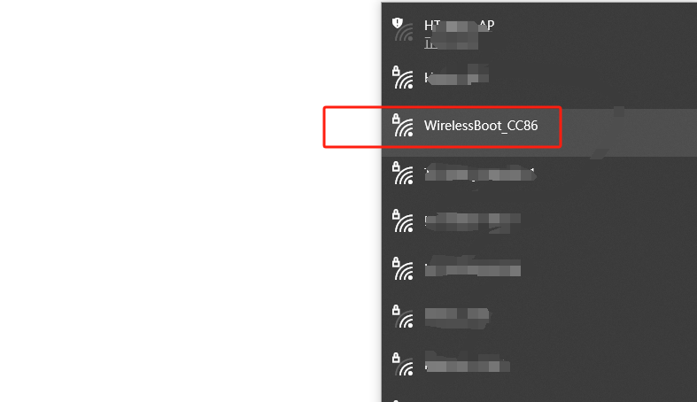
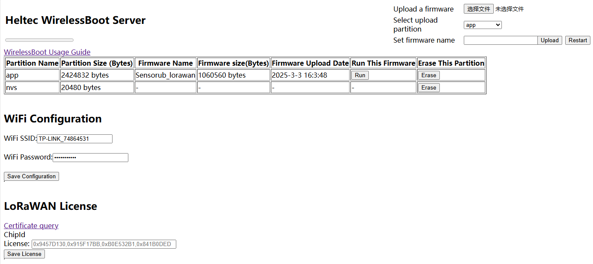
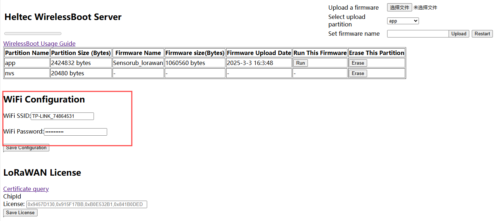
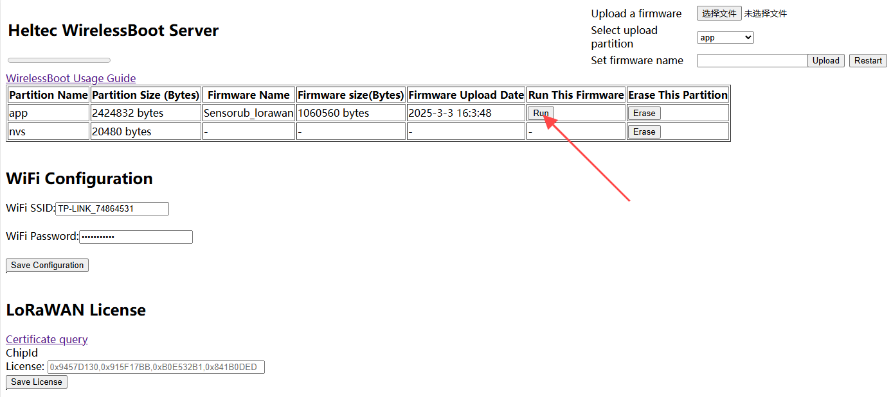
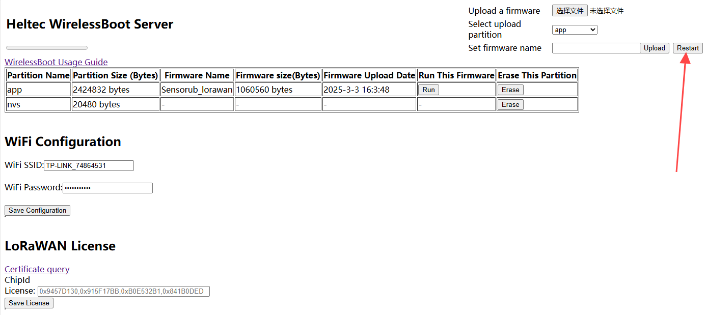

# Upload Firmware Via WirelessBoot

{ht_translation}`[简体中文]:[English]`

*This section describes how to upload a pre-compiled firmware to the device via WirelessBoot.* 

``` {warning} Note that the firmware must be in '.bin' format.
```

1. To enter WirelessBoot mode, the specific method depends on the product itself.

2. Locate the WiFi network named "WirelessBoot-xxxx" and connect to it. Default password is “heltec.org".

   


3. In your browser, enter "192.168.4.1" and use the default password "heltec.org".<br>This is the interface for uploading firmware via WirelessBoot.

   


``` {Tip} You can configure the WiFi address on this page. After "Save Configuration", you can access the WirelessBoot mode through the device's IP address without needing to connect to its WiFi.
```




``` {Note} WirelessBoot only accepts firmware in “.bin” format.
```

4. Choose the corresponding firmware,select an APP partition, and click "Upload."

   

``` {Note} The firmware name should not be too long; otherwise, it cannot be uploaded.
```

5. After the upload is successful, click "RUN" to confirm which program you want to execute.

   

6. Click "Restart" to reboot the device and start its operation.

   

----------------------------------------

