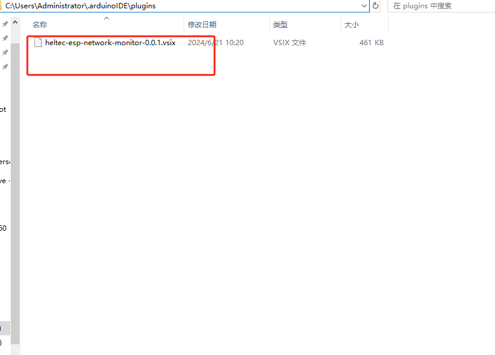
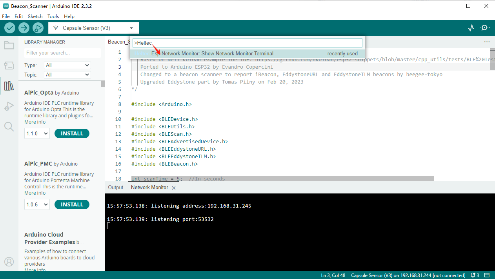

# Heltec WirelessBoot System

{ht_translation}`[简体中文]:[English]`

WirelessBoot technology is used for devices that do not have an external USB or serial port. You can download firmware, exchange information, and print logs through WiFi. Therefor, devices no longer requires a USB-UART bridge, which can reduce the hardware cost of the system and reduce device size.

This section describes how to install and use Heltec's ESP32 WirelessBoot development framework.

If you only want to upload a pre-compiled firmware, please refer to the previous topic: [Upload Firmware Via WirelessBoot](https://docs.heltec.org/en/node/esp32/wireless_boot/upload_firmware.html).

---------------------

## Install WirelessBoot Framework

1. Install [Heltec ESP32 development environment](https://github.com/Heltec-Aaron-Lee/WiFi_Kit_series/tree/WirelessBoot-Framework).

``` {Tip} If you don't know how to install, check out the [Readme.MD](https://github.com/Heltec-Aaron-Lee/WiFi_Kit_series/blob/master/README.md) file.
```

2. If you already have a development environment installed, update to the latest version.

   ```
   git pull
   ```

3. Switch to the WirelessBoot branch by entering the following command:

   ```
   git branch --set-upstream-to=origin/WirelessBoot-Framework
   ```

4. Getting branch updates

   ```
   git pull
   ```

--------------------------------------

## Work with Arduino IDE
1. Enable WirelessBoot on the device, the specific method depends on the product itself.

2. On the WirelessBoot page, fill in the WiFi SSID and password, then click "Save Configuration."

3. Connect your PC and device are on the same LAN.

4. Open Arduino IDE.

5. Click `Tools`, select the appropriate `Board` and `Port`.

   

6. At this point, you can program the device through the IDE. You can choose a sample code or write your own and upload it to your device. 

   

----------------------------

## Serial ports

1. Download the serial port serial port plug-in:
   [Heltec Esp Network Minitor](https://resource.heltec.cn/download/Heltec%20Capsule%20Sensor%20V3/heltec-esp-network-monitor-0.0.1.vsix)

2. Access path: `C:\Users\{ueser name}\.arduinoIDE`.Create a new folder called `plugins`, If the folder already exists, there is no need to create a new one.

   

3. Copy the **Heltec Esp Network Minitor** file to the folder **plugins**.

   

4. Open Arduino IDE, Press **Ctrl+Shift+P** on your keyboard at the same time.

5. In the dialog box that pops up, search: **Heltec Esp Network Minitor**.

   

6. Click the searched plugin to enable it.

7. Open the port and connect the device's serial port to your PC via WiFi.

