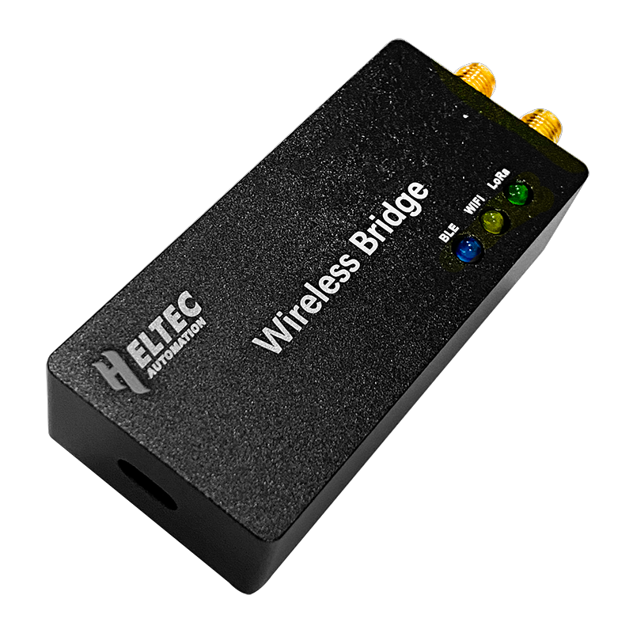

Wireless Bridge
===============
:ht_translation:`[简体中文]:[English]`

Wireless Bridge base on ESP32 and SX1276 chips, onboard 8M Byte SDRAM and 8M Byte FLASH, WiFi and Bluetooth can work at the same time. It is a bridge that converts “WiFi/Bluetooth – LoRa” signals to each other.

Related Resources
-----------------

.. toctree::
   :maxdepth: 1

   Datasheet <https://resource.heltec.cn/download/Wireless_Bridge/bridge.pdf>
   Hardware Update Log <hardware_update_log>

Get Start
---------

.. toctree::
   :maxdepth: 1

   Framework and libraries installation <https://docs.heltec.org/en/node/esp32/esp32_general_docs/quick_start.html>
   WiFi-LoRa Example<wifi_lora_user_manual>
   BLE-LoRa Example<ble_lora_user_manual>
   WiFi-BLE Example<wifi_ble_user_manual>

Frequently Asked Questions
--------------------------

.. toctree::
   :maxdepth: 1

   Frequently Asked Questions <frequently_asked_questions>

Related Links
-------------

- `Heltec esp32 series framework on Github <https://github.com/Heltec-Aaron-Lee/WiFi_Kit_series>`_
- `Heltec Esp32 library on Github <https://github.com/HelTecAutomation/Heltec_ESP32>`_
- `License Enquiry <https://resource.heltec.cn/search>`_
- `How to use license <https://docs.heltec.org/general/how_to_use_license.html>`_
- `Meshtastic Flasher <https://flasher.meshtastic.org/>`_
- `Meshtastic LoRa 32 Peripherals <https://meshtastic.org/docs/hardware/devices/heltec-automation/lora32/peripherals/>`_
- `LoRaWAN Parameters Instruction <https://docs.heltec.org/general/lorawan_parameters.html>`_
- `LoRaWAN example Sub-Band usage <https://docs.heltec.org/general/sub_band_usage.html>`_
- `LoRaWAN ABP Mode <https://docs.heltec.org/general/lorawan_abp/index.html>`_
- `LoRa Node to Node <https://docs.heltec.org/general/lora_node_to_node.html>`_
   
Heltec General Docs
-------------------
-->[General Docs]<-- <https://docs.heltec.org/general/index.html>

